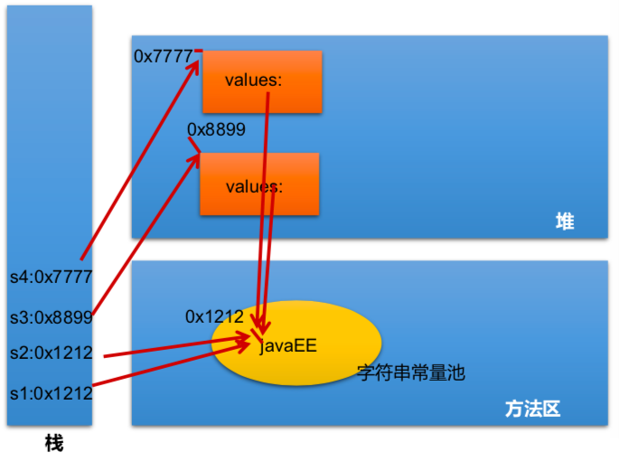
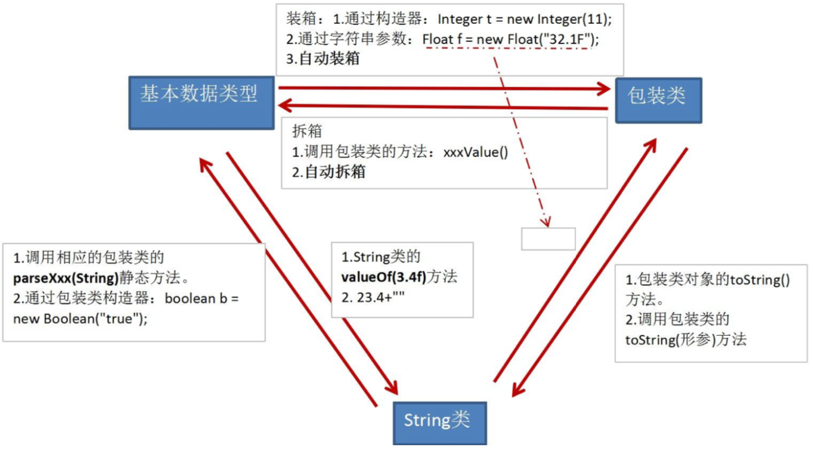

# 字符串相关的类

## String

### String类定义

1. String 声明为 final 的，不可被继承。

2. String 实现了 Serializable接口 ：表示字符串是支持序列话的

   ​           实现了 Comparable 接口：表示 String 可以比较大小

3. String 内部定义了final char[] value 用于存储字符串数据

```java
public final class String
    implements java.io.Serializable, Comparable<String>, CharSequence {
    /** The value is used for character storage. */
    private final char value[];

    /** Cache the hash code for the string */
    private int hash; // Default to 0
```

### String的不可变性

1. String 代表不可变的字符序列。简称：不可变性
   1. 当对字符串重新赋值时，需要重新指定内存区域赋值，不能使用原有的value进行赋值，
   2. 当对现有的字符串进行连接操作时，也需要重新指定内存区域赋值，不能使用原有的value进行赋值，
   3. 当调用String的replace()方法修改指定字符或字符串时，也需要重新指定内存区域赋值，不能使用原有的value进行赋值。
2. 通过字面量的方式(区别于 new)给一个字符串赋值，此时的字符串声明在字符串常量池中。
3. 字符串常量池不会存储相同内容的字符串。

### String的创建

* 通过字面量方式 - 字符串常量池中创建了一个的字符串
* 通过 new + 构造器方式 - 堆中新建一个 String 的对象，该对象的 char[] value 指向常量池中的字符串

```java
String str = "hello"; /

//本质上this.value = new char[0]; 
String s1 = new String();

//this.value = original.value;
String s2 = new String(String original); 

//this.value = Arrays.copyOf(value, value.length);
String s3 = new String(char value[])

//this.value = Arrays.copyOfRange(value, offset, offset+count);
String s4 = new String(char value[], int offset, int count);
```

#### 字符串对象是内存存储情况

```java
String s1 = "abc";
String s2 = new String("abc")
```


```java
//通过字面量定义的方式：此时的s1和s2的数据javaEE声明在方法区中的字符串常量池中。
String s1 = "javaEE";
String s2 = "javaEE";
//通过new + 构造器的方式:此时的s3和s4保存的地址值，是数据在堆空间中开辟空间以后对应的地址值。
String s3 = new String("javaEE");
String s4 = new String("javaEE");

System.out.println(s1 == s2);//true
System.out.println(s1 == s3);//false
System.out.println(s1 == s4);//false
System.out.println(s3 == s4);//false
```



```java
Person p1 = new Person("Tom",12);
Person p2 = new Person("Tom",12);

System.out.println(p1.name.equals(p2.name));//true
System.out.println(p1.name == p2.name);//true
```


#### 面试题

String s = new String("abc");方式创建对象，创建了几个对象？

两个：一个是堆空间 new 的 String 对象，另一个是 char[] value 对应的常量池中的数据"abc"。

### String的拼接

1. 常量与常量的拼接结果在常量池。且常量池中不会存在相同内容的常量。

2. 只要其中有一个是==变量==，结果就在堆中。

   如果多次执行此操作，会导致大量副本字符串对象存留在内存中，降低效率。如果这样的操作放到循环中，会极大影响程序的性能。

3. 如果拼接的结果调用 intern() 方法，返回值就在常量池中

```java
String s1 = "javaEE";
String s2 = "hadoop";

String s3 = "javaEEhadoop";
String s4 = "javaEE" + "hadoop";
String s5 = s1 + "hadoop";
String s6 = "javaEE" + s2;
String s7 = s1 + s2;

System.out.println(s3 == s4);//true
System.out.println(s3 == s5);//false
System.out.println(s3 == s6);//false
System.out.println(s3 == s7);//false
System.out.println(s5 == s6);//false
System.out.println(s5 == s7);//false
System.out.println(s6 == s7);//false

String s8 = s6.intern();//返回值得到的s8使用的常量值中已经存在的“javaEEhadoop”
System.out.println(s3 == s8);//true
```

```java
String s1 = "javaEEhadoop";
String s2 = "javaEE";
String s3 = s2 + "hadoop";
System.out.println(s1 == s3);//false

final String s4 = "javaEE";//s4:常量
String s5 = s4 + "hadoop";
System.out.println(s1 == s5);//true
```

#### 面试题

```java
public class StringTest {
	String str = new String("good");
  char[] ch = { 't', 'e', 's', 't' };
	public void change(String str, char ch[]) { 
    str = "test ok";
		ch[0] = 'b'; 
  }
  public static void main(String[] args) { 
    StringTest ex = new StringTest(); 
    ex.change(ex.str, ex.ch); 
    System.out.println(ex.str);//good 
    System.out.println(ex.ch);//best
  } 
}
```

### String 的常用方法

```java
int length()//返回字符串的长度: return value.length
char charAt(int index)//返回某索引处的字符return value[index]
boolean isEmpty()//判断是否是空字符串:return value.length == 0
String toLowerCase()//使用默认语言环境，将 String 中的所有字符转换为小写
String toUpperCase()//使用默认语言环境，将 String 中的所有字符转换为大写
String trim()://返回字符串的副本，忽略前导空白和尾部空白
boolean equals(Object obj)//比较字符串的内容是否相同
boolean equalsIgnoreCase(String anotherString)//与equals方法类似，忽略大小写
String concat(String str)//将指定字符串连接到此字符串的结尾。 等价于用“+”
int compareTo(String anotherString)//比较两个字符串的大小
String substring(int beginIndex)//返回一个新的字符串，它是此字符串的从beginIndex开始截取到最后的一个子字符串。
String substring(int beginIndex, int endIndex)//返回一个新字符串，它是此字符串从beginIndex开始截取到endIndex(不包含)的一个子字符串
```

```java
boolean endsWith(String suffix)//测试此字符串是否以指定的后缀结束
boolean startsWith(String prefix)//测试此字符串是否以指定的前缀开始
boolean startsWith(String prefix, int toffset)//测试此字符串从指定索引开始的子字符串是否以指定前缀开始
```

```java
boolean contains(CharSequence s)//当且仅当此字符串包含指定的 char 值序列 时，返回 true
int indexOf(String str)//返回指定子字符串在此字符串中第一次出现处的索引
int indexOf(String str, int fromIndex)//返回指定子字符串在此字符串中第一次出现处的索引，从指定的索引开始
int lastIndexOf(String str)//返回指定子字符串在此字符串中最右边出现处的索引
int lastIndexOf(String str, int fromIndex)//返回指定子字符串在此字符串中最后一次出现处的索引，从指定的索引开始反向搜索 注:indexOf和lastIndexOf方法如果未找到都是返回-1
```

```java
String replace(char oldChar, char newChar)//返回一个新的字符串，它是通过用 newChar 替换此字符串中出现的所有 oldChar 得到的。
String replace(CharSequence target, CharSequence replacement)//使用指定的字面值替换序列替换此字符串所有匹配字面值目标序列的子字符串。 
String replaceAll(String regex, String replacement)//使用给定的 replacement 替换此字符串所有匹配给定的正则表达式的子字符串。
String replaceFirst(String regex, String replacement)//使用给定的 replacement 替换此字符串匹配给定的正则表达式的第一个子字符串。
```

```java
boolean matches(String regex)//告知此字符串是否匹配给定的正则表达式
String[] split(String regex)//根据给定正则表达式的匹配拆分此字符串。
String[] split(String regex, int limit)//根据匹配给定的正则表达式来拆分此字符串，最多不超过limit个，如果超过了，剩下的全部都放到最后一个元素中。
```

#### 相关使用

```java
String str = "12hello34world5java7891mysql456"; //把字符串中的数字替换成,，如果结果中开头和结尾有，的话去掉
String string = str.replaceAll("\\d+", ",").replaceAll("^,|,$", ""); 
System.out.println(string);//hello,world,java,mysql
```

```java
String str = "12345"; //判断str字符串中是否全部有数字组成，即有1-n个数字组成
boolean matches = str.matches("\\d+");
System.out.println(matches);
String tel = "0571-4534289"; //判断这是否是一个杭州的固定电话
boolean result = tel.matches("0571-\\d{7,8}");
System.out.println(result);
```

```java
String str = "hello|world|java";
String[] strs = str.split("\\|");
for (int i = 0; i < strs.length; i++) { //hello world java 
	System.out.print(strs[i] + " "); 
}
System.out.println();

String str2 = "hello.world.java";
String[] strs2 = str2.split("\\.");
for (int i = 0; i < strs2.length; i++) { //hello world java 
	System.out.print(strs2[i] + " "); 
}
```

### String 和其他类型转换



#### 字符串 -> 基本数据类型、包装类

* Integer 包装类的 `public static int parseInt(String s)`：可以将由"数字"字符组成的字符串转换为整型
* 类似地，使用java.lang包中的 Byte、Short、Long、Float、Double 类调相应的类方法可以将由"数字"字符组成的字符串，转化为相应的基本数据类型

#### 基本数据类型、包装类 -> 字符串

* 调用 String 类的 `public String valueOf(int n)` 可将 int 型转换为字符串
* 相应的 `valueOf(byte b)、valueOf(long l)、valueOf(float f)、valueOf(double d)、valueOf(boolean b) `可由参数的相应类型到字符串的转换
* 基本数据类型的 "+" 拼接；包装类的 `toString()`

```java
String str1 = "123";
//int num = (int)str1;//错误的
int num = Integer.parseInt(str1);

String str2 = String.valueOf(num);//"123"
String str3 = num + "";

System.out.println(str1 == str3);//false
```

#### 字符数组 -> 字符串

* String 类的构造器：`String(char[])` 和 `String(char[]，int offset，int length)` 分别用字符数组中的全部字符和部分字符创建字符串对象

#### 字符串 -> 字符数组

* `public char[] toCharArray()`：将字符串中的全部字符存放在一个字符数组中的方法
* `public void getChars(int srcBegin, int srcEnd, char[] dst,int dstBegin)`：提供了将指定索引范围内的字符串存放到数组中的方法

```java
String str1 = "abc123";
char[] charArray = str1.toCharArray();
for (int i = 0; i < charArray.length; i++) { // a b c 1 2 3
	System.out.print(charArray[i] + " "); 
}

char[] arr = new char[]{'h','e','l','l','o'};
String str2 = new String(arr);
System.out.println(str2); //hello 
```

#### 字节数组 -> 字符串

* `String(byte[])`：通过使用平台的默认字符集解码指定的 byte 数组，构造一个新的 String
* `String(byte[]，int offset，int length)` :用指定的字节数组的一部分， 即从数组起始位置 offset 开始取 length 个字节构造一个字符串对象

#### 字符串 -> 字节数组

* `public byte[] getBytes()` ：使用平台的默认字符集将此 String 编码为 byte 序列，并将结果存储到一个新的 byte 数组中
* `public byte[] getBytes(String charsetName)`：使用指定的字符集将此 String 编码到 byte 序列，并将结果存储到新的 byte 数组

```java
/*
String 与 byte[]之间的转换
编码：String --> byte[]:调用String的getBytes()
解码：byte[] --> String:调用String的构造器

编码：字符串 -->字节  (看得懂 --->看不懂的二进制数据)
解码：编码的逆过程，字节 --> 字符串 （看不懂的二进制数据 ---> 看得懂）

说明：解码时，要求解码使用的字符集必须与编码时使用的字符集一致，否则会出现乱码。
 */
@Test
public void test3() throws UnsupportedEncodingException {
    String str1 = "abc123中国";
    byte[] bytes = str1.getBytes();//使用默认的字符集utf-8，进行编码。
    System.out.println(Arrays.toString(bytes));

    byte[] gbks = str1.getBytes("gbk");//使用gbk字符集进行编码。
    System.out.println(Arrays.toString(gbks));

    String str2 = new String(bytes);//使用默认的字符集utf-8，进行解码。
    System.out.println(str2);

    String str3 = new String(gbks);
    System.out.println(str3);//出现乱码。原因：编码集和解码集不一致！

    String str4 = new String(gbks, "gbk");
    System.out.println(str4);//没有出现乱码。原因：编码集和解码集一致！
}
```

```cmd
[97, 98, 99, 49, 50, 51, -28, -72, -83, -27, -101, -67]
[97, 98, 99, 49, 50, 51, -42, -48, -71, -6]
abc123中国
abc123�й�
abc123中国
```

## StringBuffer

### 定义

`java.lang.StringBuffer`代表可变的字符序列，JDK1.0中声明，可以对字符串内容进行增删，此时不会产生新的对象

```java
abstract class AbstractStringBuilder implements Appendable, CharSequence {
    /**
     * The value is used for character storage.
     */
    char[] value; //value 没有final声明，可以不断扩容

    /**
     * The count is the number of characters used.
     */
    int count;//记录有效字符的个数
```

### 构造器

StringBuffer 类不同 于String，其对象必须使用构造器生成。有三个构造器

`StringBuffer()`: 初始容量为16的字符串缓冲区

`StringBuffer(int size)`：构造指定容量的字符串缓冲区

`StringBuffer(String str)`：将内容初始化为指定字符串内容

### StringBuffer 常用方法(StringBuidler一样)

```java
StringBuffer append(xxx)//提供了很多的append()方法，用于进行字符串拼接 
StringBuffer delete(int start,int end)//删除指定位置的内容
StringBuffer replace(int start, int end, String str)//把[start,end)位置替换为str 
StringBuffer insert(int offset, xxx)//在指定位置插入xxx
StringBuffer reverse()//把当前字符序列逆转
```

如上这些方法支持方法链操作，==方法链==的原理

```java
public synchronized StringBuffer append(String str) {
	toStringCache = null;
	super.append(str);
	return this;//返回本身
}
```

```java
int indexOf(String str)
String substring(int start,int end)//返回一个从start开始到end索引结束的左闭右开区间的子字符串
int length()
char charAt(int n )
void setCharAt(int n ,char ch)
```

## StringBuilder

StringBuilder 和 StringBuffer 非常类似，均代表可变的字符序列，而且提供相关功能的方法也一样

## ==String、StringBuffer、StringBuild 三者异同==

### 定义层面

String：不可变的字符序列、底层采用 `final char value[]`存储

StringBuffer：可变的字符序列；线程安全，效率低；底层采用 `char[] value` 存储

StringBuilder：可变的字符序列；JDK5.0新增的，线程不安全，效率高；底层采用 `char[] value` 存储

```java
//源码分析：
String str = new String();//char[] value = new char[0];
String str1 = new String("abc");//char[] value = new char[]{'a','b','c'};

StringBuffer sb1 = new StringBuffer();//char[] value = new char[16];底层创建了一个长度是16的数组。
System.out.println(sb1.length());//
sb1.append('a');//value[0] = 'a';
sb1.append('b');//value[1] = 'b';

StringBuffer sb2 = new StringBuffer("abc");//char[] value = new char["abc".length() + 16];

//问题1. System.out.println(sb2.length());//3
//问题2. 扩容问题:如果要添加的数据底层数组盛不下了，那就需要扩容底层的数组。
        //默认情况下，扩容为原来容量的2倍 + 2，同时将原有数组中的元素复制到新的数组中。
//指导意义：开发中建议大家使用：StringBuffer(int capacity) 或 StringBuilder(int capacity)
```

### 拼接效率层面

拼接效率从高到低排列：StringBuilder > StringBuffer > String

```java
//初始设置
long startTime = 0L;
long endTime = 0L;
String text = "";
StringBuffer buffer = new StringBuffer("");
StringBuilder builder = new StringBuilder("");
//开始对比
startTime = System.currentTimeMillis();
for (int i = 0; i < 20000; i++) {
    buffer.append(String.valueOf(i));
}
endTime = System.currentTimeMillis();
System.out.println("StringBuffer的执行时间：" + (endTime - startTime));

startTime = System.currentTimeMillis();
for (int i = 0; i < 20000; i++) {
    builder.append(String.valueOf(i));
}
endTime = System.currentTimeMillis();
System.out.println("StringBuilder的执行时间：" + (endTime - startTime));

startTime = System.currentTimeMillis();
for (int i = 0; i < 20000; i++) {
    text = text + i;
}
endTime = System.currentTimeMillis();
System.out.println("String的执行时间：" + (endTime - startTime));
```

```cmd
StringBuffer的执行时间：35
StringBuilder的执行时间：9
String的执行时间：3168
```


## 常见算法题

1. 模拟一个trim方法，去除字符串两端的空格

2. 将一个字符串进行反转。将字符串中指定部分进行反转。比如“abcdefg”反转为”abfedcg”

3. 获取一个字符串在另一个字符串中出现的次数。
   比如:获取“ ab”在 “abkkcadkabkebfkabkskab” 中出现的次数

4. 获取两个字符串中最大相同子串。比如:str1 = "abcwerthelloyuiodef“;str2 = "cvhellobnm"提示:将短的那个串进行长度依次递减的子串与较长的串比较

5. 对字符串中字符进行自然顺序排序。
   提示:
   1)字符串变成字符数组。

   2)对数组排序，选择，冒泡，Arrays.sort(); 

   3)将排序后的数组变成字符串。


后期分析

```java
 String str1 = new StringBuilder("计算机软件").append("1").toString();
System.out.println(str1.intern() == str1); //true

String str2 = new StringBuilder("计算机软件").append("1").toString();
System.out.println(str2.intern() == str2); //false

String str3 = new StringBuilder("计算机软件2").toString();
System.out.println(str3.intern() == str3); //false
        
String str4 = new StringBuilder("计算机软件2").toString();
System.out.println(str4.intern() == str4); //false
```


