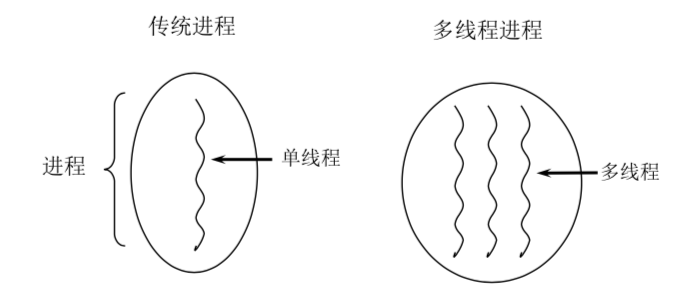
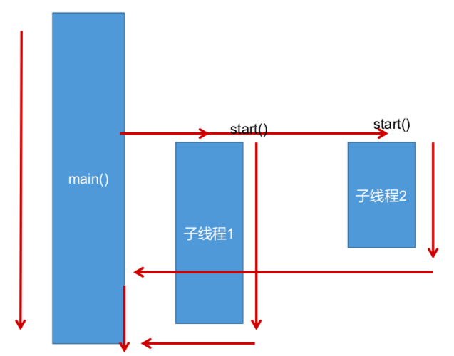
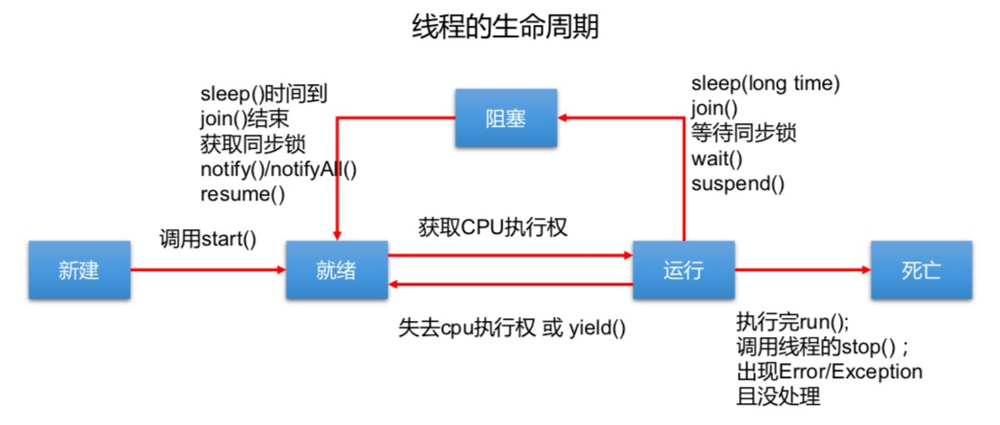
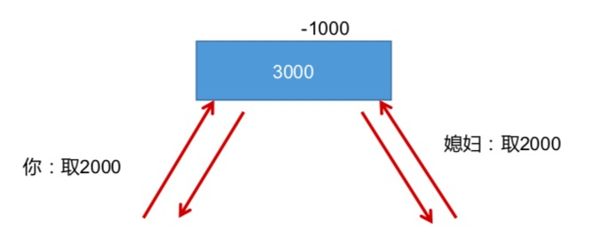

# 基本概念：程序、进程、线程

* **程序(program)**是为完成特定任务、用某种语言编写的一组指令的集合。即指==一段静态的代码==，静态对象

* **进程(process)**是程序的一次执行过程，或是==正在运行的一个程序==。是一个动态的过程：有它自身的产生、存在和消亡的过程。——生命周期
  * 如：运行中的QQ，运行中的MP3播放器
  * 程序是静态的，进程是动态的
  * ==进程作为资源分配的单位==，系统在运行时会为每个进程分配不同的内存区域

* **线程(thread)**，进程可进一步细化为线程，是一个程序内部的一条执行路径
  * 若一个进程同一时间==并行==执行多个线程，就是支持多线程的
  * ==线程作为调度和执行的单位，每个线程拥有独立的运行栈和程序计数器(pc)==，线程切换的开销小
  * 一个进程中的多个线程共享相同的内存单元/内存地址空间 -> 它们从同一堆中分配对象，可以访问相同的变量和对象。这就使得线程间通信更简便、高效。但多个线程操作共享的系统资源可能就会带来安全的隐患




* 单核CPU和多核CPU的理解
  * 单核CPU，其实是一种假的多线程，因为在一个时间单元内，也只能执行一个线程的任务。例如：虽然有多车道，但是收费站只有一个工作人员在收费，只有收了费才能通过，那么CPU就好比收费人员。如果有某个人不想交钱，那么收费人员可以把他"挂起"(晾着他，等他想通了，准备好了钱，再去收费)。但是因为CPU时间单元特别短，因此感觉不出来
  * 如果是多核的话，才能更好的发挥多线程的效率。(现在的服务器都是多核的)
  * 一个 Java 应用程序 java.exe，其实至少有三个线程：==main()主线程，gc()垃圾回收线程，异常处理线程==。当然如果发生异常，会影响主线程

* 并行与并发
  * **并行**：多个CPU同时执行多个任务。比如：多个人同时做不同的事
  * **并发**：一个CPU(采用时间片)同时执行多个任务。比如：秒杀、多个人做同一件事

## 使用多线程的优点

背景：以单核CPU为例，只使用单个线程先后完成多个任务(调用多个方法)，肯定比用多个线程来完成用的时间更短，为何仍需多线程呢?

多线程程序的优点：

1. 提高应用程序的响应。对图形化界面更有意义，可增强用户体验
2. 提高计算机系统CPU的利用率
3. 改善程序结构。将既长又复杂的进程分为多个线程，独立运行，利于理解和修改

## 何时需要多线程

1. 程序需要同时执行两个或多个任务
2. 程序需要实现一些需要等待的任务时，如用户输入、文件读写操作、网络操作、搜索等
3. 需要一些后台运行的程序时

# 线程的创建和使用

## 概述

* Java语言的JVM允许程序运行多个线程，它通过 java.lang.Thread 类来体现
* Thread类的特性
  * 每个线程都是通过某个特定 Thread 对象的 run() 方法来完成操作的，经常把 run() 方法的主体称为**线程体**
  * 通过该 Thread 对象的 start() 方法来启动这个线程，而非直接调用 run()

## Thread构造器

```java
Thread();//创建新的Thread对象
Thread(String threadname);//创建线程并指定线程实例名
Thread(Runnable target);//指定创建线程的目标对象，它实现了Runnable接口中的run方法
Thread(Runnable target, String name);//创建新的Thread对象
```

## Thread常用方法

```java
void start();//启动线程，并执行对象的run()方法
run();//线程在被调度时执行的操作
String getName();//返回线程的名称
void setName(String name);//设置该线程名称
static Thread currentThread();//返回当前线程。在Thread子类中就是this，通常用于主线程和Runnable实现类
```

```java
static void yield();//线程让步，释放当前CPU的执行权 
//暂停当前正在执行的线程，把执行机会让给优先级相同或更高的线程（有可能下一刻CPU还是让此线程执行）
//若队列中没有同优先级的线程，忽略此方法
join();//当某个程序执行流中调用其他线程的 join() 方法时，调用线程将被阻塞，直到 join()方法加入的 join 线程执行完为止（比如：一个线程中需要另外一个线程的数据，只能等另外的线程执行完才行）
//低优先级的线程也可以获得执行
static void sleep(long millis);//(指定时间:毫秒)
//令当前活动线程在指定时间段内放弃对CPU控制,使其他线程有机会被执行,时间到后重排队。
//抛出InterruptedException异常
stop();//强制线程生命期结束，不推荐使用
boolean isAlive();//返回boolean，判断线程是否还活着
```

## JDK1.5之前API中创建线程的两种方式

JDK1.5之前创建新执行线程有两种方法

继承Thread类的方式

实现Runnable接口的方式

### ==方式一:继承Thread类==

* 定义子类继承Thread类
* ==子类中重写 Thread 类中的 run 方法==
* 创建 Thread 子类对象，即创建了线程对象
* 调用线程对象 start 方法：启动线程，调用 run 方法

```java
//1. 创建一个继承于Thread类的子类
class MyThread extends Thread {
    //2. 重写Thread类的run()
    @Override
    public void run() {
        for (int i = 0; i < 100; i++) {
            if(i % 2 == 0){
                System.out.println(Thread.currentThread().getName() + ":" + i);
            }
        }
    }
}
public class ThreadTest {
    public static void main(String[] args) {
        //3. 创建Thread类的子类的对象
        MyThread t1 = new MyThread();

        //4.通过此对象调用start():①启动当前线程 ② 调用当前线程的run()
        t1.start();
        //问题一：我们不能通过直接调用run()的方式启动线程。
//        t1.run();

        //问题二：再启动一个线程，遍历100以内的偶数。不可以还让已经start()的线程去执行。会报IllegalThreadStateException
//        t1.start();
    }

}
```




#### 注意点

1. 如果自己手动调用 run() 方法，那么就只是普通方法，没有启动多线程模式
2. run() 方法由 JVM 调用，什么时候调用，执行的过程控制都有操作系统的CPU调度决定
3. 想要启动多线程，必须调用 start 方法
4. 一个线程对象只能调用一次 start() 方法启动，如果重复调用了，则将抛出以上的异常"IllegalThreadStateException"

### ==方式二:实现Runnable接口==

* 定义子类，实现 Runnable 接口
* ==子类中重写 Runnable 接口中的 run 方法==
* 通过 Thread 类含参构造器创建线程对象
* 将 Runnable 接口的子类对象作为实际参数传递给 Thread 类的构造器中
* 调用 Thread 类的 start 方法：开启线程，调用 Runnable 子类接口的 run 方法

```java
//1. 创建一个实现了Runnable接口的类
class MThread implements Runnable{

    //2. 实现类去实现Runnable中的抽象方法：run()
    @Override
    public void run() {
        for (int i = 0; i < 100; i++) {
            if(i % 2 == 0){
                System.out.println(Thread.currentThread().getName() + ":" + i);
            }
        }
    }
}

public class ThreadTest1 {
    public static void main(String[] args) {
        //3. 创建实现类的对象
        MThread mThread = new MThread();
        //4. 将此对象作为参数传递到Thread类的构造器中，创建Thread类的对象
        Thread t1 = new Thread(mThread);
        t1.setName("线程1");
        //5. 通过Thread类的对象调用start():① 启动线程 ②调用当前线程的run()-->调用了Runnable类型的target的run()
        t1.start();

        //再启动一个线程，遍历100以内的偶数
        Thread t2 = new Thread(mThread);
        t2.setName("线程2");
        t2.start();
    }
}
```

### 继承方式和实现方式的联系与区别

#### 区别

* 继承Thread：线程代码存放 Thread 子类 run 方法中
* 实现Runnable：线程代码存在接口的子类的 run 方法

#### 实现方式的好处

* 避免了单继承的局限性
* 多个线程可以共享同一个接口实现类的对象，==非常适合多个相同线程来处理同一份资源==

# 线程的调度

## 调度策略

* 时间片

  

* 抢占式：高优先级的线程抢占CPU

## Java的调度方法

* 同优先级线程组成先进先出队列(先到先服务)，使用时间片策略
* 对高优先级，使用优先调度的抢占式策略

# 线程的优先级

* 线程的优先级等级

  ```java
  MAX_PRIORITY:10//最大优先级为10 
  MIN _PRIORITY:1//最小优先级为1
  NORM_PRIORITY:5//默认优先级为5
  ```

* 涉及的方法

  ```java
  getPriority();//返回线程优先值
  setPriority(int newPriority);//设置线程的优先级
  ```

* 说明

  * 线程创建时继承父线程的优先级
  * 低优先级只是获得调度的概率低，并非一定是在高优先级线程之后才被调用

# ==线程的生命周期==

JDK中用 Thread 的内部类 State 类定义了线程的几种状态

要想实现多线程，必须在主线程中创建新的线程对象。Java语言使用Thread类及其子类的对象来表示线程，在它的一个完整的生命周期中通常要经历如下的五种状态：

* ==新建==: 当一个 Thread 类或其子类的对象被声明并创建时，新生的线程对象处于新建状态
* ==就绪==：处于新建状态的线程被 start() 后，将进入线程队列等待CPU时间片，此时它已具备了运行的条件，只是没分配到CPU资源
* ==运行==：当就绪的线程被调度并获得CPU资源时,便进入运行状态，run()方法定义了线程的操作和功能
* ==阻塞==：在某种特殊情况下，被人为挂起或执行输入输出操作时，让出 CPU 并临时中止自己的执行，进入阻塞状态
* ==死亡==：线程完成了它的全部工作或线程被提前强制性地中止或出现异常导致结束



# 线程的同步

## 线程安全问题理解

* 多个线程执行的不确定性引起执行结果的不稳定
* 多个线程对账本的共享，会造成操作的不完整性，会破坏数据



问题的原因

当多条语句在操作同一个线程共享数据时，一个线程对多条语句只执行了一部分，还没有执行完，另一个线程参与进来执行。导致共享数据的错误

解决办法

对多条操作共享数据的语句，只能让一个线程都执行完，在执行过程中，其他线程不可以参与执行

## Synchronized的使用方法

### ==解决线程安全问题方式一：同步代码块==

```java
synchronized (对象){
// 需要被同步的代码;
}
```

说明：

1. 操作共享数据的代码，即为需要被同步的代码
2. 共享数据：多个线程共同操作的变量。比如：买火车票的 ticket
3. 同步监视器，俗称：锁，任何一个对象都可以充当锁
   * 要求：==多个线程必须要共用同一把锁==

### ==解决线程安全问题方式二：同步方法==

synchronized还可以放在方法声明中，表示整个方法为同步方法

```java
public synchronized void show (String name){ 
  ....
}
```

## 同步机制中的锁

Java对于多线程的安全问题提供了专业的解决方式：==同步机制==

### 同步锁机制

在《Thinking in Java》中，是这么说的：对于并发工作，你需要某种方式来防止两个任务访问相同的资源(其实就是共享资源竞争)。 防止这种冲突的方法就是当资源被一个任务使用时，在其上加锁。第一个访问某项资源的任务必须锁定这项资源，使其他任务在其被解锁之前，就无法访问它了，而在其被解锁之时，另一个任务就可以锁定并使用它了

### synchronized的锁是什么?

- 任意对象都可以作为同步锁。所有对象都自动含有单一的锁(监视器)
- 同步方法的锁：静态方法(类名.class)、非静态方法(this)
- 同步代码块：自己指定，很多时候也是指定为 this 或类名 .class

### 注意

必须确保使用同一个资源的==多个线程共用一把锁==，这个非常重要，否则就无法保证共享资源的安全

一个线程类中的所有静态方法共用同一把锁(类名.class)，所有非静态方法共用同一把锁(this)，同步代码块(指定需谨慎)

## 同步的范围

1. ==如何找问题，即代码是否存在线程安全?(非常重要)==

   * 明确哪些代码是多线程运行的代码
   * 明确多个线程是否有共享数据
   * 明确多线程运行代码中是否有多条语句操作共享数据

2. ==如何解决呢?(非常重要)==

   对多条操作共享数据的语句，只能让一个线程都执行完，在执行过程中，其他线程不可以参与执行。 即所有操作共享数据的这些语句都要放在同步范围中

3. 切记

   * 范围太小：没锁住所有有安全问题的代码
   * 范围太大：没发挥多线程的功能

## 同步实现举例

### 实现方式同步代码块

```java
class Window1 implements Runnable{
    private int ticket = 100;
//    Dog dog = new Dog();
    @Override
    public void run() {
        while(true){
            synchronized (this){//此时的this:唯一的Window1的对象   //方式二：synchronized (dog) 
                if (ticket > 0) {
                    try {
                        Thread.sleep(100);
                    } catch (InterruptedException e) {
                        e.printStackTrace();
                    }
                    System.out.println(Thread.currentThread().getName() + ":卖票，票号为：" + ticket);
                    ticket--;
                } else {
                    break;
                }
            }
        }
    }
}

public class WindowTest1 {
    public static void main(String[] args) {
        Window1 w = new Window1();

        Thread t1 = new Thread(w);
        Thread t2 = new Thread(w);
        Thread t3 = new Thread(w);

        t1.setName("窗口1");
        t2.setName("窗口2");
        t3.setName("窗口3");

        t1.start();
        t2.start();
        t3.start();
    }
}

class Dog{
}
```

### 继承方式同步代码块

```java
class Window2 extends Thread{
    private static int ticket = 100;
    private static Object obj = new Object();

    @Override
    public void run() {

        while(true){
            //正确的
//            synchronized (obj){
            synchronized (Window2.class){//Class clazz = Window2.class,Window2.class只会加载一次
                //错误的方式：this代表着t1,t2,t3三个对象
//              synchronized (this){
                if(ticket > 0){
                    try {
                        Thread.sleep(100);
                    } catch (InterruptedException e) {
                        e.printStackTrace();
                    }
                    System.out.println(getName() + "：卖票，票号为：" + ticket);
                    ticket--;
                }else{
                    break;
                }
            }
        }
    }
}

public class WindowTest2 {
    public static void main(String[] args) {
        Window2 t1 = new Window2();
        Window2 t2 = new Window2();
        Window2 t3 = new Window2();


        t1.setName("窗口1");
        t2.setName("窗口2");
        t3.setName("窗口3");

        t1.start();
        t2.start();
        t3.start();
    }
}
```

### 实现方式同步方法

```java
class Window3 implements Runnable {
    private int ticket = 100;
    @Override
    public void run() {
        while (true) {
            show();
        }
    }

    private synchronized void show(){//同步监视器：this
        //synchronized (this){
            if (ticket > 0) {

                try {
                    Thread.sleep(100);
                } catch (InterruptedException e) {
                    e.printStackTrace();
                }

                System.out.println(Thread.currentThread().getName() + ":卖票，票号为：" + ticket);

                ticket--;
            }
        //}
    }
}

public class WindowTest3 {
    public static void main(String[] args) {
        Window3 w = new Window3();

        Thread t1 = new Thread(w);
        Thread t2 = new Thread(w);
        Thread t3 = new Thread(w);

        t1.setName("窗口1");
        t2.setName("窗口2");
        t3.setName("窗口3");

        t1.start();
        t2.start();
        t3.start();
    }
}
```

### 继承方式同步方式

```java
class Window4 extends Thread {
    private static int ticket = 100;

    @Override
    public void run() {
        while (true) {
            show();
        }
    }
    private static synchronized void show(){//同步监视器：Window4.class
        //private synchronized void show(){ //同步监视器：t1,t2,t3。此种解决方式是错误的
        if (ticket > 0) {

            try {
                Thread.sleep(100);
            } catch (InterruptedException e) {
                e.printStackTrace();
            }

            System.out.println(Thread.currentThread().getName() + "：卖票，票号为：" + ticket);
            ticket--;
        }
    }
}

public class WindowTest4 {
    public static void main(String[] args) {
        Window4 t1 = new Window4();
        Window4 t2 = new Window4();
        Window4 t3 = new Window4();

        t1.setName("窗口1");
        t2.setName("窗口2");
        t3.setName("窗口3");

        t1.start();
        t2.start();
        t3.start();
    }
}
```

## 释放锁的操作

- 当前线程的同步方法、同步代码块执行结束。

- 当前线程在同步代码块、同步方法中遇到 break、return 终止了该代码块、 该方法的继续执行。

- 当前线程在同步代码块、同步方法中出现了未处理的 Error 或 Exception，导致异常结束。

- 当前线程在同步代码块、同步方法中执行了线程对象的`wait()`方法，当前线程暂停，并释放锁。

## 不会释放锁的操作

- 线程执行同步代码块或同步方法时，程序调用`Thread.sleep()`、`Thread.yield()`方法暂停当前线程的执行
- 线程执行同步代码块时，其他线程调用了该线程的`suspend()`方法将该线程挂起，该线程不会释放锁(同步监视器)
  - 应尽量避免使用`suspend()`和`resume()`来控制线程

## 线程的死锁问题

举例：吃饭假设只有一双筷子，两个人都拿了一根筷子，都等待对方吃完把筷子给你。

```java
public class ThreadTest {
    public static void main(String[] args) {
        Object s1 = new Object();
        Object s2 = new Object();
      
        new Thread() {
            @Override
            public void run() {
                synchronized (s1) {
                    System.out.println("线程1 -- 步骤一：sleep睡前");
                    try {
                        Thread.sleep(1000);
                    } catch (InterruptedException e) {
                        e.printStackTrace();
                    }
                    System.out.println("线程1 -- 步骤一：sleep睡后");
                    synchronized (s2) {
                        System.out.println("线程1 -- 步骤二");
                    }
                }
            }
        }.start();

        new Thread(new Runnable() {
            @Override
            public void run() {
                synchronized (s2) {
                    System.out.println("线程2 -- 步骤一：sleep睡前");
                    try {
                        Thread.sleep(1000);
                    } catch (InterruptedException e) {
                        e.printStackTrace();
                    }
                    System.out.println("线程2 -- 步骤一：sleep睡后");
                    synchronized (s1) {
                        System.out.println("线程2 -- 步骤二");
                    }
                }
            }
        }).start();
    }
}

```

运行结果

```cmd
线程1 -- 步骤一：sleep睡前
线程2 -- 步骤一：sleep睡前
线程1 -- 步骤一：sleep睡后
线程2 -- 步骤一：sleep睡后
```

当线程1执行，sleep 1000毫秒时，线程2执行，且也开始 sleep 1000毫秒，线程1 sleep完毕，开始拿锁 s2 ，但是这时候锁 s2 被线程2持有，只能等线程2释放锁 s2，线程2也 sleep完毕，开始拿锁 s1，但是锁 s1 还是被线程1持有，只能等线程1释放锁 s1，这样就互相等待，死锁了

### 死锁

- 不同的线程分别占用对方需要的同步资源不放弃，都在等待对方放自己需要的同步资源，就形成了线程的死锁
- 出现死锁后，不会出现异常，不会出现提示，只是所有的线程都处于阻塞状态，无法继续

### 解决方法

- 专门的算法、原则
- 尽量减少同步资源的定义
- 尽量避免嵌套同步

# 线程安全的单例模式之懒汉式

```java
class Singleton {
	private static Singleton instance = null;
	private Singleton(){}
	public static Singleton getInstance(){
		if(instance==null){ 
      synchronized(Singleton.class){
        if(instance==null){
					instance=new Singleton();
        }}}
			return instance; 
   }
}
public class SingletonTest{
	public static void main(String[] args){
		Singleton s1=Singleton.getInstance(); 
    Singleton s2=Singleton.getInstance(); 	
    System.out.println(s1==s2);
	}
}
```

为什么外面加一层`if(instance==null)`效率高？

当实例已经创建的时候，就不需要进入同步代码块创建，直接返回实例就好

# ==解决线程安全问题方式三：Lock==

## 概述

* 从 JDK 5.0 开始，Java 提供了更强大的线程同步机制——通过显式定义同步锁对象来实现同步。同步锁使用Lock 对象充当
* `java.util.concurrent.locks.Lock`接口是控制多个线程对共享资源进行访问的工具。锁提供了对共享资源的独占访问，每次只能有一个线程对 Lock 对象加锁，线程开始访问共享资源之前应先获得 Lock 对象
* ReentrantLock 类实现了 Lock ，它拥有与 synchronized 相同的并发性和内存语义，在实现线程安全的控制中，比较常用的是 ReentrantLock，可以显式加锁、释放锁

## 使用代码

```java
class A{
	private final ReentrantLock lock = new ReenTrantLock(); 
  public void m(){
		lock.lock();
    try{
      //保证线程安全的代码;
    } finally{
      lock.unlock();
    } 
  }
}
```

注意：如果同步代码有异常，要将`unlock()`写入`finally`语句块

```java
class Window implements Runnable{
    private int ticket = 100;
    //1.实例化ReentrantLock
    private ReentrantLock lock = new ReentrantLock();

    @Override
    public void run() {
        while(true){
            try{
                //2.调用锁定方法lock()
                lock.lock();
                if(ticket > 0){
                    try {
                        Thread.sleep(100);
                    } catch (InterruptedException e) {
                        e.printStackTrace();
                    }
                    System.out.println(Thread.currentThread().getName() + "：售票，票号为：" + ticket);
                    ticket--;
                }else{
                    break;
                }
            }finally {
                //3.调用解锁方法：unlock()
                lock.unlock();
            }
        }
    }
}

public class LockTest {
    public static void main(String[] args) {
        Window w = new Window();

        Thread t1 = new Thread(w);
        Thread t2 = new Thread(w);
        Thread t3 = new Thread(w);

        t1.setName("窗口1");
        t2.setName("窗口2");
        t3.setName("窗口3");

        t1.start();
        t2.start();
        t3.start();
    }
}
```

## ==synchronized 与 Lock 的对比==

相同：二者都可以解决线程安全问题

不同：

* Lock 是显式锁(手动开启和关闭锁，别忘记关闭锁)，synchronized是隐式锁，出了作用域自动释放
* Lock 只有代码块锁，synchronized 有代码块锁和方法锁
* 使用 Lock 锁，JVM 将花费较少的时间来调度线程，性能更好。并且具有更好的扩展性(提供更多的子类)	

优先使用顺序

​	Lock --> 同步代码块(已经进入了方法体，分配了相应资源) --> 同步方法 (在方法体之外)

# 线程的通信

## wait() 与 notify() 和 notifyAll()

* **wait()**：令当前线程挂起并放弃CPU、同步资源并等待，使别的线程可访问并修改共享资源，而当前线程排队等候其他线程调用`notify()`或`notifyAll()`方法唤醒，唤醒后等待重新获得对监视器的所有权后才能继续执行

* **notify()**：唤醒正在排队等待同步资源的线程中优先级最高者结束等待
* **notifyAll ()**：唤醒正在排队等待资源的所有线程结束等待

这三个方法只有在 synchronized 方法或 synchronized 代码块中才能使用，否则会报java.lang.IllegalMonitorStateException 异常

因为这三个方法必须有锁对象调用，而任意对象都可以作为synchronized的同步锁， 因此这三个方法只能在Object类中声明

### wait()方法

* 在当前线程中调用方法: 对象名.wait()
* 使当前线程进入等待(某对象)状态 ，直到另一线程对该对象发出 notify(或notifyAll) 为止。
* 调用方法的必要条件：当前线程必须具有对该对象的监控权(加锁)
* ==调用此方法后，当前线程将释放对象监控权 ，然后进入等待==
* 在当前线程被notify后，要重新获得监控权，然后从断点处继续代码的执行

### notify()/notifyAll()

* 在当前线程中调用方法: 对象名.notify()
* 功能：唤醒等待该对象监控权的一个/所有线程
* 调用方法的必要条件：当前线程必须具有对该对象的监控权(加锁)

## 使用举例

例子：使用两个线程打印 1-100。线程1, 线程2 交替打印

```java
class Number implements Runnable{
    private int number = 1;
    private Object obj = new Object();
    @Override
    public void run() {

        while(true){
            synchronized (obj) {
                obj.notify();//唤醒此锁相关的线程
                if(number <= 100){
                    try {
                        Thread.sleep(10);
                    } catch (InterruptedException e) {
                        e.printStackTrace();
                    }

                    System.out.println(Thread.currentThread().getName() + ":" + number);
                    number++;

                    try {
                        //使得调用如下wait()方法的线程进入阻塞状态，释放锁
                        obj.wait();
                    } catch (InterruptedException e) {
                        e.printStackTrace();
                    }
                }else{
                    break;
                }
            }
        }
    }
}

public class CommunicationTest {
    public static void main(String[] args) {
        Number number = new Number();
        Thread t1 = new Thread(number);
        Thread t2 = new Thread(number);

        t1.setName("线程1");
        t2.setName("线程2");

        t1.start();
        t2.start();
    }
}
```

## ==sleep() 和 wait()的异同==

相同点：一旦执行方法，都可以使得当前的线程进入阻塞状态

不同点：

* **两个方法声明的位置不同**：Thread 类中声明 `sleep()` , Object类中声明 `wait()`

* **调用的要求不同**：`sleep()` 可以在任何需要的场景下调用。 `wait()` 必须使用在同步代码块或同步方法中

* **是否释放同步监视器**：如果两个方法都使用在同步代码块或同步方法中，`sleep()`不会释放锁，`wait()`会释放锁

# 多线程问题分析

```java
/**
 * 线程通信的应用：经典例题：生产者/消费者问题
 *
 * 生产者(Productor)将产品交给店员(Clerk)，而消费者(Customer)从店员处取走产品，
 * 店员一次只能持有固定数量的产品(比如:20），如果生产者试图生产更多的产品，店员
 * 会叫生产者停一下，如果店中有空位放产品了再通知生产者继续生产；如果店中没有产品
 * 了，店员会告诉消费者等一下，如果店中有产品了再通知消费者来取走产品。
 * 
 * 分析：
 * 1. 是否是多线程问题？是，生产者线程，消费者线程
 * 2. 是否有共享数据？是，店员（或产品）
 * 3. 如何解决线程的安全问题？同步机制,有三种方法
 * 4. 是否涉及线程的通信？是
 */
class Clerk {

    private int productCount = 0;

    //生产产品
    public synchronized void produceProduct() {
        if (productCount < 20) {
            productCount++;
            System.out.println(Thread.currentThread().getName() + ":开始生产第" + productCount + "个产品");
            notify();

        } else {
            //等待
            try {
                wait();
            } catch (InterruptedException e) {
                e.printStackTrace();
            }
        }

    }

    //消费产品
    public synchronized void consumeProduct() {
        if (productCount > 0) {
            System.out.println(Thread.currentThread().getName() + ":开始消费第" + productCount + "个产品");
            productCount--;
            notify();
        } else {
            //等待
            try {
                wait();
            } catch (InterruptedException e) {
                e.printStackTrace();
            }
        }

    }
}

class Producer extends Thread {//生产者

    private Clerk clerk;
    public Producer(Clerk clerk) {
        this.clerk = clerk;
    }
    @Override
    public void run() {
        System.out.println(getName() + ":开始生产产品.....");
        while (true) {
            try {
                Thread.sleep(10);
            } catch (InterruptedException e) {
                e.printStackTrace();
            }
            clerk.produceProduct();
        }

    }
}

class Consumer extends Thread {//消费者
    private Clerk clerk;
    public Consumer(Clerk clerk) {
        this.clerk = clerk;
    }
    @Override
    public void run() {
        System.out.println(getName() + ":开始消费产品.....");
        while (true) {

            try {
                Thread.sleep(20);
            } catch (InterruptedException e) {
                e.printStackTrace();
            }

            clerk.consumeProduct();
        }
    }
}

public class ProductTest {

    public static void main(String[] args) {
        Clerk clerk = new Clerk();

        Producer p1 = new Producer(clerk);
        p1.setName("生产者1");

        Consumer c1 = new Consumer(clerk);
        c1.setName("消费者1");
        Consumer c2 = new Consumer(clerk);
        c2.setName("消费者2");

        p1.start();
        c1.start();
        c2.start();

    }
}
```

# JDK5.0新增线程创建方式

## ==新增方式一:实现Callable接口==

### 与使用Runnable相比， Callable功能更强大些

* 相比 run() 方法，可以有返回值
* 方法可以抛出异常
* 支持泛型的返回值
* 需要借助 FutureTask 类，比如获取返回结果

### Future接口

* 可以对具体 Runnable、Callable 任务的执行结果进行取消、查询是否完成、获取结果等
* ==FutrueTask 是 Futrue 接口的唯一的实现类==
* FutureTask 同时实现了Runnable, Future接口。它既可以作为 Runnable 被线程执行，又可以作为 Future 得到 Callable 的返回值

### 用法举例：

100以内的偶数的和

```java
//1.创建一个实现Callable的实现类
class NumThread implements Callable{
    //2.实现call方法，将此线程需要执行的操作声明在call()中
    @Override
    public Object call() throws Exception {
        int sum = 0;
        for (int i = 1; i <= 100; i++) {
            if(i % 2 == 0){
                System.out.println(i);
                sum += i;
            }
        }
        return sum;
    }
}

public class ThreadNew {
    public static void main(String[] args) {
        //3.创建Callable接口实现类的对象
        NumThread numThread = new NumThread();
        //4.将此Callable接口实现类的对象作为传递到FutureTask构造器中，创建FutureTask的对象
        FutureTask futureTask = new FutureTask(numThread);
        //5.将FutureTask的对象作为参数传递到Thread类的构造器中，创建Thread对象，并调用start()
        new Thread(futureTask).start();

        try {
            //6.获取Callable中call方法的返回值
            //get()返回值即为FutureTask构造器参数Callable实现类重写的call()的返回值。
            Object sum = futureTask.get();
            System.out.println("总和为：" + sum);
        } catch (InterruptedException e) {
            e.printStackTrace();
        } catch (ExecutionException e) {
            e.printStackTrace();
        }
    }

}
```

## ==新增方式二:使用线程池==

### 背景

经常创建和销毁、使用量特别大的资源，比如并发情况下的线程， 对性能影响很大

### 思路

提前创建好多个线程，放入线程池中，使用时直接获取，使用完放回池中。可以避免频繁创建销毁、实现重复利用。类似生活中的公共交通工具

### 好处

* 提高响应速度(减少了创建新线程的时间)
* 降低资源消耗(重复利用线程池中线程，不需要每次都创建)
* 便于线程管理
  * corePoolSize:核心池的大小
  * maximumPoolSize：最大线程数
  * keepAliveTime：线程没有任务时最多保持多长时间后会终止

### 线程池相关类

* JDK 5.0起提供了线程池相关API：==ExecutorService== 和 ==Executors==

* ExecutorService：真正的线程池接口。常见子类 ThreadPoolExecutor

  ```java
  void execute(Runnable command);//执行任务/命令，没有返回值，一般用来执行Runnable
  <T> Future<T> submit(Callable<T> task);//执行任务，有返回值，一般又来执行Callable
  void shutdown();//关闭连接池
  ```

* Executors：工具类、线程池的工厂类，用于创建并返回不同类型的线程池

  ```java
  Executors.newCachedThreadPool();//创建一个可根据需要创建新线程的线程池
  Executors.newFixedThreadPool(n);//创建一个可重用固定线程数的线程池
  Executors.newSingleThreadExecutor();//创建一个只有一个线程的线程池
  Executors.newScheduledThreadPool(n);//创建一个线程池，它可安排在给定延迟后运行命令或者定期地执行。
  ```

### 使用用例

```java
class NumberThread implements Runnable {

    @Override
    public void run() {
        for (int i = 0; i <= 100; i++) {
            if (i % 2 == 0) {
                System.out.println(Thread.currentThread().getName() + ": " + i);
            }
        }
    }
}

class NumberThread1 implements Runnable {

    @Override
    public void run() {
        for (int i = 0; i <= 100; i++) {
            if (i % 2 != 0) {
                System.out.println(Thread.currentThread().getName() + ": " + i);
            }
        }
    }
}

public class ThreadPool {

    public static void main(String[] args) {
        //1. 提供指定线程数量的线程池
        ExecutorService service = Executors.newFixedThreadPool(10);
        ThreadPoolExecutor service1 = (ThreadPoolExecutor) service;
        //设置线程池的属性
//        System.out.println(service.getClass());
//        service1.setCorePoolSize(15);
//        service1.setKeepAliveTime();


        //2.执行指定的线程的操作。需要提供实现Runnable接口或Callable接口实现类的对象
        service.execute(new NumberThread());//适合适用于Runnable
        service.execute(new NumberThread1());//适合适用于Runnable

//        service.submit(Callable callable);//适合使用于Callable
        //3.关闭连接池
        service.shutdown();
    }

}
```

# 面试题

1. 创建多线程的几种实现方式？

   4

2. 如何解决线程安全问题？有几种？

   3种，synchronized 同步代码块、同步方法、Lock

3. sleep() 和 wait()的异同？

   相同点：一旦执行方法，都可以使得当前的线程进入阻塞状态。

   不同点：

   1）两个方法声明的位置不同：Thread 类中声明 sleep() , Object类中声明 wait()

   2）调用的要求不同：sleep() 可以在任何需要的场景下调用。 wait() 必须使用在同步代码块或同步方法中

   3）关于是否释放同步监视器：如果两个方法都使用在同步代码块或同步方法中，sleep()不会释放锁，wait()会释放锁。

4. 如何理解实现Callable接口的方式创建多线程比实现Runnable接口创建多线程方式强大？

5. 线程池的运行原理

   

   