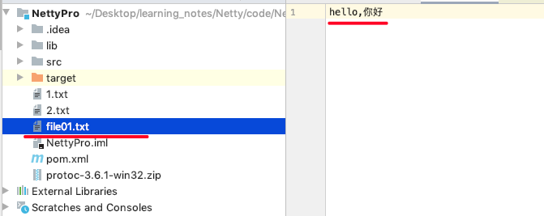
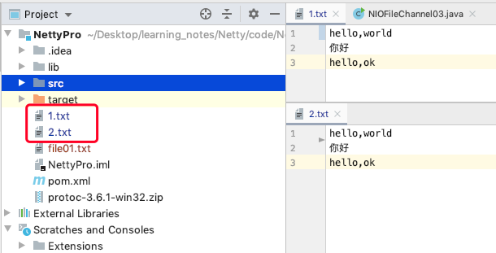
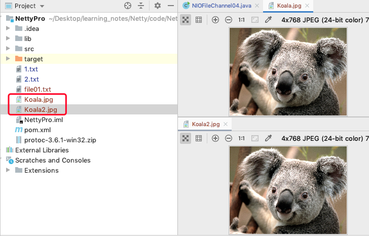
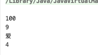
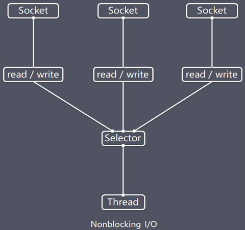
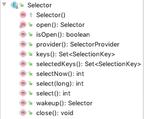
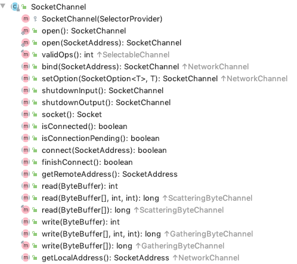
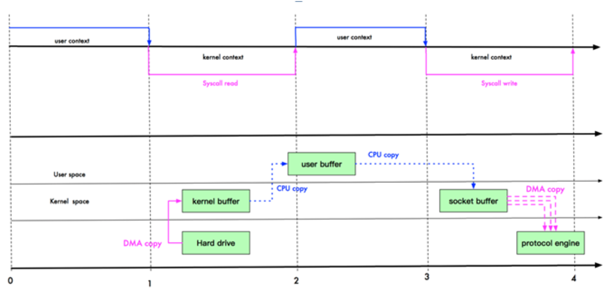
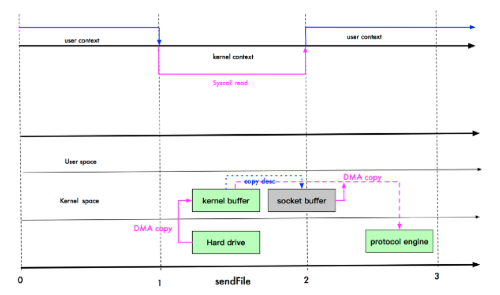

# 3.1 Java NIO 基本介绍


1. Java NIO 全称 **java non-blocking IO**，是指 JDK 提供的新 API。从 JDK1.4 开始，Java 提供了一系列改进的
   输入/输出的新特性，被统称为 NIO(即 New IO)，是==同步非阻塞==的。

2. NIO 相关类都被放在 **java.nio** 包及子包下，并且对原 java.io 包中的很多类进行改写。【基本案例】

   

3. NIO 有三大核心部分:**Channel(通道)，Buffer(缓冲区)，Selector(选择器)**。

| ddddddddddddddddddddddddddddddddddddddddddddddddddddddddddddddddddddddddddddddddddddddddddd | d    |
| ------------------------------------------------------------ | ---- |
|  |      |

4. **NIO 是 面向缓冲区 ，或者面向 块 编程的**。数据读取到一个它稍后处理的缓冲区，需要时可在缓冲区中前后 移动，这就增加了处理过程中的灵活性，使用它可以提供==非阻塞式==的高伸缩性网络

5. Java NIO 的非阻塞模式，使一个线程从某通道发送请求或者读取数据，但是它仅能得到目前可用的数据，如果目前没有数据可用时，就什么都不会获取，而==不是保持线程阻塞==，所以直至数据变的可以读取之前，该线程可以继续做其他的事情。 非阻塞写也是如此，一个线程请求写入一些数据到某通道，但不需要等待它完全写入， 这个线程同时可以去做别的事情。【后面有案例说明】

6. 通俗理解:NIO是可以做到用一个线程来处理多个操作的。假设有10000个请求过来，根据实际情况，可以分配 50 或者 100 个线程来处理。不像之前的阻塞 IO 那样，非得分配 10000 个。

7. HTTP2.0 使用了多路复用的技术，做到同一个连接并发处理多个请求，而且并发请求的数量比 HTTP1.1 大了好几个数量级。

8. 案例说明NIO的Buffer

```java
package com.atguigu.nio;

import java.nio.IntBuffer;

public class BasicBuffer {
    public static void main(String[] args) {

        //举例说明Buffer 的使用 (简单说明)
        //创建一个Buffer, 大小为 5, 即可以存放5个int
        IntBuffer intBuffer = IntBuffer.allocate(5);

        //向buffer 存放数据
//        intBuffer.put(10);
//        intBuffer.put(11);
//        intBuffer.put(12);
//        intBuffer.put(13);
//        intBuffer.put(14);
        for(int i = 0; i < intBuffer.capacity(); i++) {
            intBuffer.put( i * 2);
        }

        //如何从buffer读取数据
        //将buffer转换，读写切换(!!!)
        /*
        public final Buffer flip() {
        limit = position; //读数据不能超过5
        position = 0;
        mark = -1;
        return this;
    }
         */
        intBuffer.flip();
        intBuffer.position(1);//1,2
        System.out.println(intBuffer.get());
        intBuffer.limit(3);
        while (intBuffer.hasRemaining()) {
            System.out.println(intBuffer.get());
        }
    }
}
```


# 3.2 NIO 和 BIO 的比较


1. BIO 以流的方式处理数据,而 NIO 以块的方式处理数据,块 I/O 的效率比流 I/O 高很多。
2. BIO 是阻塞的，NIO 则是非阻塞的。
3. BIO 基于字节流和字符流进行操作，而 NIO 基于 Channel(通道)和 Buffer(缓冲区)进行操作，数据总是从通道 读取到缓冲区中，或者从缓冲区写入到通道中。Selector(选择器)用于监听多个通道的事件(比如:连接请求， 数据到达等)，因此使用==单个线程就可以监听多个客户端通道==。


# 3.3 NIO 三大核心原理示意图


一张图描述 NIO 的 Selector 、 Channel 和 Buffer 的关系


## 3.3.1 Selector 、 Channel 和 Buffer 的关系图(简单版)


1. 每个channel都会对应一个Buffer。
2. Selector 对应一个线程， 一个线程对应多个 channel(连接)。
3. 该图反应了有三个channel注册到该selector//程序。
4. 程序切换到哪个channel是有事件决定的,Event就是一个重要的概念。
5. Selector 会根据不同的事件，在各个通道上切换。
6. Buffer 就是一个内存块 ， 底层是有一个数组。
7. 数据的读取写入是通过Buffer,这个和BIO,BIO中要么是输入流，或者是输出流, 不能双向，但是 NIO 的 Buffer 是可以读也可以写, 需要 flip 方法切换 channel 是双向的, 可以返回底层操作系统的情况, 比如 Linux，底层的操作系统通道就是双向的。


# 3.4 缓冲区(Buffer)

## 3.4.1 基本介绍


缓冲区(Buffer):缓冲区本质上是一个可以读写数据的内存块，可以理解成是一个==容器对象(含数组)==，该对象提供了==一组方法==，可以更轻松地使用内存块，缓冲区对象内置了一些机制，能够跟踪和记录缓冲区的状态变化情况。Channel 提供从文件、网络读取数据的渠道，但是读取或写入的数据都必须经由 Buffer，如图: 【后面举例说明】


## 3.4.2 Buffer 类及其子类


1. 在 NIO 中，Buffer 是一个顶层父类，它是一个抽象类, 类的层级关系图:


2. Buffer类定义了所有的缓冲区都具有的四个属性来提供关于其所包含的数据元素的信息:

| dddddddddddddddddddddddddddddddddddddddddddddddddddddddddddddddddddddddddddddddddddddddddddddddddddddddddddddddddd | d    |
| ------------------------------------------------------------ | ---- |
|  |      |


2. Buffer类相关方法一览

```java
public abstract class Buffer {
    //JDK1.4时，引入的api
    public final int capacity( )//返回此缓冲区的容量
    public final int position( )//返回此缓冲区的位置
    public final Buffer position (int newPositio)//设置此缓冲区的位置
    public final int limit( )//返回此缓冲区的限制
    public final Buffer limit (int newLimit)//设置此缓冲区的限制
    public final Buffer mark( )//在此缓冲区的位置设置标记
    public final Buffer reset( )//将此缓冲区的位置重置为以前标记的位置
    public final Buffer clear( )//清除此缓冲区, 即将各个标记恢复到初始状态，但是数据并没有真正擦除, 后面操作会覆盖
    public final Buffer flip( )//反转此缓冲区
    public final Buffer rewind( )//重绕此缓冲区
    public final int remaining( )//返回当前位置与限制之间的元素数
    public final boolean hasRemaining( )//告知在当前位置和限制之间是否有元素
    public abstract boolean isReadOnly( );//告知此缓冲区是否为只读缓冲区
 
    //JDK1.6时引入的api
    public abstract boolean hasArray();//告知此缓冲区是否具有可访问的底层实现数组
    public abstract Object array();//返回此缓冲区的底层实现数组
    public abstract int arrayOffset();//返回此缓冲区的底层实现数组中第一个缓冲区元素的偏移量
    public abstract boolean isDirect();//告知此缓冲区是否为直接缓冲区
}
```


## 3.4.3  ByteBuffer


从前面可以看出对于 Java 中的基本数据类型(boolean 除外)，都有一个 Buffer 类型与之相对应，最常用的自然是 ByteBuffer 类(二进制数据)，该类的主要方法如下:

```java
public abstract class ByteBuffer {
    //缓冲区创建相关api
    public static ByteBuffer allocateDirect(int capacity)//创建直接缓冲区
    public static ByteBuffer allocate(int capacity)//设置缓冲区的初始容量
    public static ByteBuffer wrap(byte[] array)//把一个数组放到缓冲区中使用
    //构造初始化位置offset和上界length的缓冲区
    public static ByteBuffer wrap(byte[] array,int offset, int length)
     //缓存区存取相关API
    public abstract byte get( );//从当前位置position上get，get之后，position会自动+1
    public abstract byte get (int index);//从绝对位置get
    public abstract ByteBuffer put (byte b);//从当前位置上添加，put之后，position会自动+1
    public abstract ByteBuffer put (int index, byte b);//从绝对位置上put
 }
```


# 3.5 通道(Channel)

## 3.5.1 基本介绍


1. NIO 的通道类似于流，但有些区别如下:
   * 通道可以同时进行读写，而流只能读或者只能写
   * 通道可以实现异步读写数据
   * 通道可以从缓冲读数据，也可以写数据到缓冲
2. BIO 中的 stream 是单向的，例如 FileInputStream 对象只能进行读取数据的操作，而 NIO 中的通道(Channel) 是双向的，可以读操作，也可以写操作。
3. Channel 在 NIO 中是一个接口 `public interface Channel extends Closeable{}`
4. 常 用 的 Channel 类 有 : **FileChannel** 、 DatagramChannel 、 **ServerSocketChannel** 和 **SocketChannel** 。 【ServerSocketChanne 类似 ServerSocket , SocketChannel 类似 Socket】
5. FileChannel 用于文件的数据读写，DatagramChannel 用于 UDP 的数据读写，ServerSocketChannel 和SocketChannel 用于 TCP 的数据读写。


## 3.6.2 FileChannel 类


FileChannel 主要用来对本地文件进行 IO 操作，常见的方法有

```java
public int read(ByteBuffer dst);//从通道读取数据并放到缓冲区中
public int write(ByteBuffer src);//把缓冲区的数据写到通道中
public long transferFrom(ReadableByteChannel src, long position, long count);//从目标通道中复制数据到当前通道
public long transferTo(long position, long count, WritableByteChannel target);//把数据从当前通道复制给目标通道
```


## 3.5.3 应用实例 1-本地文件写数据


1. 使用前面的 ByteBuffer(缓冲) 和 FileChannel(通道)， 将 "hello,你好" 写入到 file01.txt 中
2. 文件不存在就创建
3. 代码实现

```java
package com.atguigu.nio;

import java.io.FileOutputStream;
import java.nio.ByteBuffer;
import java.nio.channels.FileChannel;

public class NIOFileChannel01 {
    public static void main(String[] args) throws Exception{

        String str = "hello,你好";
        //创建一个输出流->channel
        FileOutputStream fileOutputStream = new FileOutputStream("file01.txt");

        //通过 fileOutputStream 获取 对应的 FileChannel
        //这个 fileChannel 真实 类型是  FileChannelImpl
        FileChannel fileChannel = fileOutputStream.getChannel();

        //创建一个缓冲区 ByteBuffer
        ByteBuffer byteBuffer = ByteBuffer.allocate(1024);

        //将 str 放入 byteBuffer
        byteBuffer.put(str.getBytes());

        //对byteBuffer 进行flip
        byteBuffer.flip();

        //将byteBuffer 数据写入到 fileChannel
        fileChannel.write(byteBuffer);
        fileOutputStream.close();

    }
}
```




## 3.5.4 应用实例 2-本地文件读数据


1. 使用前面的 ByteBuffer(缓冲) 和 FileChannel(通道)， 将 file01.txt 中的数据读入到程序，并显示在控制台屏幕。
2. 假定文件已经存在、
3. 代码实现

```java
package com.atguigu.nio;

import java.io.File;
import java.io.FileInputStream;
import java.nio.ByteBuffer;
import java.nio.channels.FileChannel;

public class NIOFileChannel02 {
    public static void main(String[] args) throws Exception {

        //创建文件的输入流
        File file = new File("file01.txt");
        FileInputStream fileInputStream = new FileInputStream(file);

        //通过fileInputStream 获取对应的FileChannel -> 实际类型  FileChannelImpl
        FileChannel fileChannel = fileInputStream.getChannel();

        //创建缓冲区
        ByteBuffer byteBuffer = ByteBuffer.allocate((int) file.length());

        //将 通道的数据读入到Buffer
        fileChannel.read(byteBuffer);

        //将byteBuffer 的 字节数据 转成String
        System.out.println(new String(byteBuffer.array()));
        fileInputStream.close();
    }
}
```


## 3.5.5 应用实例 3-使用一个 Buffer 完成文件读取、写入


1. 使用 FileChannel(通道) 和 方法 read , write，完成文件的拷贝
2. 拷贝一个文本文件 1.txt , 放在项目下即可
3. 流程图


4. 代码实现

```java
package com.atguigu.nio;

import java.io.FileInputStream;
import java.io.FileOutputStream;
import java.nio.ByteBuffer;
import java.nio.channels.FileChannel;

public class NIOFileChannel03 {
    public static void main(String[] args) throws Exception {

        FileInputStream fileInputStream = new FileInputStream("1.txt");
        FileChannel fileChannel01 = fileInputStream.getChannel();

        FileOutputStream fileOutputStream = new FileOutputStream("2.txt");
        FileChannel fileChannel02 = fileOutputStream.getChannel();

        ByteBuffer byteBuffer = ByteBuffer.allocate(512);

        while (true) { //循环读取

            //这里有一个重要的操作，一定不要忘了
            /*
             public final Buffer clear() {
                position = 0;
                limit = capacity;
                mark = -1;
                return this;
            }
             */
            byteBuffer.clear(); //清空buffer
            int read = fileChannel01.read(byteBuffer);
            System.out.println("read =" + read);
            if(read == -1) { //表示读完
                break;
            }
            //将buffer 中的数据写入到 fileChannel02 -- 2.txt
            byteBuffer.flip();
            fileChannel02.write(byteBuffer);
        }

        //关闭相关的流
        fileInputStream.close();
        fileOutputStream.close();
    }
}
```




## 3.5.6 应用实例 4-拷贝文件 transferFrom 方法


1. 使用 FileChannel(通道) 和 方法 transferFrom ，完成文件的拷贝
2. 拷贝一张图片
3. 代码实现

```java
package com.atguigu.nio;

import java.io.FileInputStream;
import java.io.FileOutputStream;
import java.nio.channels.FileChannel;

public class NIOFileChannel04 {
    public static void main(String[] args)  throws Exception {

        //创建相关流
        FileInputStream fileInputStream = new FileInputStream("Koala.jpg");
        FileOutputStream fileOutputStream = new FileOutputStream("Koala2.jpg");

        //获取各个流对应的filechannel
        FileChannel sourceCh = fileInputStream.getChannel();
        FileChannel destCh = fileOutputStream.getChannel();

        //使用transferForm完成拷贝
        destCh.transferFrom(sourceCh,0,sourceCh.size());
        //关闭相关通道和流
        sourceCh.close();
        destCh.close();
        fileInputStream.close();
        fileOutputStream.close();
    }
}
```




## 3.5.7 关于 Buffer 和 Channel 的注意事项和细节


1. ByteBuffer 支持类型化的 put 和 get, put 放入的是什么数据类型，get 就应该使用相应的数据类型来取出，否则可能有 `BufferUnderflowException` 异常。[举例说明]

```java
package com.atguigu.nio;

import java.nio.ByteBuffer;

public class NIOByteBufferPutGet {
    public static void main(String[] args) {

        //创建一个Buffer
        ByteBuffer buffer = ByteBuffer.allocate(64);

        //类型化方式放入数据
        buffer.putInt(100);
        buffer.putLong(9);
        buffer.putChar('爱');
        buffer.putShort((short) 4);

        //取出
        buffer.flip();

        System.out.println();

        System.out.println(buffer.getInt());
        System.out.println(buffer.getLong());
        System.out.println(buffer.getChar());
        System.out.println(buffer.getShort());
    }
}
```




2. 可以将一个普通Buffer转成只读Buffer[举例说明]

```java
package com.atguigu.nio;

import java.nio.ByteBuffer;

public class ReadOnlyBuffer {
    public static void main(String[] args) {

        //创建一个buffer
        ByteBuffer buffer = ByteBuffer.allocate(2);

        for(int i = 0; i < 2; i++) {
            buffer.put((byte)i);
        }

        //读取
        buffer.flip();

        //得到一个只读的Buffer
        ByteBuffer readOnlyBuffer = buffer.asReadOnlyBuffer();
        System.out.println(readOnlyBuffer.getClass());

        //读取
        while (readOnlyBuffer.hasRemaining()) {
            System.out.println(readOnlyBuffer.get());
        }

        readOnlyBuffer.put((byte)100); //ReadOnlyBufferException
    }
}
```


3. NIO 还提供了 `MappedByteBuffer`， 可以让文件直接在内存(堆外的内存)中进行修改， 而如何同步到文件由 NIO 来完成。 [举例说明]

```java
package com.atguigu.nio;

import java.io.RandomAccessFile;
import java.nio.MappedByteBuffer;
import java.nio.channels.FileChannel;

/*
说明
1. MappedByteBuffer 可让文件直接在内存(堆外内存)修改, 操作系统不需要拷贝一次
 */
public class MappedByteBufferTest {
    public static void main(String[] args) throws Exception {

        RandomAccessFile randomAccessFile = new RandomAccessFile("1.txt", "rw");
        //获取对应的通道
        FileChannel channel = randomAccessFile.getChannel();

        /**
         * 参数1: FileChannel.MapMode.READ_WRITE 使用的读写模式
         * 参数2： 0 ： 可以直接修改的起始位置
         * 参数3:  5: 是映射到内存的大小(不是索引位置) ,即将 1.txt 的多少个字节映射到内存
         * 可以直接修改的范围就是 0-5
         * 实际类型 DirectByteBuffer
         */
        MappedByteBuffer mappedByteBuffer = channel.map(FileChannel.MapMode.READ_WRITE, 0, 5);

        mappedByteBuffer.put(0, (byte) 'H');
        mappedByteBuffer.put(3, (byte) '9');
//        mappedByteBuffer.put(5, (byte) 'Y');//IndexOutOfBoundsException

        randomAccessFile.close();
        System.out.println("修改成功~~");

    }
}
```


4. 面我们讲的读写操作，都是通过一个 Buffer 完成的，NIO 还支持 通过多个 Buffer (即 Buffer 数组) 完成读写操作，即 Scattering 和 Gathering 【举例说明】

```java
package com.atguigu.nio;

import java.net.InetSocketAddress;
import java.nio.ByteBuffer;
import java.nio.channels.ServerSocketChannel;
import java.nio.channels.SocketChannel;
import java.util.Arrays;

/**
 * Scattering：将数据写入到buffer时，可以采用buffer数组，依次写入 [分散]
 * Gathering: 从buffer读取数据时，可以采用buffer数组，依次读
 */
public class ScatteringAndGatheringTest {
    public static void main(String[] args) throws Exception {

        //使用 ServerSocketChannel 和 SocketChannel 网络

        ServerSocketChannel serverSocketChannel = ServerSocketChannel.open();
        InetSocketAddress inetSocketAddress = new InetSocketAddress(6666);

        //绑定端口到socket ，并启动
        serverSocketChannel.socket().bind(inetSocketAddress);

        //创建buffer数组
        ByteBuffer[] byteBuffers = new ByteBuffer[2];
        byteBuffers[0] = ByteBuffer.allocate(5);
        byteBuffers[1] = ByteBuffer.allocate(3);

        //等客户端连接(telnet)
        SocketChannel socketChannel = serverSocketChannel.accept();
        int messageLength = 8;   //假定从客户端接收8个字节
        //循环的读取
        while (true) {

            int byteRead = 0;

            while (byteRead < messageLength) {
                long l = socketChannel.read(byteBuffers);
                byteRead += l; //累计读取的字节数
                System.out.println("byteRead=" + byteRead);
                //使用流打印, 看看当前的这个buffer的position 和 limit
                Arrays.asList(byteBuffers).stream().map(buffer ->
                        "postion=" + buffer.position() + ", limit=" + buffer.limit()).forEach(System.out::println);
            }

            //将所有的buffer进行flip
            Arrays.asList(byteBuffers).forEach(buffer -> buffer.flip());

            //将数据读出显示到客户端
            long byteWirte = 0;
            while (byteWirte < messageLength) {
                long l = socketChannel.write(byteBuffers); //回显到客户端
                byteWirte += l;
            }

            //将所有的buffer 进行clear
            Arrays.asList(byteBuffers).forEach(buffer -> {
                buffer.clear();
            });

            System.out.println("byteRead:=" + byteRead + " byteWrite=" + byteWirte + ", messagelength" + messageLength);
        }

    }
}
```

客服端发送 6个字节(回车两个字节）：


socketChannel 让 byteBuffers 数组自动分配了元素(Scattering)。


客服端发送 8个字节(回车两个字节）：


socketChannel 让 byteBuffers 数组自动整合了元素(Gathering)。


# 3.6 Selector(选择器)

## 3.6.1 基本介绍


1. Java 的 NIO，用非阻塞的 IO 方式。可以用一个线程，处理多个的客户端连接，就会使用到 Selector(选择器)
2. Selector 能够检测多个注册的通道上是否有事件发生(注意:多个 Channel 以事件的方式可以注册到同一个 Selector)，如果有事件发生，便获取事件然后针对每个事件进行相应的处理。这样就可以只用一个单线程去管 理多个通道，也就是管理多个连接和请求。
3. 只有在连接/通道真正有读写事件发生时，才会进行读写，就大大地减少了系统开销，并且不必为每个连接都 创建一个线程，不用去维护多个线程。
4. 避免了多线程之间的上下文切换导致的开销。


## 3.6.2 Selector 示意图和特点说明




1. Netty 的 IO 线程 NioEventLoop 聚合了 Selector(选择器，也叫多路复用器)，可以同时并发处理成百上千个客户端连接。
2. 当线程从某客户端 Socket 通道进行读写数据时，若没有数据可用时，该线程可以进行其他任务。
3. 线程通常将非阻塞 IO 的空闲时间用于在其他通道上执行 IO 操作，所以单独的线程可以管理多个输入和输出通道。
4. 由于读写操作都是非阻塞的，这就可以充分提升 IO 线程的运行效率，避免由于频繁 I/O 阻塞导致的线程挂起。
5. 一个 I/O 线程可以并发处理 N 个客户端连接和读写操作，这从根本上解决了传统同步阻塞 I/O 一连接一线程模型，架构的性能、弹性伸缩能力和可靠性都得到了极大的提升。


## 3.6.3 Selector类相关方法


Selector 类是一个抽象类, 常用方法和说明如下:

```java
public abstract class Selector implements Closeable { 
	public static Selector open();//得到一个选择器对象
	public int select(long timeout);//监控所有注册的通道，当其中有 IO 操作可以进行时，将对应的 SelectionKey 加入到内部集合中并返回，参数用来设置超时时间
	public Set<SelectionKey> selectedKeys();//从内部集合中得到所有的 SelectionKey	
}
```




## 3.6.4 注意事项


1. NIO 中的 ServerSocketChannel 功能类似 ServerSocket，SocketChannel 功能类似 Socket。
2. selector 相关方法说明

```java
selector.select()//阻塞
selector.select(1000);//阻塞 1000 毫秒，在 1000 毫秒后返回 
selector.wakeup();//唤醒 selector 
selector.selectNow();//不阻塞，立马返还
```


# 3.7 NIO 非阻塞网络编程原理分析图


NIO 非阻塞网络编程相关的(Selector、SelectionKey、ServerScoketChannel 和 SocketChannel) 关系梳理图

| ddddddddddddddddddddddddddddddddddddddddddddddddddddddddddddddddddddddddddddddddddddddddddddd | d    |
| ------------------------------------------------------------ | ---- |
|                          |      |

对上图的说明:

1. 当客户端连接时，会通过 ServerSocketChannel 得到 SocketChannel。
2. Selector 进行监听 select 方法, 返回有事件发生的通道的个数。
3. 将socketChannel注册到Selector上，`register(Selectorsel,intops)`,一个selector上可以注册多个SocketChannel。
4. 注册后返回一个 SelectionKey，会和该 Selector 关联(集合)。
5. 进一步得到各个 SelectionKey (有事件发生)。
6. 在通过 SelectionKey 反向获取 SocketChannel , 方法 `channel()`。
7. 通过得到的 channel , 完成业务处理。


# 3.8 NIO 非阻塞网络编程代码实现


1. 编写一个 NIO 入门案例，实现服务器端和客户端之间的数据简单通讯(非阻塞)。
2. 目的:理解NIO非阻塞网络编程机制
3. 代码实现

```java
package com.atguigu.nio;

import java.net.InetSocketAddress;
import java.nio.ByteBuffer;
import java.nio.channels.*;
import java.util.Iterator;
import java.util.Set;

public class NIOServer {
    public static void main(String[] args) throws Exception {

        //创建ServerSocketChannel -> ServerSocket
        ServerSocketChannel serverSocketChannel = ServerSocketChannel.open();

        //得到一个Selecor对象
        Selector selector = Selector.open();

        //绑定一个端口6666, 在服务器端监听
        serverSocketChannel.socket().bind(new InetSocketAddress(6666));
        //设置为非阻塞
        serverSocketChannel.configureBlocking(false);

        //把 serverSocketChannel 注册到  selector 关心 事件为 OP_ACCEPT
        serverSocketChannel.register(selector, SelectionKey.OP_ACCEPT);

        System.out.println("注册后的selectionkey 数量=" + selector.keys().size()); // 1


        //循环等待客户端连接
        while (true) {

            //这里我们等待1秒，如果没有事件发生, 返回
            if (selector.select(1000) == 0) { //没有事件发生
                System.out.println("服务器等待了1秒，无连接");
                continue;
            }

            //如果返回的>0, 就获取到相关的 selectionKey集合
            //1.如果返回的>0， 表示已经获取到关注的事件
            //2. selector.selectedKeys() 返回关注事件的集合
            //   通过 selectionKeys 反向获取通道
            Set<SelectionKey> selectionKeys = selector.selectedKeys();
            System.out.println("selectionKeys 数量 = " + selectionKeys.size());

            //遍历 Set<SelectionKey>, 使用迭代器遍历
            Iterator<SelectionKey> keyIterator = selectionKeys.iterator();

            while (keyIterator.hasNext()) {
                //获取到SelectionKey
                SelectionKey key = keyIterator.next();
                //根据key 对应的通道发生的事件做相应处理
                if (key.isAcceptable()) { //如果是 OP_ACCEPT, 有新的客户端连接
                    //该该客户端生成一个 SocketChannel
                    SocketChannel socketChannel = serverSocketChannel.accept();
                    System.out.println("客户端连接成功 生成了一个 socketChannel " + socketChannel.hashCode());
                    //将  SocketChannel 设置为非阻塞
                    socketChannel.configureBlocking(false);
                    //将socketChannel 注册到selector, 关注事件为 OP_READ， 同时给socketChannel
                    //关联一个Buffer
                    socketChannel.register(selector, SelectionKey.OP_READ, ByteBuffer.allocate(1024));

                    System.out.println("客户端连接后 ，注册的selectionkey 数量=" + selector.keys().size()); //2,3,4..
                }
                if (key.isReadable()) {  //发生 OP_READ

                    //通过key 反向获取到对应channel
                    SocketChannel channel = (SocketChannel) key.channel();

                    //获取到该channel关联的buffer
                    ByteBuffer buffer = (ByteBuffer) key.attachment();
                    channel.read(buffer);
                    System.out.println("form 客户端 " + new String(buffer.array()));

                }

                //手动从集合中移动当前的selectionKey, 防止重复操作
                keyIterator.remove();

            }

        }

    }
}
```


```java
package com.atguigu.nio;

import java.net.InetSocketAddress;
import java.nio.ByteBuffer;
import java.nio.channels.SocketChannel;

public class NIOClient {
    public static void main(String[] args) throws Exception{

        //得到一个网络通道
        SocketChannel socketChannel = SocketChannel.open();
        //设置非阻塞
        socketChannel.configureBlocking(false);
        //提供服务器端的ip 和 端口
        InetSocketAddress inetSocketAddress = new InetSocketAddress("127.0.0.1", 6666);
        //连接服务器
        if (!socketChannel.connect(inetSocketAddress)) {

            while (!socketChannel.finishConnect()) {
                System.out.println("因为连接需要时间，客户端不会阻塞，可以做其它工作..");
            }
        }

        //...如果连接成功，就发送数据
        String str = "hello, 你好~";
        //Wraps a byte array into a buffer
        ByteBuffer buffer = ByteBuffer.wrap(str.getBytes());
        //发送数据，将 buffer 数据写入 channel
        socketChannel.write(buffer);
        System.in.read();

    }
}
```

先运行服务端，在运行客户端：


# 3.9 SelectionKey

## 3.9.1 和网络通道的注册关系


SelectionKey，表示 **Selector** 和网络通道的注册关系, 共四种:

```java
int OP_ACCEPT://有新的网络连接可以 accept，值为 16 
int OP_CONNECT://代表连接已经建立，值为 8
int OP_READ://代表读操作，值为 1
int OP_WRITE://代表写操作，值为 4
```

源码：

```java
public static final int OP_READ = 1 << 0; 
public static final int OP_WRITE = 1 << 2; 
public static final int OP_CONNECT = 1 << 3; 
public static final int OP_ACCEPT = 1 << 4;
```


## 3.9.2 SelectionKey相关方法


```java
public abstract class SelectionKey {
	public abstract Selector selector();//得到与之关联的 Selector 对象
	public abstract SelectableChannel channel();//得到与之关联的通道
	public final Object attachment();//得到与之关联的共享数据
	public abstract SelectionKey interestOps(int ops);//设置或改变监听事件
	public final boolean isAcceptable();//是否可以 accept
	public final boolean isReadable();//是否可以读
	public final boolean isWritable();//是否可以写
}
```


# 3.10 ServerSocketChannel


1. ServerSocketChannel 在服务器端监听新的客户端 Socket 连接
2. 相关方法如下

```java
public abstract class ServerSocketChannel extends AbstractSelectableChannel implements NetworkChannel{
	public static ServerSocketChannel open();//得到一个 ServerSocketChannel 通道
	public final ServerSocketChannel bind(SocketAddress local);//设置服务器端端口号
	public final SelectableChannel configureBlocking(boolean block);//设置阻塞或非阻塞模式，取值 false 表示采用非阻塞模式
	public SocketChannel accept();//接受一个连接，返回代表这个连接的通道对象
	public final SelectionKey register(Selector sel, int ops);//注册一个选择器并设置监听事件
}
```


# 3.11 SocketChannel


1. SocketChannel，网络 IO 通道，具体负责进行读写操作。NIO 把缓冲区的数据写入通道，或者把通道里的数据读到缓冲区。
2. 相关方法如下

```java
public abstract class SocketChannel extends AbstractSelectableChannel implements ByteChannel, ScatteringByteChannel, GatheringByteChannel, NetworkChannel{
    public static SocketChannel open();//得到一个 SocketChannel 通道
    public final SelectableChannel configureBlocking(boolean block);//设置阻塞或非阻塞模式，取值 false 表示采用非阻塞模式
    public boolean connect(SocketAddress remote);//连接服务器
    public boolean finishConnect();//如果上面的方法连接失败，接下来就要通过该方法完成连接操作
    public int write(ByteBuffer src);//往通道里写数据
    public int read(ByteBuffer dst);//从通道里读数据
    public final SelectionKey register(Selector sel, int ops, Object att);//注册一个选择器并设置监听事件，最后一个参数可以设置共享数据
    public final void close();//关闭通道
}
```




# 3.12 NIO 网络编程应用实例-群聊系统


1. 编写一个 NIO 群聊系统，实现服务器端和客户端之间的数据简单通讯(非阻塞)。
2. 实现多人群聊。
3. 服务器端:可以监测用户上线，离线，并实现消息转发功能。
4. 客户端:通过channel可以无阻塞发送消息给其它所有用户，同时可以接受其它用户发送的消息(有服务器转发得到)。
5. 目的:进一步理解NIO非阻塞网络编程机制
6. 步骤分析

```java
1. 先编写服务器端
1.1. 服务器启动并监听 6667
1.2  服务器接收客户端信息，并实现转发 [处理上线和离线]
2. 编写客户端
2.1 连接服务器
2.2 发送消息
2.3 接收服务器消息
```

7. 代码实现

```java

package com.atguigu.nio.groupchat;

import java.io.IOException;
import java.net.InetSocketAddress;
import java.nio.ByteBuffer;
import java.nio.channels.*;
import java.util.Iterator;

public class GroupChatServer {
    //定义属性
    private Selector selector;
    private ServerSocketChannel listenChannel;
    private static final int PORT = 6667;

    //构造器
    //初始化工作
    public GroupChatServer() {

        try {

            //得到选择器
            selector = Selector.open();
            //ServerSocketChannel
            listenChannel =  ServerSocketChannel.open();
            //绑定端口
            listenChannel.socket().bind(new InetSocketAddress(PORT));
            //设置非阻塞模式
            listenChannel.configureBlocking(false);
            //将该listenChannel 注册到selector
            listenChannel.register(selector, SelectionKey.OP_ACCEPT);

        }catch (IOException e) {
            e.printStackTrace();
        }

    }

    //监听
    public void listen() {

        System.out.println("监听线程: " + Thread.currentThread().getName());
        try {

            //循环处理
            while (true) {

                int count = selector.select();
                if(count > 0) {//有事件处理

                    //遍历得到selectionKey 集合
                    Iterator<SelectionKey> iterator = selector.selectedKeys().iterator();
                    while (iterator.hasNext()) {
                        //取出selectionkey
                        SelectionKey key = iterator.next();

                        //监听到accept
                        if(key.isAcceptable()) {
                            SocketChannel sc = listenChannel.accept();
                            sc.configureBlocking(false);
                            //将该 sc 注册到seletor
                            sc.register(selector, SelectionKey.OP_READ);

                            //提示
                            System.out.println(sc.getRemoteAddress() + " 上线 ");

                        }
                        if(key.isReadable()) { //通道发送read事件，即通道是可读的状态
                            //处理读 (专门写方法..)
                            readData(key);
                        }
                        //当前的key 删除，防止重复处理
                        iterator.remove();
                    }

                } else {
                    System.out.println("等待....");
                }
            }

        }catch (Exception e) {
            e.printStackTrace();

        }finally {
            //发生异常处理....
        }
    }

    //读取客户端消息
    private void readData(SelectionKey key) {

        //取到关联的channle
        SocketChannel channel = null;

        try {
           //得到channel
            channel = (SocketChannel) key.channel();
            //创建buffer
            ByteBuffer buffer = ByteBuffer.allocate(1024);

            int count = channel.read(buffer);
            //根据count的值做处理
            if(count > 0) {
                //把缓存区的数据转成字符串
                String msg = new String(buffer.array());
                //输出该消息
                System.out.println("from 客户端: " + msg);

                //向其它的客户端转发消息(去掉自己), 专门写一个方法来处理
                sendInfoToOtherClients(msg, channel);
            }

        }catch (IOException e) {
            try {
                System.out.println(channel.getRemoteAddress() + " 离线了..");
                //取消注册
                key.cancel();
                //关闭通道
                channel.close();
            }catch (IOException e2) {
                e2.printStackTrace();;
            }
        }
    }

    //转发消息给其它客户(通道)
    private void sendInfoToOtherClients(String msg, SocketChannel self ) throws  IOException{

        System.out.println("服务器转发消息中...");
        System.out.println("服务器转发数据给客户端线程: " + Thread.currentThread().getName());
        //遍历 所有注册到selector 上的 SocketChannel,并排除 self
        for(SelectionKey key: selector.keys()) {

            //通过 key  取出对应的 SocketChannel
            Channel targetChannel = key.channel();

            //排除自己
            if(targetChannel instanceof  SocketChannel && targetChannel != self) {

                //转型
                SocketChannel dest = (SocketChannel)targetChannel;
                //将msg 存储到buffer
                ByteBuffer buffer = ByteBuffer.wrap(msg.getBytes());
                //将buffer 的数据写入 通道
                dest.write(buffer);
            }
        }

    }

    public static void main(String[] args) {

        //创建服务器对象
        GroupChatServer groupChatServer = new GroupChatServer();
        groupChatServer.listen();
    }
}
```


```java
package com.atguigu.nio.groupchat;

import java.io.IOException;
import java.net.InetSocketAddress;
import java.nio.ByteBuffer;
import java.nio.channels.SelectionKey;
import java.nio.channels.Selector;
import java.nio.channels.SocketChannel;
import java.util.Iterator;
import java.util.Scanner;
import java.util.Set;

public class GroupChatClient {

    //定义相关的属性
    private final String HOST = "127.0.0.1"; // 服务器的ip
    private final int PORT = 6667; //服务器端口
    private Selector selector;
    private SocketChannel socketChannel;
    private String username;

    //构造器, 完成初始化工作
    public GroupChatClient() throws IOException {

        selector = Selector.open();
        //连接服务器
        socketChannel = socketChannel.open(new InetSocketAddress("127.0.0.1", PORT));
        //设置非阻塞
        socketChannel.configureBlocking(false);
        //将channel 注册到selector
        socketChannel.register(selector, SelectionKey.OP_READ);
        //得到username
        username = socketChannel.getLocalAddress().toString().substring(1);
        System.out.println(username + " is ok...");

    }

    //向服务器发送消息
    public void sendInfo(String info) {

        info = username + " 说：" + info;

        try {
            socketChannel.write(ByteBuffer.wrap(info.getBytes()));
        }catch (IOException e) {
            e.printStackTrace();
        }
    }

    //读取从服务器端回复的消息
    public void readInfo() {

        try {

            int readChannels = selector.select();
            if(readChannels > 0) {//有可以用的通道

                Iterator<SelectionKey> iterator = selector.selectedKeys().iterator();
                while (iterator.hasNext()) {

                    SelectionKey key = iterator.next();
                    if(key.isReadable()) {
                        //得到相关的通道
                       SocketChannel sc = (SocketChannel) key.channel();
                       //得到一个Buffer
                        ByteBuffer buffer = ByteBuffer.allocate(1024);
                        //读取
                        sc.read(buffer);
                        //把读到的缓冲区的数据转成字符串
                        String msg = new String(buffer.array());
                        System.out.println(msg.trim());
                    }
                }
                iterator.remove(); //删除当前的selectionKey, 防止重复操作
            } else {
                //System.out.println("没有可以用的通道...");

            }

        }catch (Exception e) {
            e.printStackTrace();
        }
    }

    public static void main(String[] args) throws Exception {

        //启动我们客户端
        GroupChatClient chatClient = new GroupChatClient();

        //启动一个线程, 每个3秒，读取从服务器发送数据
        new Thread() {
            public void run() {

                while (true) {
                    chatClient.readInfo();
                    try {
                        Thread.currentThread().sleep(3000);
                    }catch (InterruptedException e) {
                        e.printStackTrace();
                    }
                }
            }
        }.start();

        //发送数据给服务器端
        Scanner scanner = new Scanner(System.in);

        while (scanner.hasNextLine()) {
            String s = scanner.nextLine();
            chatClient.sendInfo(s);
        }
    }
}
```


将服务端启动，然后启动三个客户端：


客服端1发送"我是 58085":


服务端和其他客户端：


# 3.13 NIO 与零拷贝

## 3.13.1 零拷贝基本介绍


1. 零拷贝是网络编程的关键，很多性能优化都离不开。
2. 在 Java 程序中，常用的零拷贝有 mmap(内存映射) 和 sendFile。那么，他们在 OS 里，到底是怎么样的一个的设计?我们分析 mmap 和 sendFile 这两个零拷贝。
3. 另外我们看下NIO中如何使用零拷贝。


## 3.13.2 传统 IO 数据读写


```java
package com.atguigu.nio.zerocopy;

import java.io.DataInputStream;
import java.net.ServerSocket;
import java.net.Socket;

//java IO 的服务器
public class OldIOServer {

    public static void main(String[] args) throws Exception {
        ServerSocket serverSocket = new ServerSocket(7001);

        while (true) {
            Socket socket = serverSocket.accept();
            DataInputStream dataInputStream = new DataInputStream(socket.getInputStream());

            try {
                byte[] byteArray = new byte[4096];

                while (true) {
                    int readCount = dataInputStream.read(byteArray, 0, byteArray.length);

                    if (-1 == readCount) {
                        break;
                    }
                }
            } catch (Exception ex) {
                ex.printStackTrace();
            }
        }
    }
}
```

```java
package com.atguigu.nio.zerocopy;

import java.io.DataOutputStream;
import java.io.FileInputStream;
import java.io.InputStream;
import java.net.Socket;

public class OldIOClient {

    public static void main(String[] args) throws Exception {
        Socket socket = new Socket("localhost", 7001);

        String fileName = "protoc-3.6.1-win32.zip";
        InputStream inputStream = new FileInputStream(fileName);

        DataOutputStream dataOutputStream = new DataOutputStream(socket.getOutputStream());

        byte[] buffer = new byte[4096];
        long readCount;
        long total = 0;

        long startTime = System.currentTimeMillis();

        while ((readCount = inputStream.read(buffer)) >= 0) {
            total += readCount;
            dataOutputStream.write(buffer);
        }

        System.out.println("发送总字节数： " + total + ", 耗时： " + (System.currentTimeMillis() - startTime));

        dataOutputStream.close();
        socket.close();
        inputStream.close();
    }
}
```

启动服务端，然后启动客户端：


## 3.13.3 传统 IO 模型


| d                                | d    |
| -------------------------------- | ---- |
|  |      |

DMA: direct memory access 直接内存拷贝(不使用 CPU)


## 3.13.4 mmap 优化


1. mmap 通过内存映射，==将文件映射到内核缓冲区==，同时，==用户空间可以共享内核空间的数据==。这样，在进行网络传输时，就可以减少内核空间到用户空间的拷贝次数。如下图

| dddddddddddddddddddddddddddddddddddddddddddddddddddddddddddddddddddddddddddddddddddddddddddddddddddddddddddddddd | d    |
| ------------------------------------------------------------ | ---- |
|                        |      |


## 3.13.5 sendFile 优化


1. Linux 2.1 版本 提供了 sendFile 函数，其基本原理如下：数据根本不经过用户态，==直接从内核缓冲区进入到 Socket Buffer==，同时，由于和用户态完全无关，就减少了一次上下文切换。
2. 示意图

| dddddddddddddddddddddddddddddddddddddddddddddddddddddddddddddddddddddddddddddddddddddddddddddddd | d    |
| ------------------------------------------------------------ | ---- |
|                            |      |

3. 提示:零拷贝从操作系统角度，是没有cpu拷贝

4. Linux 在 2.4 版本中，做了一些修改，==避免了从内核缓冲区拷贝到 Socket buffer 的操作==，直接拷贝到协议栈，从而再一次减少了数据拷贝。具体如下图和小结：

| ddddddddddddddddddddddddddddddddddddddddddddddddddddddddddddddddddddddddddddddddddddddddddddddddddd | d    |
| ------------------------------------------------------------ | ---- |
|                              |      |

5. 这里其实有一次cpu拷贝 kernel buffer -> socket buffer ，但是，拷贝的信息很少，比如 lenght , offset , 消耗低，可以忽略。


## 3.13.6 零拷贝的再次理解


1. 我们说零拷贝，是==从操作系统的角度==来说的。因为内核缓冲区之间，没有数据是重复的(只有 kernel buffer 有一份数据)。
2. 零拷贝不仅仅带来更少的数据复制，还能带来其他的性能优势，例如更少的上下文切换，更少的 CPU 缓存伪共享以及无 CPU 校验和计算。


## 3.13. 7 mmap 和 sendFile 的区别


1. mmap 适合小数据量读写，sendFile 适合大文件传输。
2. mmap 需要 4 次上下文切换，3 次数据拷贝;sendFile 需要 3 次上下文切换，最少 2 次数据拷贝。
3. sendFile 可以利用 DMA 方式，减少 CPU 拷贝，mmap 则不能(必须从内核拷贝到 Socket 缓冲区)。


## 3.13.8 NIO 零拷贝案例


1. 使用传统的IO方法传递一个大文件。
2. 使用NIO零拷贝方式传递(transferTo)一个大文件。
3. 看看两种传递方式耗时时间分别是多少
4. 代码实现

```java
package com.atguigu.nio.zerocopy;

import java.net.InetSocketAddress;
import java.net.ServerSocket;
import java.nio.ByteBuffer;
import java.nio.channels.ServerSocketChannel;
import java.nio.channels.SocketChannel;

//服务器
public class NewIOServer {
    public static void main(String[] args) throws Exception {

        InetSocketAddress address = new InetSocketAddress(7001);

        ServerSocketChannel serverSocketChannel = ServerSocketChannel.open();

        ServerSocket serverSocket = serverSocketChannel.socket();

        serverSocket.bind(address);

        //创建buffer
        ByteBuffer byteBuffer = ByteBuffer.allocate(4096);

        while (true) {
            SocketChannel socketChannel = serverSocketChannel.accept();

            int readcount = 0;
            while (-1 != readcount) {
                try {

                    readcount = socketChannel.read(byteBuffer);

                } catch (Exception ex) {
                    // ex.printStackTrace();
                    break;
                }
                //
                byteBuffer.rewind(); //倒带 position = 0 mark 作废
            }
        }
    }
}
```

```java
package com.atguigu.nio.zerocopy;

import java.io.FileInputStream;
import java.net.InetSocketAddress;
import java.nio.channels.FileChannel;
import java.nio.channels.SocketChannel;

public class NewIOClient {
    public static void main(String[] args) throws Exception {

        SocketChannel socketChannel = SocketChannel.open();
        socketChannel.connect(new InetSocketAddress("localhost", 7001));
        String filename = "protoc-3.6.1-win32.zip";

        //得到一个文件channel
        FileChannel fileChannel = new FileInputStream(filename).getChannel();

        //准备发送
        long startTime = System.currentTimeMillis();

        //在linux下一个transferTo 方法就可以完成传输
        //在windows 下 一次调用 transferTo 只能发送8M , 就需要分段传输文件, 而且要主要
        //Windows下传输时的位置 =》 文件总大小除以8M,看要循环几次
        //transferTo 底层使用到零拷贝
        long transferCount = fileChannel.transferTo(0, fileChannel.size(), socketChannel);

        System.out.println("发送的总的字节数 =" + transferCount + " 耗时:" + (System.currentTimeMillis() - startTime));

        //关闭
        fileChannel.close();

    }
}
```

启动服务端，然后启动客户端：


# 3.14 JavaAIO 基本介绍


1. JDK 7 引入了 Asynchronous I/O，即 AIO。在进行 I/O 编程中，常用到两种模式:Reactor 和 Proactor。Java 的 NIO 就是 Reactor，当有事件触发时，服务器端得到通知，进行相应的处理。
2. AIO 即 NIO2.0，叫做异步不阻塞的 IO。AIO 引入异步通道的概念，采用了 Proactor 模式，简化了程序编写， 有效的请求才启动线程，它的特点是先由操作系统完成后才通知服务端程序启动线程去处理，一般适用于连接数较多且连接时间较长的应用。
3. 目前AIO还没有广泛应用，Netty也是基于NIO,而不是AIO，因此我们就不详解AIO了，有兴趣的可以参考 <<Java 新一代网络编程模型 AIO 原理及 Linux 系统 AIO 介绍 >>http://www.52im.net/thread-306-1-1.html


# 3.15 BIO、NIO、AIO 对比表


|          | **BIO**  | **NIO**                | **AIO**    |
| -------- | -------- | ---------------------- | ---------- |
| IO 模型  | 同步阻塞 | 同步非阻塞（多路复用） | 异步非阻塞 |
| 编程难度 | 简单     | 复杂                   | 复杂       |
| 可靠性   | 差       | 好                     | 好         |
| 吞吐量   | 低       | 高                     | 高         |

**举例说明** 

1. **同步阻塞**：到理发店理发，就一直等理发师，直到轮到自己理发。
2. **同步非阻塞**：到理发店理发，发现前面有其它人理发，给理发师说下，先干其他事情，一会过来看是否轮到自己。

3. **步步非阻塞**：给理发师打电话，让理发师上门服务，自己干其它事情，理发师自己来家给你理发。

