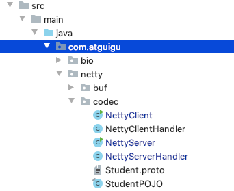
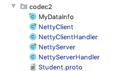

# 7.1 编码和解码的基本介绍


1. 编写网络应用程序时，因为数据在网络中传输的都是二进制字节码数据，在发送数据时就需要编码，接收数据 时就需要解码 [示意图]


2. codec(编解码器) 的组成部分有两个:decoder(解码器)和 encoder(编码器)。encoder 负责把业务数据转换成字节 码数据，decoder 负责把字节码数据转换成业务数据。


# 7.2 Netty 本身的编码解码的机制和问题分析


1. Netty 自身提供了一些 codec(编解码器)
2. Netty 提供的编码器和解码器

```java
StringEncoder;//对字符串数据进行编码
ObjectEncoder;//对 Java 对象进行编码
//...
StringDecoder;//对字符串数据进行解码
ObjectDecoder;//对 Java 对象进行解码
//...
```

3. Netty 本身自带的 ObjectDecoder 和 ObjectEncoder 可以用来实现 POJO 对象或各种业务对象的编码和解码，底层使用的仍是 Java 序列化技术 , 而 Java 序列化技术本身效率就不高，存在如下问题:
   * 无法跨语言
   * 序列化后的体积太大，是二进制编码的 5 倍多。
   * 序列化性能太低
4. => 引出新的解决方案 [Google 的 Protobuf]


# 7.3 Protobuf


Protobuf 基本介绍和使用示意图

1. Protobuf 是 Google 发布的开源项目，全称 Google Protocol Buffers，是一种轻便高效的结构化数据存储格式， 可以用于结构化数据串行化，或者说序列化。它很适合做数据存储或==RPC[远程过程调用 remote procedure call ] 数据交换格式== 。
   目前很多公司 **http+json=> tcp+protobuf**
2. 参考文档 : [https://](https://developers.google.com/protocol-buffers/docs/proto)[developers.google.com/protocol-buffers/docs/proto](https://developers.google.com/protocol-buffers/docs/proto)  语言指南
3. Protobuf 是以 message 的方式来管理数据的。
4. 支持跨平台、==跨语言==，即[客户端和服务器端可以是不同的语言编写的] （==支持目前绝大多数语言==，例如 C++、C#、Java、python 等）。
5. 高性能，高可靠性
6. 使用 protobuf 编译器能自动生成代码，Protobuf 是将类的定义使用.proto 文件进行描述。说明，在 idea 中编写 .proto 文件时，会自动提示是否下载 .ptotot 编写插件，可以让语法高亮。
7. 然后通过 protoc.exe 编译器根据.proto 自动生成.java 文件。
8. protobuf 使用示意图


# 7.4 Protobuf 快速入门实例


1. 客户端可以发送一个 Student PoJo 对象到服务器 (通过 Protobuf 编码)
2. 服务端能接收 Student PoJo 对象，并显示信息(通过 Protobuf 解码)


引入依赖

```xml
        <dependency>
            <groupId>com.google.protobuf</groupId>
            <artifactId>protobuf-java</artifactId>
            <version>3.6.1</version>
        </dependency>
```

编写proto文件Student.proto

```protobuf
syntax = "proto3"; //版本
option java_outer_classname = "StudentPOJO";//生成的外部类名，同时也是文件名
//protobuf 使用message 管理数据
message Student { //会在 StudentPOJO 外部类生成一个内部类 Student， 他是真正发送的POJO对象
    int32 id = 1; // Student 类中有 一个属性 名字为 id 类型为int32(protobuf类型) 1表示属性序号，不是值
    string name = 2;
}
```


MAC 先可参照  https://blog.csdn.net/new_Aiden/article/details/73076860 将Student.proto 文件生成StudentPOJO.java文件(也可以==idea集成ProtoBuf的插件==操作，可参考https://blog.csdn.net/qq_21383435/article/details/88605891)

```cmd
protoc --java_out=. Student.proto
```



```java
package com.atguigu.netty.codec;

import io.netty.bootstrap.ServerBootstrap;
import io.netty.channel.*;
import io.netty.channel.nio.NioEventLoopGroup;
import io.netty.channel.socket.SocketChannel;
import io.netty.channel.socket.nio.NioServerSocketChannel;
import io.netty.handler.codec.protobuf.ProtobufDecoder;

public class NettyServer {
    public static void main(String[] args) throws Exception {

        EventLoopGroup bossGroup = new NioEventLoopGroup(1);
        EventLoopGroup workerGroup = new NioEventLoopGroup(); //8

        try {
            ServerBootstrap bootstrap = new ServerBootstrap();

            //使用链式编程来进行设置
            bootstrap.group(bossGroup, workerGroup) //设置两个线程组
                    .channel(NioServerSocketChannel.class) //使用NioSocketChannel 作为服务器的通道实现
                    .option(ChannelOption.SO_BACKLOG, 128) // 设置线程队列得到连接个数
                    .childOption(ChannelOption.SO_KEEPALIVE, true) //设置保持活动连接状态
                    .childHandler(new ChannelInitializer<SocketChannel>() {//创建一个通道初始化对象(匿名对象)
                        //给pipeline 设置处理器
                        @Override
                        protected void initChannel(SocketChannel ch) throws Exception {

                            ChannelPipeline pipeline = ch.pipeline();
                            //在pipeline加入ProtoBufDecoder
                            //指定对哪种对象进行解码
                            pipeline.addLast("decoder", new ProtobufDecoder(StudentPOJO.Student.getDefaultInstance()));
                            pipeline.addLast(new NettyServerHandler());
                        }
                    });

            System.out.println(".....服务器 is ready...");
            ChannelFuture cf = bootstrap.bind(9000).sync();

            //给cf 注册监听器，监控我们关心的事件
            cf.addListener(new ChannelFutureListener() {
                @Override
                public void operationComplete(ChannelFuture future) throws Exception {
                    if (cf.isSuccess()) {
                        System.out.println("监听端口 9000 成功");
                    } else {
                        System.out.println("监听端口 9000 失败");
                    }
                }
            });

            //对关闭通道进行监听
            cf.channel().closeFuture().sync();
        } finally {
            bossGroup.shutdownGracefully();
            workerGroup.shutdownGracefully();
        }

    }

}
```

```java
package com.atguigu.netty.codec;

import io.netty.buffer.ByteBuf;
import io.netty.buffer.Unpooled;
import io.netty.channel.*;
import io.netty.util.CharsetUtil;

public class NettyServerHandler extends SimpleChannelInboundHandler<StudentPOJO.Student> {

    @Override
    public void channelRead0(ChannelHandlerContext ctx, StudentPOJO.Student msg) throws Exception {
        //读取从客户端发送的StudentPojo.Student
        System.out.println("客户端发送的数据 id=" + msg.getId() + " 名字=" + msg.getName());
    }

//    //读取数据实际(这里我们可以读取客户端发送的消息)
//    /*
//    1. ChannelHandlerContext ctx:上下文对象, 含有 管道pipeline , 通道channel, 地址
//    2. Object msg: 就是客户端发送的数据 默认Object
//     */
//    @Override
//    public void channelRead(ChannelHandlerContext ctx, Object msg) throws Exception {
//
//        //读取从客户端发送的StudentPojo.Student
//
//        StudentPOJO.Student student = (StudentPOJO.Student) msg;
//
//        System.out.println("客户端发送的数据 id=" + student.getId() + " 名字=" + student.getName());
//    }

    //数据读取完毕
    @Override
    public void channelReadComplete(ChannelHandlerContext ctx) throws Exception {
        //将数据写入到缓存，并刷新
        //一般讲，我们对这个发送的数据进行编码
        ctx.writeAndFlush(Unpooled.copiedBuffer("hello, 客户端~(>^ω^<)喵1", CharsetUtil.UTF_8));
    }

    //处理异常, 一般是需要关闭通道
    @Override
    public void exceptionCaught(ChannelHandlerContext ctx, Throwable cause) throws Exception {
        ctx.close();
    }
}
```


```java
package com.atguigu.netty.codec;

import io.netty.bootstrap.Bootstrap;
import io.netty.channel.ChannelFuture;
import io.netty.channel.ChannelInitializer;
import io.netty.channel.ChannelPipeline;
import io.netty.channel.EventLoopGroup;
import io.netty.channel.nio.NioEventLoopGroup;
import io.netty.channel.socket.SocketChannel;
import io.netty.channel.socket.nio.NioSocketChannel;
import io.netty.handler.codec.protobuf.ProtobufEncoder;

public class NettyClient {
    public static void main(String[] args) throws Exception {

        //客户端需要一个事件循环组
        EventLoopGroup group = new NioEventLoopGroup();
        try {
            //创建客户端启动对象
            //注意客户端使用的不是 ServerBootstrap 而是 Bootstrap
            Bootstrap bootstrap = new Bootstrap();

            //设置相关参数
            bootstrap.group(group) //设置线程组
                    .channel(NioSocketChannel.class) // 设置客户端通道的实现类(反射)
                    .handler(new ChannelInitializer<SocketChannel>() {
                        @Override
                        protected void initChannel(SocketChannel ch) throws Exception {
                            ChannelPipeline pipeline = ch.pipeline();
                            //在pipeline中加入 ProtoBufEncoder
                            pipeline.addLast("encoder", new ProtobufEncoder());
                            pipeline.addLast(new NettyClientHandler()); //加入自己的处理器
                        }
                    });

            System.out.println("客户端 ok..");

            //启动客户端去连接服务器端
            //关于 ChannelFuture 要分析，涉及到netty的异步模型
            ChannelFuture channelFuture = bootstrap.connect("127.0.0.1", 9000).sync();
            //给关闭通道进行监听
            channelFuture.channel().closeFuture().sync();
        }finally {
            group.shutdownGracefully();
        }
    }
}
```

```java
package com.atguigu.netty.codec;

import io.netty.buffer.ByteBuf;
import io.netty.buffer.Unpooled;
import io.netty.channel.ChannelHandlerContext;
import io.netty.channel.ChannelInboundHandlerAdapter;
import io.netty.util.CharsetUtil;

public class NettyClientHandler extends ChannelInboundHandlerAdapter {

    //当通道就绪就会触发该方法
    @Override
    public void channelActive(ChannelHandlerContext ctx) throws Exception {

        //发生一个Student 对象到服务器

        StudentPOJO.Student student = StudentPOJO.Student.newBuilder().setId(4).setName("智多星 吴用").build();
        //Teacher , Member ,Message
        ctx.writeAndFlush(student);
    }

    //当通道有读取事件时，会触发
    @Override
    public void channelRead(ChannelHandlerContext ctx, Object msg) throws Exception {
        ByteBuf buf = (ByteBuf) msg;
        System.out.println("服务器回复的消息:" + buf.toString(CharsetUtil.UTF_8));
        System.out.println("服务器的地址： "+ ctx.channel().remoteAddress());
    }

    @Override
    public void exceptionCaught(ChannelHandlerContext ctx, Throwable cause) throws Exception {
        cause.printStackTrace();
        ctx.close();
    }
}
```


运行服务器，然后启动客服端：


# 7.5 Protobuf 快速入门实例 2


1. 客户端可以随机发送 Student PoJo/ Worker PoJo 对象到服务器 (通过 Protobuf 编码)
2. 服务端能接收StudentPoJo/WorkerPoJo对象(需要判断是哪种类型)，并显示信息(通过Protobuf解码)





```protobuf
syntax = "proto3";
option optimize_for = SPEED; // 加快解析
option java_package="com.atguigu.netty.codec2";   //指定生成到哪个包下
option java_outer_classname="MyDataInfo"; // 外部类名, 文件名

//protobuf 可以使用message 管理其他的message
message MyMessage {

    //定义一个枚举类型
    enum DataType {
        StudentType = 0; //在proto3 要求enum的编号从0开始
        WorkerType = 1;
    }

    //用data_type 来标识传的是哪一个枚举类型
    DataType data_type = 1;

    //表示每次枚举类型最多只能出现其中的一个, 节省空间
    oneof dataBody {
        Student student = 2;
        Worker worker = 3;
    }

}

message Student {
    int32 id = 1;//Student类的属性
    string name = 2; //
}
message Worker {
    string name=1;
    int32 age=2;
}
```


```java
package com.atguigu.netty.codec2;

import com.atguigu.netty.codec.StudentPOJO;
import io.netty.bootstrap.ServerBootstrap;
import io.netty.channel.*;
import io.netty.channel.nio.NioEventLoopGroup;
import io.netty.channel.socket.SocketChannel;
import io.netty.channel.socket.nio.NioServerSocketChannel;
import io.netty.handler.codec.protobuf.ProtobufDecoder;

public class NettyServer {
    public static void main(String[] args) throws Exception {

        EventLoopGroup bossGroup = new NioEventLoopGroup(1);
        EventLoopGroup workerGroup = new NioEventLoopGroup(); //8

        try {
            //创建服务器端的启动对象，配置参数
            ServerBootstrap bootstrap = new ServerBootstrap();

            //使用链式编程来进行设置
            bootstrap.group(bossGroup, workerGroup) //设置两个线程组
                    .channel(NioServerSocketChannel.class) //使用NioSocketChannel 作为服务器的通道实现
                    .option(ChannelOption.SO_BACKLOG, 128) // 设置线程队列得到连接个数
                    .childOption(ChannelOption.SO_KEEPALIVE, true) //设置保持活动连接状态
                    .childHandler(new ChannelInitializer<SocketChannel>() {//创建一个通道初始化对象(匿名对象)
                        //给pipeline 设置处理器
                        @Override
                        protected void initChannel(SocketChannel ch) throws Exception {

                            ChannelPipeline pipeline = ch.pipeline();
                            //在pipeline加入ProtoBufDecoder
                            //指定对哪种对象进行解码
                            pipeline.addLast("decoder", new ProtobufDecoder(MyDataInfo.MyMessage.getDefaultInstance()));
                            pipeline.addLast(new NettyServerHandler());
                        }
                    }); // 给我们的workerGroup 的 EventLoop 对应的管道设置处理器

            System.out.println(".....服务器 is ready...");

            //绑定一个端口并且同步, 生成了一个 ChannelFuture 对象
            //启动服务器(并绑定端口)
            ChannelFuture cf = bootstrap.bind(9000).sync();

            //给cf 注册监听器，监控我们关心的事件
            cf.addListener(new ChannelFutureListener() {
                @Override
                public void operationComplete(ChannelFuture future) throws Exception {
                    if (cf.isSuccess()) {
                        System.out.println("监听端口 9000 成功");
                    } else {
                        System.out.println("监听端口 9000 失败");
                    }
                }
            });

            //对关闭通道进行监听
            cf.channel().closeFuture().sync();
        }finally {
            bossGroup.shutdownGracefully();
            workerGroup.shutdownGracefully();
        }
    }
}
```

```java
package com.atguigu.netty.codec2;

import com.atguigu.netty.codec.StudentPOJO;
import io.netty.buffer.Unpooled;
import io.netty.channel.ChannelHandlerContext;
import io.netty.channel.SimpleChannelInboundHandler;
import io.netty.util.CharsetUtil;

public class NettyServerHandler extends SimpleChannelInboundHandler<MyDataInfo.MyMessage> {

    @Override
    public void channelRead0(ChannelHandlerContext ctx, MyDataInfo.MyMessage msg) throws Exception {

        //根据dataType 来显示不同的信息
        MyDataInfo.MyMessage.DataType dataType = msg.getDataType();
        if(dataType == MyDataInfo.MyMessage.DataType.StudentType) {

            MyDataInfo.Student student = msg.getStudent();
            System.out.println("学生id=" + student.getId() + " 学生名字=" + student.getName());

        } else if(dataType == MyDataInfo.MyMessage.DataType.WorkerType) {
            MyDataInfo.Worker worker = msg.getWorker();
            System.out.println("工人的名字=" + worker.getName() + " 年龄=" + worker.getAge());
        } else {
            System.out.println("传输的类型不正确");
        }

    }

    //数据读取完毕
    @Override
    public void channelReadComplete(ChannelHandlerContext ctx) throws Exception {
        //将数据写入到缓存，并刷新
        //一般讲，我们对这个发送的数据进行编码
        ctx.writeAndFlush(Unpooled.copiedBuffer("hello, 客户端~(>^ω^<)喵1", CharsetUtil.UTF_8));
    }

    //处理异常, 一般是需要关闭通道
    @Override
    public void exceptionCaught(ChannelHandlerContext ctx, Throwable cause) throws Exception {
        ctx.close();
    }
}
```


```java
package com.atguigu.netty.codec2;

import io.netty.bootstrap.Bootstrap;
import io.netty.channel.ChannelFuture;
import io.netty.channel.ChannelInitializer;
import io.netty.channel.ChannelPipeline;
import io.netty.channel.EventLoopGroup;
import io.netty.channel.nio.NioEventLoopGroup;
import io.netty.channel.socket.SocketChannel;
import io.netty.channel.socket.nio.NioSocketChannel;
import io.netty.handler.codec.protobuf.ProtobufEncoder;

public class NettyClient {
    public static void main(String[] args) throws Exception {

        //客户端需要一个事件循环组
        EventLoopGroup group = new NioEventLoopGroup();
        try {
            Bootstrap bootstrap = new Bootstrap();

            //设置相关参数
            bootstrap.group(group) //设置线程组
                    .channel(NioSocketChannel.class) // 设置客户端通道的实现类(反射)
                    .handler(new ChannelInitializer<SocketChannel>() {
                        @Override
                        protected void initChannel(SocketChannel ch) throws Exception {
                            ChannelPipeline pipeline = ch.pipeline();
                            //在pipeline中加入 ProtoBufEncoder
                            pipeline.addLast("encoder", new ProtobufEncoder());
                            pipeline.addLast(new NettyClientHandler()); //加入自己的处理器
                        }
                    });

            System.out.println("客户端 ok..");

            //启动客户端去连接服务器端
            //关于 ChannelFuture 要分析，涉及到netty的异步模型
            ChannelFuture channelFuture = bootstrap.connect("127.0.0.1", 9000).sync();
            //给关闭通道进行监听
            channelFuture.channel().closeFuture().sync();
        }finally {
            group.shutdownGracefully();
        }
    }
}
```

```java
package com.atguigu.netty.codec2;

import com.atguigu.netty.codec.StudentPOJO;
import io.netty.buffer.ByteBuf;
import io.netty.channel.ChannelHandlerContext;
import io.netty.channel.ChannelInboundHandlerAdapter;
import io.netty.util.CharsetUtil;

import java.util.Random;

public class NettyClientHandler extends ChannelInboundHandlerAdapter {

    //当通道就绪就会触发该方法
    @Override
    public void channelActive(ChannelHandlerContext ctx) throws Exception {

        //随机的发送Student 或者 Workder 对象
        int random = new Random().nextInt(3);
        MyDataInfo.MyMessage myMessage = null;
        if(0 == random) { //发送Student 对象
            myMessage = MyDataInfo.MyMessage.newBuilder().setDataType(MyDataInfo.MyMessage.DataType.StudentType).setStudent(MyDataInfo.Student.newBuilder().setId(5).setName("玉麒麟 卢俊义").build()).build();
        } else { // 发送一个Worker 对象
            myMessage = MyDataInfo.MyMessage.newBuilder().setDataType(MyDataInfo.MyMessage.DataType.WorkerType).setWorker(MyDataInfo.Worker.newBuilder().setAge(20).setName("老李").build()).build();
        }
        ctx.writeAndFlush(myMessage);
    }

    //当通道有读取事件时，会触发
    @Override
    public void channelRead(ChannelHandlerContext ctx, Object msg) throws Exception {
        ByteBuf buf = (ByteBuf) msg;
        System.out.println("服务器回复的消息:" + buf.toString(CharsetUtil.UTF_8));
        System.out.println("服务器的地址： "+ ctx.channel().remoteAddress());
    }

    @Override
    public void exceptionCaught(ChannelHandlerContext ctx, Throwable cause) throws Exception {
        cause.printStackTrace();
        ctx.close();
    }
}
```

运行服务器，然后运行客户端


