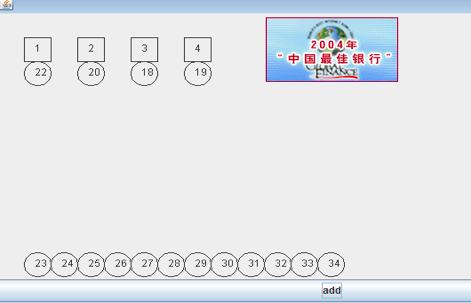
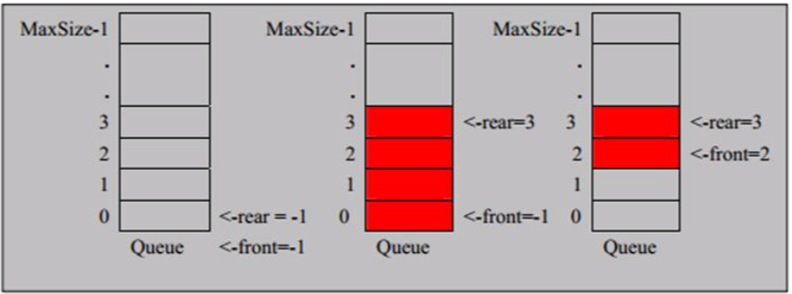
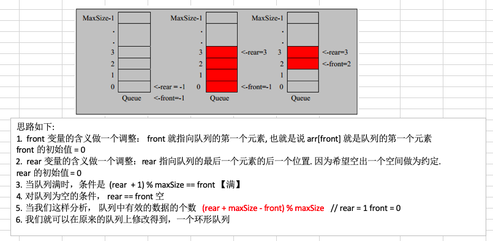

# 3.1 队列的一个使用场景


银行排队的案例




# 3.2 队列介绍


1. 队列是一个有序列表，可以用==数组==或是==链表==来实现。
2. 遵循==先入先出==的原则。即:==先存入队列的数据，要先取出。后存入的要后取出==。


# 3.3 数组模拟队列

## 3.3.1 思路


1. 队列本身是有序列表，若使用数组的结构来存储队列的数据，则队列数组的声明如下图，其中 maxSize 是该队列的最大容量。
2. 因为队列的输出、输入是分别从前后端来处理，因此需要两个变量 front 及 rear 分别记录队列前后端的下标， front 会随着数据输出而改变，而 rear 则是随着数据输入而改变，如图所示:



3. 当我们将数据存入队列时称为"addQueue"，addQueue 的处理需要有两个步骤:
   * 将尾指针往后移:rear+1 , 当 front == rear 【空】
   * 若尾指针 rear 小于队列的最大下标 maxSize-1，则将数据存入 rear 所指的数组元素中，否则无法存入数据。rear == maxSize - 1[队列满]


## 3.3.2 代码实现


```java
package com.atguigu.queue;
// 使用数组模拟队列-编写一个ArrayQueue类
class ArrayQueue {
	private int maxSize; // 表示数组的最大容量
	private int front; // 队列头
	private int rear; // 队列尾
	private int[] arr; // 该数据用于存放数据, 模拟队列

	// 创建队列的构造器
	public ArrayQueue(int arrMaxSize) {
		maxSize = arrMaxSize;
		arr = new int[maxSize];
		front = -1; // 指向队列头部，分析出front是指向队列头的前一个位置.
		rear = -1; // 指向队列尾，指向队列尾的数据(即就是队列最后一个数据)
	}

	// 判断队列是否满
	public boolean isFull() {
		return rear == maxSize - 1;
	}

	// 判断队列是否为空
	public boolean isEmpty() {
		return rear == front;
	}

	// 添加数据到队列
	public void addQueue(int n) {
		// 判断队列是否满
		if (isFull()) {
			System.out.println("队列满，不能加入数据~");
			return;
		}
		rear++; // 让rear 后移
		arr[rear] = n;
	}

	// 获取队列的数据, 出队列
	public int getQueue() {
		// 判断队列是否空
		if (isEmpty()) {
			// 通过抛出异常
			throw new RuntimeException("队列空，不能取数据");
		}
		front++; // front后移
		return arr[front];

	}

	// 显示队列的所有数据
	public void showQueue() {
		// 遍历
		if (isEmpty()) {
			System.out.println("队列空的，没有数据~~");
			return;
		}
		for (int i = 0; i < arr.length; i++) {
			System.out.printf("arr[%d]=%d\n", i, arr[i]);
		}
	}

	// 显示队列的头数据， 注意不是取出数据
	public int headQueue() {
		// 判断
		if (isEmpty()) {
			throw new RuntimeException("队列空的，没有数据~~");
		}
		return arr[front + 1];
	}
}
```


## 3.3.3 问题分析并优化


1. 目前数组使用一次就不能用， 没有达到复用的效果
2. 将这个数组使用算法，改进成一个==环形的队列== 取模:%


# 3.4 数组模拟环形队列

## 3.4.1 思路


对前面的数组模拟队列的优化，充分利用数组. 因此将数组看做是一个环形的。(通过取模的方式来实现即可)




## 3.4.2 代码实现


```java
package com.atguigu.queue;

class CircleArray {
	private int maxSize; // 表示数组的最大容量
	//front 变量的含义做一个调整： front 就指向队列的第一个元素, 也就是说 arr[front] 就是队列的第一个元素 
	//front 的初始值 = 0
	private int front; 
	//rear 变量的含义做一个调整：rear 指向队列的最后一个元素的后一个位置. 因为希望空出一个空间做为约定.
	//rear 的初始值 = 0
	private int rear; // 队列尾
	private int[] arr; // 该数据用于存放数据, 模拟队列
	
	public CircleArray(int arrMaxSize) {
		maxSize = arrMaxSize;
		arr = new int[maxSize];
	}
	
	// 判断队列是否满
	public boolean isFull() {
		return (rear  + 1) % maxSize == front;
	}
	
	// 判断队列是否为空
	public boolean isEmpty() {
		return rear == front;
	}
	
	// 添加数据到队列
	public void addQueue(int n) {
		// 判断队列是否满
		if (isFull()) {
			System.out.println("队列满，不能加入数据~");
			return;
		}
		//直接将数据加入
		arr[rear] = n;
		//将 rear 后移, 这里必须考虑取模
		rear = (rear + 1) % maxSize;
	}
	
	// 获取队列的数据, 出队列
	public int getQueue() {
		// 判断队列是否空
		if (isEmpty()) {
			// 通过抛出异常
			throw new RuntimeException("队列空，不能取数据");
		}
		// 这里需要分析出 front是指向队列的第一个元素
		// 1. 先把 front 对应的值保留到一个临时变量
		// 2. 将 front 后移, 考虑取模
		// 3. 将临时保存的变量返回
		int value = arr[front];
		front = (front + 1) % maxSize;
		return value;

	}
	
	// 显示队列的所有数据
	public void showQueue() {
		// 遍历
		if (isEmpty()) {
			System.out.println("队列空的，没有数据~~");
			return;
		}
		// 思路：从front开始遍历，遍历多少个元素
		// 动脑筋
		for (int i = front; i < front + size() ; i++) {
			System.out.printf("arr[%d]=%d\n", i % maxSize, arr[i % maxSize]);
		}
	}
	
	// 求出当前队列有效数据的个数
	public int size() {
		// rear = 2
		// front = 1
		// maxSize = 3 
		return (rear + maxSize - front) % maxSize;   
	}
	
	// 显示队列的头数据， 注意不是取出数据
	public int headQueue() {
		// 判断
		if (isEmpty()) {
			throw new RuntimeException("队列空的，没有数据~~");
		}
		return arr[front];
	}
}
```

