# 7.1 排序算法

## 7.1.1 基本介绍


排序也称排序算法 (Sort Algorithm)，排序是将一组数据，依指定的顺序进行排列的过程。


## 7.1.2 排序的分类


1. 内部排序：指将需要处理的所有数据都加载到==内部存储器==**(**内存**)**中进行排序。
2. 外部排序法：==数据量过大==，无法全部加载到内存中，需要借助==外部存储==**(**文件等**)**进行排序。


# 7.2 算法的时间复杂度

## 7.2.1 度量一个程序(算法)执行时间的两种方法


1. 事后统计的方法

   这种方法可行，但是有两个问题：一是要想对设计的算法的运行性能进行评测，需要实际运行该程序；二是所得时间的统计量依赖于计算机的硬件、软件等环境因素，==这种方式，要在同一台计算机的相同状态下运行，才能比较那个算法速度更快==。

2. 事前估算的方法

   通过分析某个算法的==时间复杂度==来判断哪个算法更优。


## 7.2.2 时间频度


1. 基本介绍

一个算法花费的时间与算法中语句的执行次数成正比例，哪个算法中语句执行次数多，它花费时间就多。一个算法中的语句执行次数称为语句频度或时间频度。记为 T(n)。[举例说明]


2. 举例说明-基本案例

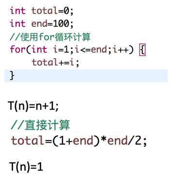

3. 举例说明-忽略常数项

| ddddddddddddddddddddddddddddddddddddddddddddddddddddddddddddddddddddddddddddddddddddddddddddddddddddddddddd | d    |
| ------------------------------------------------------------ | ---- |
|  |      |

结论: 

1) 2n+20 和 2n 随着n 变大，执行曲线无限接近, 20可以忽略

2) 3n+10 和 3n 随着n 变大，执行曲线无限接近, 10可以忽略


4. 举例说明-忽略低次项

| ddddddddddddddddddddddddddddddddddddddddddddddddddddddddddddddddddddddddddddddddddddddddddddddddddddddddddddd | d    |
| ------------------------------------------------------------ | ---- |
|  |      |

结论：

1) 2n^2^+3n+10 和 2n^2^ 随着n 变大, 执行曲线无限接近, 可以忽略 3n+10

2) n^2^+5n+20 和 n^2^ 随着n 变大,执行曲线无限接近, 可以忽略 5n+20


5. 举例说明-忽略系数

| ddddddddddddddddddddddddddddddddddddddddddddddddddddddddddddddddddddddddddddddddddddddddddddddddddddddddddddd | d    |
| ------------------------------------------------------------ | ---- |
|  |      |

结论：

1) 随着n值变大，5n^2^+7n 和 3n^2^ + 2n ，执行曲线重合, 说明 这种情况下, 5和3可以忽略

2) 而n^3^+5n 和 6n^3^+4n ，执行曲线分离，说明多少次方式关键


## 7.3.3 时间复杂度


1. 一般情况下，算法中的基本操作语句的重复执行次数是问题规模 **n** 的某个函数，用 T(n)表示，若有某个辅助函数 f(n)，使得当 n 趋近于无穷大时，T(n) / f(n) 的极限值为不等于零的常数，则称 f(n)是 T(n)的同数量级函数。 记作 **T(n)=**O**( f(n) )**，称O( f(n) ) 为算法的渐进时间复杂度，简称时间复杂度。
2. T(n) 不同，但时间复杂度可能相同。 如:T(n)=n^2^+7n+6 与 T(n)=3n^2^+2n+2 它们的 T(n) 不同，但时间复杂 度相同，都为 **O(n^2^)**。
3. 计算时间复杂度的方法:
   * 用常数 1 代替运行时间中的所有加法常数 T(n)=5n^2^+7n+6 => T(n)=5n^2^+7n+1
   * 修改后的运行次数函数中，只保留最高阶项 T(n)=5n^2^+7n+1 => T(n) =5n^2^
   * 去除最高阶项的系数 T(n) = 5n^2^ => T(n) = n^2^ => O(n^2^)


## 7.3.4 常见的时间复杂度


说明：

1) 常见的算法时间复杂度由小到大依次为:==Ο(1)<Ο(log~2~n)<Ο(n)<Ο(nlog~2~n)<Ο(n^2^)<Ο(n^3^)< Ο(n^k^) < Ο(2^n^)== ，随着问题规模 n 的不断增大，上述时间复杂度不断增大，算法的执行效率越低。

2) 从图中可见，我们应该尽可能避免使用指数阶的算法。


1. **常数阶O(1)**

   无论代码执行了多少行，只要是没有循环等复杂结构，那这个代码的时间复杂度就都是O(1)

   

   

**说明**：上述代码在执行的时候，它消耗的时候并不随着某个变量的增长而增长，那么无论这类代码有多长，即使有几万几十万行，都可以用O(1)来表示它的时间复杂度。


2. **对数阶O(log~2~n)**

   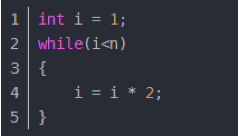

   

**说明**：在while循环里面，每次都将 i 乘以 2，乘完之后，i 距离 n 就越来越近了。假设循环x次之后，i 就大于2 了，此时这个循环就退出了，也就是说 2 的 x 次方等于 n，那么 x = log~2~n也就是说当循环 log~2~n 次以后，这个代码就结束了。因此这个代码的时间复杂度为：O(log~2~n) 。 O(log~2~n) 的这个2 时间上是根据代码变化的，i = i * 3 ，则是 O(log~3~n)。


3. **线性阶O(n)**

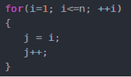

​	

**说明**：这段代码，for循环里面的代码会执行n遍，因此它消耗的时间是随着n的变化而变化的，因此这类代码都	可以用O(n)来表示它的时间复杂度。


4. **线性对数阶 O(nlogN)**


**说明**：线性对数阶O(nlogN) 其实非常容易理解，将时间复杂度为O(logn)的代码循环N遍的话，那么它的时间复杂度就是 n * O(logN)，也就是了O(nlogN)。


5. **平方阶O(n^2^)**

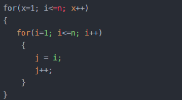

**说明**：平方阶O(n²) 就更容易理解了，如果把 O(n) 的代码再嵌套循环一遍，它的时间复杂度就是 O(n²)，这段代码其实就是嵌套了2层n循环，它的时间复杂度就是 O(n\*n)，即 O(n²) 如果将其中一层循环的n改成m，那它的时间复杂度就变成了 O(m*n)。


6. **立方阶O(n³)、K次方阶O(n^k^)**

**说明**：参考上面的O(n²) 去理解就好了，O(n³)相当于三层n循环，其它的类似


## 7.3.5 算法的时间复杂度


# 7.4 算法的空间复杂度


1. 类似于时间复杂度的讨论，一个算法的空间复杂度(Space Complexity)定义为该算法所耗费的存储空间，它也是问题规模n的函数。
2. 空间复杂度(Space Complexity)是对一个算法在运行过程中临时占用存储空间大小的量度。有的算法需要占用的临时工作单元数与解决问题的规模n有关，它随着n的增大而增大，当n较大时，将占用较多的存储单元，例如快速排序和归并排序算法就属于这种情况。
3. 在做算法分析时，==主要讨论的是时间复杂度==。从用户使用体验上看，更看重的程序执行的速度。一些缓存产品(redis, memcache)和算法(基数排序)本质就是用空间换时间。


# 7.5 冒泡排序

## 7.5.1 基本介绍


冒泡排序（Bubble Sorting）的基本思想是：通过对待排序序列从前向后（从下标较小的元素开始）,依次比较相邻元素的值，若发现逆序则交换，使值较大的元素逐渐从前移向后部，就象水底下的气泡一样逐渐向上冒。

优化：

因为排序的过程中，各元素不断接近自己的位置，==如果一趟比较下来没有进行过交换，就说明序列有序==，因此要在 排序过程中设置一个标志 flag 判断元素是否进行过交换。从而减少不必要的比较。(这里说的优化，可以在冒泡排 序写好后，再进行)。


## 7.5.2 演示冒泡过程的例子(图解)


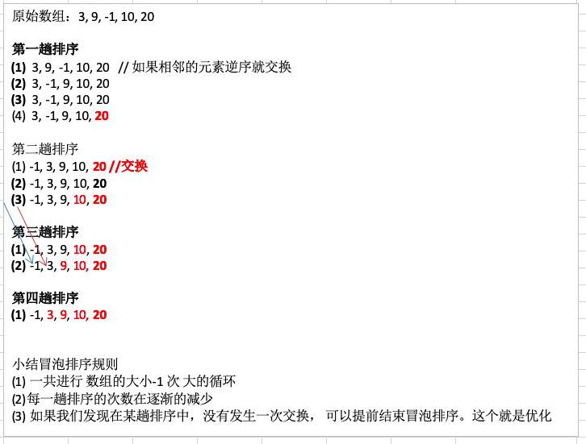


## 7.5.3 代码推导过程


```java
package com.atguigu.sort;
import java.util.Arrays;
public class BubbleSort {

	public static void main(String[] args) {
		int arr[] = {3, 9, -1, 10, 20};
		
		System.out.println("排序前");
		System.out.println(Arrays.toString(arr));
		//为了容量理解，我们把冒泡排序的演变过程，给大家展示
		//测试冒泡排序
		bubbleSort1(arr);
	}
	
	public static void bubbleSort1(int[] arr) {
		
		 // 第一趟排序，就是将第一大的数排在倒数第一位
		int temp = 0; // 临时变量
		for (int j = 0; j < arr.length - 1 ; j++) {
			// 如果前面的数比后面的数大，则交换
			if (arr[j] > arr[j + 1]) {
				temp = arr[j];
				arr[j] = arr[j + 1];
				arr[j + 1] = temp;
			}
		}
		
		System.out.println("第一趟排序后的数组");
		System.out.println(Arrays.toString(arr));
		
		// 第二趟排序，就是将第二大的数排在倒数第二位
		for (int j = 0; j < arr.length - 1 - 1 ; j++) {
			// 如果前面的数比后面的数大，则交换
			if (arr[j] > arr[j + 1]) {
				temp = arr[j];
				arr[j] = arr[j + 1];
				arr[j + 1] = temp;
			}
		}
		
		System.out.println("第二趟排序后的数组");
		System.out.println(Arrays.toString(arr));
		
		// 第三趟排序，就是将第三大的数排在倒数第三位
		for (int j = 0; j < arr.length - 1 - 2; j++) {
			// 如果前面的数比后面的数大，则交换
			if (arr[j] > arr[j + 1]) {
				temp = arr[j];
				arr[j] = arr[j + 1];
				arr[j + 1] = temp;
			}
		}

		System.out.println("第三趟排序后的数组");
		System.out.println(Arrays.toString(arr));
		
		// 第四趟排序，就是将第4大的数排在倒数第4位
		for (int j = 0; j < arr.length - 1 - 3; j++) {
			// 如果前面的数比后面的数大，则交换
			if (arr[j] > arr[j + 1]) {
				temp = arr[j];
				arr[j] = arr[j + 1];
				arr[j + 1] = temp;
			}
		}

		System.out.println("第四趟排序后的数组");
		System.out.println(Arrays.toString(arr)); 
	}

}
```


## 7.5.4 代码整理及优化


```java
package com.atguigu.sort;
import java.util.Arrays;
public class BubbleSort {

	public static void main(String[] args) {
		int arr[] = {3, 9, -1, 10, 20};
		
		System.out.println("排序前");
		System.out.println(Arrays.toString(arr));
		//为了容量理解，我们把冒泡排序的演变过程，给大家展示
		//测试冒泡排序
//		bubbleSort1(arr);
		bubbleSort(arr);
	}
	
	// 将前面额冒泡排序算法，封装成一个方法
	public static void bubbleSort(int[] arr) {
		// 冒泡排序 的时间复杂度 O(n^2)
		int temp = 0; // 临时变量
		boolean flag = false; // 标识变量，表示是否进行过交换
		for (int i = 0; i < arr.length - 1; i++) {

			for (int j = 0; j < arr.length - 1 - i; j++) {
				// 如果前面的数比后面的数大，则交换
				if (arr[j] > arr[j + 1]) {
					flag = true;
					temp = arr[j];
					arr[j] = arr[j + 1];
					arr[j + 1] = temp;
				}
			}
			System.out.println("第" + (i + 1) + "趟排序后的数组");
			System.out.println(Arrays.toString(arr));

			if (!flag) { // 在一趟排序中，一次交换都没有发生过
				break;
			} else {
				flag = false; // 重置flag!!!, 进行下次判断
			}
		}
	}

}
```

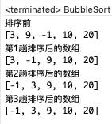


# 7.6 选择排序

## 7.6.1 基本介绍


选择式排序也属于内部排序法，是从欲排序的数据中，按指定的规则选出某一元素，再依规定交换位置后达到排序的目的。


## 7.6.2 选择排序思想


选择排序（select sorting）也是一种简单的排序方法。

它的**基本思想**是：

第一次从arr[0] arr[n-1]中选取最小值，与arr[0]交换，

第二次从arr[1] arr[n-1]中选取最小值，与arr[1]交换，

第三次从arr[2] arr[n-1]中选取最小值，与arr[2]交换，

…，

第i次从arr[i-1] arr[n-1]中选取最小值，与arr[i-1]交换，

…, 

第n-1次从arr[n-2]~arr[n-1]中选取最小值，与arr[n-2]交换，

总共通过n-1次，得到一个按排序码从小到大排列的有序序列。


## 7.6.3 思路分析图


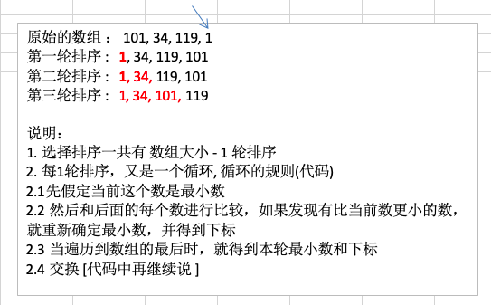


## 7.6.4 代码推导过程


```java
package com.atguigu.sort;
import java.util.Arrays;

//选择排序
public class SelectSort {

	public static void main(String[] args) {
		int[] arr = { 101, 34, 119, 1 };
		System.out.println("排序前");
		System.out.println(Arrays.toString(arr));

		selectSort1(arr);

		System.out.println("排序后");
		System.out.println(Arrays.toString(arr));
	}


	public static void selectSort1(int[] arr) {

		// 使用逐步推导的方式来，讲解选择排序
		// 第1轮
		// 原始的数组 ： 101, 34, 119, 1
		// 第一轮排序 : 1, 34, 119, 101
		// 算法 先简单--》 做复杂， 就是可以把一个复杂的算法，拆分成简单的问题-》逐步解决

		// 第1轮
		int minIndex = 0;
		int min = arr[0];
		for (int j = 0 + 1; j < arr.length; j++) {
			if (min > arr[j]) { // 说明假定的最小值，并不是最小
				min = arr[j]; // 重置min
				minIndex = j; // 重置minIndex
			}
		}

		// 将最小值，放在arr[0], 即交换
		if (minIndex != 0) {
			arr[minIndex] = arr[0];
			arr[0] = min;
		}

		System.out.println("第1轮后~~");
		System.out.println(Arrays.toString(arr));// 1, 34, 119, 101

		// 第2轮
		minIndex = 1;
		min = arr[1];
		for (int j = 1 + 1; j < arr.length; j++) {
			if (min > arr[j]) { // 说明假定的最小值，并不是最小
				min = arr[j]; // 重置min
				minIndex = j; // 重置minIndex
			}
		}

		// 将最小值，放在arr[0], 即交换
		if (minIndex != 1) {
			arr[minIndex] = arr[1];
			arr[1] = min;
		}

		System.out.println("第2轮后~~");
		System.out.println(Arrays.toString(arr));// 1, 34, 119, 101

		// 第3轮
		minIndex = 2;
		min = arr[2];
		for (int j = 2 + 1; j < arr.length; j++) {
			if (min > arr[j]) { // 说明假定的最小值，并不是最小
				min = arr[j]; // 重置min
				minIndex = j; // 重置minIndex
			}
		}

		// 将最小值，放在arr[0], 即交换
		if (minIndex != 2) {
			arr[minIndex] = arr[2];
			arr[2] = min;
		}

		System.out.println("第3轮后~~");
		System.out.println(Arrays.toString(arr));// 1, 34, 101, 119
	}

}
```

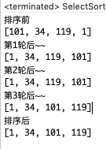


## 7.6.5 代码整理及优化


```java
package com.atguigu.sort;

import java.text.SimpleDateFormat;
import java.util.Arrays;
import java.util.Date;

//选择排序
public class SelectSort {

	public static void main(String[] args) {
		int[] arr = { 101, 34, 119, 1 };
		System.out.println("排序前");
		System.out.println(Arrays.toString(arr));

		//selectSort1(arr);
		selectSort(arr);

		System.out.println("排序后");
		System.out.println(Arrays.toString(arr));
	}

	// 选择排序
	public static void selectSort(int[] arr) {

		// 在推导的过程，我们发现了规律，因此，可以使用for来解决
		// 选择排序时间复杂度是 O(n^2)
		for (int i = 0; i < arr.length - 1; i++) {
			int minIndex = i;
			int min = arr[i];
			for (int j = i + 1; j < arr.length; j++) {
				if (min > arr[j]) { // 说明假定的最小值，并不是最小
					min = arr[j]; // 重置min
					minIndex = j; // 重置minIndex
				}
			}

			// 将最小值，放在arr[0], 即交换
			if (minIndex != i) {
				arr[minIndex] = arr[i];
				arr[i] = min;
			}

			 System.out.println("第"+(i+1)+"轮后~~");
			 System.out.println(Arrays.toString(arr));// 1, 34, 119, 101
		}
	}

}
```


# 7.7 插入排序

## 7.7.1 基本介绍


插入式排序属于内部排序法，是对于欲排序的元素以插入的方式找寻该元素的适当位置，以达到排序的目的。


## 7.7.2 插入排序法思想


插入排序(Insertion Sorting)的基本思想是:

把 **n** 个待排序的元素看成为一个有序表和一个无序表，==开始时有序表中只包含一个元素，无序表中包含有 **n-1** 个元素==，序过程中每次从无序表中取出第一个元素，把它的排 序码依次与有序表元素的排序码进行比较，将它插入到有序表中的适当位置，使之成为新的有序表。


## 7.7.3 插入排序思路图


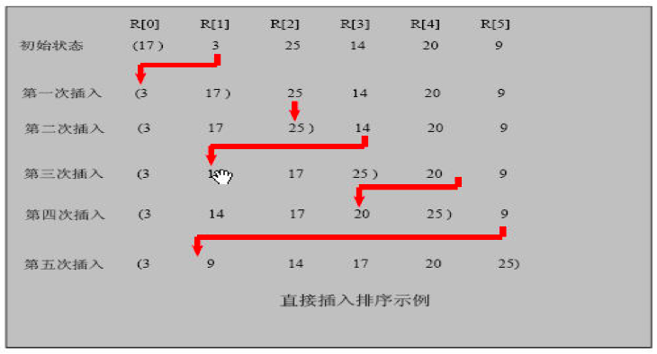


## 7.7.4 代码推导过程


```java
package com.atguigu.sort;
import java.util.Arrays;

public class InsertSort {

	public static void main(String[] args) {
		int[] arr = { 101, 34, 119, 1 };
		System.out.println("插入排序前");
		System.out.println(Arrays.toString(arr));
        
		insertSort1(arr);

		System.out.println("插入排序后");
		System.out.println(Arrays.toString(arr));
	}

	public static void insertSort1(int[] arr) {

		// 使用逐步推导的方式来讲解，便利理解
		// 第1轮 {101, 34, 119, 1}; => {34, 101, 119, 1}

		// {101, 34, 119, 1}; => {101,101,119,1}
		// 定义待插入的数
		int insertVal = arr[1];
		int insertIndex = 1 - 1; // 即arr[1]的前面这个数的下标

		// 给insertVal 找到插入的位置
		// 说明
		// 1. insertIndex >= 0 保证在给insertVal 找插入位置，不越界
		// 2. insertVal < arr[insertIndex] 待插入的数，还没有找到插入位置
		// 3. 就需要将 arr[insertIndex] 后移
		while (insertIndex >= 0 && insertVal < arr[insertIndex]) {
			arr[insertIndex + 1] = arr[insertIndex];// arr[insertIndex]
			insertIndex--;
		}
		// 当退出while循环时，说明插入的位置找到, insertIndex + 1
		// 举例：理解不了，我们一会 debug
		arr[insertIndex + 1] = insertVal;

		System.out.println("第1轮插入");
		System.out.println(Arrays.toString(arr));

		// 第2轮
		insertVal = arr[2];
		insertIndex = 2 - 1;

		while (insertIndex >= 0 && insertVal < arr[insertIndex]) {
			arr[insertIndex + 1] = arr[insertIndex];// arr[insertIndex]
			insertIndex--;
		}

		arr[insertIndex + 1] = insertVal;
		System.out.println("第2轮插入");
		System.out.println(Arrays.toString(arr));

		// 第3轮
		insertVal = arr[3];
		insertIndex = 3 - 1;

		while (insertIndex >= 0 && insertVal < arr[insertIndex]) {
			arr[insertIndex + 1] = arr[insertIndex];// arr[insertIndex]
			insertIndex--;
		}

		arr[insertIndex + 1] = insertVal;
		System.out.println("第3轮插入");
		System.out.println(Arrays.toString(arr));
	}

}
```


## 7.7.5 代码整理及优化


```java
package com.atguigu.sort;

import java.text.SimpleDateFormat;
import java.util.Arrays;
import java.util.Date;

public class InsertSort {

	public static void main(String[] args) {
		int[] arr = { 101, 34, 119, 1 };
		System.out.println("插入排序前");
		System.out.println(Arrays.toString(arr));
        
		// insertSort1(arr);
		insertSort(arr);

		System.out.println("插入排序后");
		System.out.println(Arrays.toString(arr));

	}

	// 插入排序
	public static void insertSort(int[] arr) {
		int insertVal = 0;
		int insertIndex = 0;
		// 使用for循环来把代码简化
		for (int i = 1; i < arr.length; i++) {
			// 定义待插入的数
			insertVal = arr[i];
			insertIndex = i - 1; // 即arr[1]的前面这个数的下标

			// 给insertVal 找到插入的位置
			// 说明
			// 1. insertIndex >= 0 保证在给insertVal 找插入位置，不越界
			// 2. insertVal < arr[insertIndex] 待插入的数，还没有找到插入位置
			// 3. 就需要将 arr[insertIndex] 后移
			while (insertIndex >= 0 && insertVal < arr[insertIndex]) {
				arr[insertIndex + 1] = arr[insertIndex];// arr[insertIndex]
				insertIndex--;
			}
			// 当退出while循环时，说明插入的位置找到, insertIndex + 1
			// 举例：理解不了，我们一会 debug
			// 这里我们判断是否需要赋值
			if (insertIndex + 1 != i) {
				arr[insertIndex + 1] = insertVal;
			}

			System.out.println("第" + i + "轮插入");
			System.out.println(Arrays.toString(arr));
		}
	}
}
```

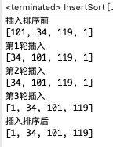


# 7.8 希尔排序

## 7.7.1 简单插入排序存在的问题


我们看简单的插入排序可能存在的问题:

数组 arr = {2,3,4,5,6,1} 这时需要插入的数 1(**最小**), 这样的过程是:

{2,3,4,5,6,6}

{2,3,4,5,5,6}

{2,3,4,4,5,6}

{2,3,3,4,5,6}

{2,2,3,4,5,6}

{1,2,3,4,5,6}

结论**:** ==当需要插入的数是较小的数时，后移的次数明显增多，对效率有影响==。


## 7.7.2 希尔排序法介绍


希尔排序是希尔(Donald Shell)于 1959 年提出的一种排序算法。希尔排序也是一种插入排序，它是简单插入排序经过改进之后的一个更高效的版本，也称为缩小增量排序。


## 7.7.3 希尔排序法基本思想


希尔排序是把记录按下标的一定增量分组，对每组使用直接插入排序算法排序；随着增量逐渐减少，每组包含的关键词越来越多，当增量减至 **1** 时，整个文件恰被分成一组，算法便终止。


## 7.7.4 希尔排序法的示意图


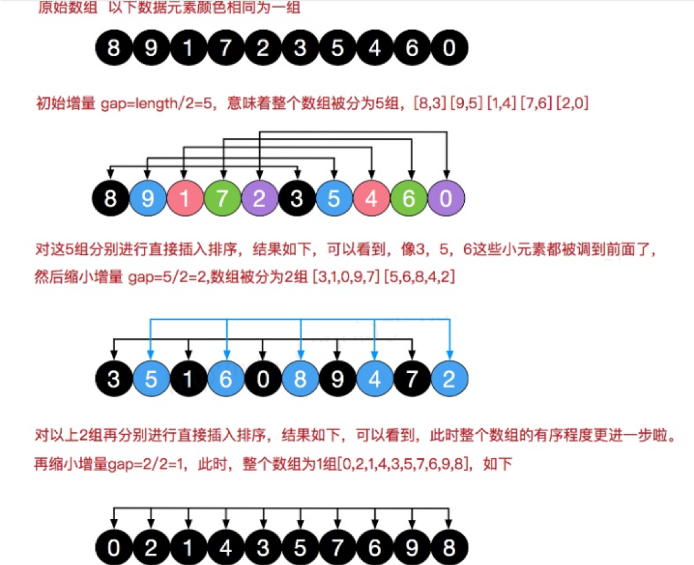


## 7.7.5 代码推导过程


1. 希尔排序时， 对有序序列在插入时采用**交换法**, 并测试排序速度(速度很慢)

```java
package com.atguigu.sort;
import java.util.Arrays;

public class ShellSort {

	public static void main(String[] args) {
		int[] arr = { 8, 9, 1, 7, 2, 3, 5, 4, 6, 0 };
		System.out.println("排序前");
		System.out.println(Arrays.toString(arr));

		shellSort0(arr); // 交换式 推导过程
		// shellSort1(arr); // 交换式 整理
		// shellSort2(arr);// 希尔 插入排序 推导过程
		// shellSort3(arr);// 希尔排序整理

		System.out.println("排序后");
		System.out.println(Arrays.toString(arr));
	}

	// 效率比直接插入排序还要慢很多 当中用了交换
	public static void shellSort0(int[] arr) {
		int temp = 0;

		// 希尔排序的第1轮排序
		// 因为第1轮排序，是将10个数据分成了 5组
		for (int i = 5; i < arr.length; i++) {
			// 遍历各组中所有的元素(共5组，每组有2个元素), 步长5
			for (int j = i - 5; j >= 0; j -= 5) {
				// 如果当前元素大于加上步长后的那个元素，说明交换
				if (arr[j] > arr[j + 5]) {
					temp = arr[j];
					arr[j] = arr[j + 5];
					arr[j + 5] = temp;
				}
			}
		}

		System.out.println("希尔 交换1轮后=" + Arrays.toString(arr));//

		// 希尔排序的第2轮排序
		// 因为第2轮排序，是将10个数据分成了 5/2 = 2组
		for (int i = 2; i < arr.length; i++) {
			// 遍历各组中所有的元素(共2组，每组有5个元素), 步长2
			for (int j = i - 2; j >= 0; j -= 2) {
				// 如果当前元素大于加上步长后的那个元素，说明交换
				if (arr[j] > arr[j + 2]) {
					temp = arr[j];
					arr[j] = arr[j + 2];
					arr[j + 2] = temp;
				}
			}
		}

		System.out.println("希尔 交换2轮后=" + Arrays.toString(arr));//

		// 希尔排序的第3轮排序
		// 因为第3轮排序，是将10个数据分成了 2/2 = 1组
		for (int i = 1; i < arr.length; i++) {
			// 遍历各组中所有的元素(共1组，每组有10个元素), 步长1
			for (int j = i - 1; j >= 0; j -= 1) {
				// 如果当前元素大于加上步长后的那个元素，说明交换
				if (arr[j] > arr[j + 1]) {
					temp = arr[j];
					arr[j] = arr[j + 1];
					arr[j + 1] = temp;
				}
			}
		}

		System.out.println("希尔 交换3轮后=" + Arrays.toString(arr));//

	}

}
```

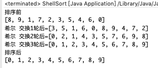


2. 希尔排序时， 对有序序列在插入时采用插入排序, 并测试排序速度(很快)

```java
package com.atguigu.sort;
import java.util.Arrays;

public class ShellSort {

	public static void main(String[] args) {
		int[] arr = { 8, 9, 1, 7, 2, 3, 5, 4, 6, 0 };
		System.out.println("排序前");
		System.out.println(Arrays.toString(arr));

		// shellSort0(arr); // 交换式 推导过程
		// shellSort1(arr); // 交换式 整理
		shellSort2(arr);// 希尔 插入排序 推导过程
		// shellSort3(arr);// 希尔排序整理

		System.out.println("排序后");
		System.out.println(Arrays.toString(arr));
	}

	public static void shellSort2(int[] arr) {

		// 希尔排序的第1轮排序
		// 因为第1轮排序，是将10个数据分成了 5组(0,5)(1,6)(2,7)(3,8)(4,9) 每一组进行直接排序
		for (int i = 5; i < arr.length; i++) {

			int insertVal = arr[i];
			int insertIndex = i - 5; // 即arr[5]的前面这个数的下标
			while (insertIndex >= 0 && insertVal < arr[insertIndex]) {
				arr[insertIndex + 5] = arr[insertIndex];// arr[insertIndex]
				insertIndex -= 5;
			}
			// 当退出while循环时，说明插入的位置找到, insertIndex + 5
			arr[insertIndex + 5] = insertVal;

		}

		System.out.println("希尔排序1轮后=" + Arrays.toString(arr));//

		// 希尔排序的第2轮排序
		// 因为第2轮排序，是将10个数据分成了 5/2 = 2组(0,2,4,6,8)(1,3,5,7,9)每一组进行直接排序
		for (int i = 2; i < arr.length; i++) {

			int insertVal = arr[i];
			int insertIndex = i - 2; // 即arr[2]的前面这个数的下标
			while (insertIndex >= 0 && insertVal < arr[insertIndex]) {
				arr[insertIndex + 2] = arr[insertIndex];// arr[insertIndex]
				insertIndex -= 2;
			}
			// 当退出while循环时，说明插入的位置找到, insertIndex + 2
			arr[insertIndex + 2] = insertVal;
		}

		System.out.println("希尔排序2轮后=" + Arrays.toString(arr));//

		// 希尔排序的第3轮排序
		// 因为第3轮排序，是将10个数据分成了 2/2 = 1组
		for (int i = 1; i < arr.length; i++) {
			int insertVal = arr[i];
			int insertIndex = i - 1; // 即arr[1]的前面这个数的下标
			while (insertIndex >= 0 && insertVal < arr[insertIndex]) {
				arr[insertIndex + 1] = arr[insertIndex];// arr[insertIndex]
				insertIndex -= 1;
			}
			// 当退出while循环时，说明插入的位置找到, insertIndex + 1
			arr[insertIndex + 1] = insertVal;
		}

		System.out.println("希尔排序3轮后=" + Arrays.toString(arr));//

	}


}

```

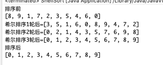

## 7.7.6 代码整理及优化


1. 希尔 交换

```java
package com.atguigu.sort;
import java.util.Arrays;

public class ShellSort {

	public static void main(String[] args) {
		int[] arr = { 8, 9, 1, 7, 2, 3, 5, 4, 6, 0 };
		System.out.println("排序前");
		System.out.println(Arrays.toString(arr));

		// shellSort0(arr); // 交换式 推导过程
		shellSort1(arr); // 交换式 整理
		// shellSort2(arr);// 希尔 插入排序 推导过程
		// shellSort3(arr);// 希尔排序整理

		System.out.println("排序后");
		System.out.println(Arrays.toString(arr));
	}

	// 使用逐步推导的方式来编写希尔排序
	// 希尔排序时， 对有序序列在插入时采用交换法,
	// 思路(算法) ===> 代码
	public static void shellSort1(int[] arr) {

		int temp = 0;
		int count = 0;
		// 根据前面的逐步分析，使用循环处理
		for (int gap = arr.length / 2; gap > 0; gap /= 2) {
			for (int i = gap; i < arr.length; i++) {
				// 遍历各组中所有的元素(共gap组，每组有个元素), 步长gap
				for (int j = i - gap; j >= 0; j -= gap) {
					// 如果当前元素大于加上步长后的那个元素，说明交换
					if (arr[j] > arr[j + gap]) {
						temp = arr[j];
						arr[j] = arr[j + gap];
						arr[j + gap] = temp;
					}
				}
			}
			System.out.println("希尔 交换第" + (++count) + "轮 =" + Arrays.toString(arr));
		}

	}

}

```


2. 希尔 插入排序

```java
package com.atguigu.sort;

import java.text.SimpleDateFormat;
import java.util.Arrays;
import java.util.Date;

public class ShellSort {

	public static void main(String[] args) {
		int[] arr = { 8, 9, 1, 7, 2, 3, 5, 4, 6, 0 };
		System.out.println("排序前");
		System.out.println(Arrays.toString(arr));

		// shellSort0(arr); // 交换式 推导过程
//		shellSort1(arr); // 交换式 整理
		// shellSort2(arr);// 希尔 插入排序 推导过程
		 shellSort3(arr);// 希尔排序整理

		System.out.println("排序后");
		System.out.println(Arrays.toString(arr));
	}
    
	public static void shellSort3(int[] arr) {

		for (int gap = arr.length / 2; gap > 0; gap /= 2) {
			for (int i = gap; i < arr.length; i++) {

				int insertVal = arr[i];
				int insertIndex = i - gap; // 即arr[gap]的前面这个数的下标
				while (insertIndex >= 0 && insertVal < arr[insertIndex]) {
					arr[insertIndex + gap] = arr[insertIndex];// arr[insertIndex]
					insertIndex -= gap;
				}
				// 当退出while循环时，说明插入的位置找到, insertIndex + gap
				arr[insertIndex + gap] = insertVal;
			}
			System.out.println("希尔排序 间隔为" + gap + "后 =" + Arrays.toString(arr));
		}

	}

}
```


# 7.9 快速排序

## 7.9.1 基本介绍


快速排序(Quicksort)是对==冒泡排序==的一种==改进==。==基本思想是==:通过一趟排序将要排序的数据分割成独立的两部分，其中一部分的所有数据都比另外一部分的所有数据都要小，然后再按此方法对这两部分数据分别进行快速排序，整个排序过程可以递归进行，以此达到整个数据变成有序序列。


## 7.9.2 示意图


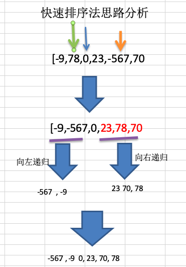


## 7.9.3 代码实现


```java
package com.atguigu.sort;
import java.util.Arrays;

public class QuickSort {

	public static void main(String[] args) {

		int[] arr = { 2, 1, 4, 7, 0 };
//		quickSort(arr, 0, arr.length - 1);
		 quickSort1(arr, 0, arr.length - 1);
		System.out.println("arr=" + Arrays.toString(arr));
	}

	// 以中间数为基准
	public static void quickSort(int[] arr, int left, int right) {
		int l = left; // 左下标
		int r = right; // 右下标
		// pivot 中轴值
		int pivot = arr[(left + right) / 2];
		int temp = 0; // 临时变量，作为交换时使用
		// while循环的目的是让比pivot 值小放到左边
		// 比pivot 值大放到右边
		while (l < r) {
			// 在pivot的左边一直找,找到大于等于pivot值,才退出
			while (arr[l] < pivot) {
				l += 1;
			}
			// 在pivot的右边一直找,找到小于等于pivot值,才退出
			while (arr[r] > pivot) {
				r -= 1;
			}
			// 如果l >= r说明pivot 的左右两的值，已经按照左边全部是
			// 小于等于pivot值，右边全部是大于等于pivot值
			if (l >= r) {
				break;
			}

			// 交换
			temp = arr[l];
			arr[l] = arr[r];
			arr[r] = temp;

			// 如果交换完后，发现这个arr[l] == pivot值 相等 r--， 前移
			if (arr[l] == pivot) {
				r -= 1;
			}
			// 如果交换完后，发现这个arr[r] == pivot值 相等 l++， 后移
			if (arr[r] == pivot) {
				l += 1;
			}
		}

		// 如果 l == r, 必须l++, r--, 否则为出现栈溢出
		if (l == r) {
			l += 1;
			r -= 1;
		}
		// 向左递归
		if (left < r) {
			quickSort(arr, left, r);
		}
		// 向右递归
		if (right > l) {
			quickSort(arr, l, right);
		}

	}

	// 以左边第一个数为基准 从小到大
	public static void quickSort1(int[] arr, int start, int end) {

		if (start > end) { // 递归退出条件
			return;
		}

		int base = arr[start];
		int low = start; // 左边的指针
		int high = end + 1; // 4 + 1 右边的指针
		while (true) {
			while (low < end && arr[++low] < base)
				;
			while (high > start && arr[--high] > base)
				;

			if (low < high) { // 交换这两个值
				swap(arr, low, high);
			} else {
				break;
			}
		}
		// 交换第一个和中间值 [2,1,4,7,0] -> low:2 high:4 ->[2,1,0,7,4] -> low:3,high:2
		swap(arr, start, high); // ->[0,1,2,7,4] //下面的递归以high为分界点

		// 左递归
		quickSort1(arr, start, high - 1);
		// 右递归
		quickSort1(arr, high + 1, end);

	}

	public static void swap(int arr[], int left, int right) {
		int temp = arr[left];
		arr[left] = arr[right];
		arr[right] = temp;
	}

}
```


# 7.10 归并排序

## 7.10.1 基本介绍


归并排序(MERGE-SORT)是利用归并的思想实现的排序方法，该算法采用经典的分治(**divide-and-conquer**) 策略(分治法将问题分(divide)==成一些小的问题然后递归求解==，而治(conquer)的阶段则将分的阶段得到的各答案"修补"在一起，即分而治之)。


## 7.10.2 基本思想


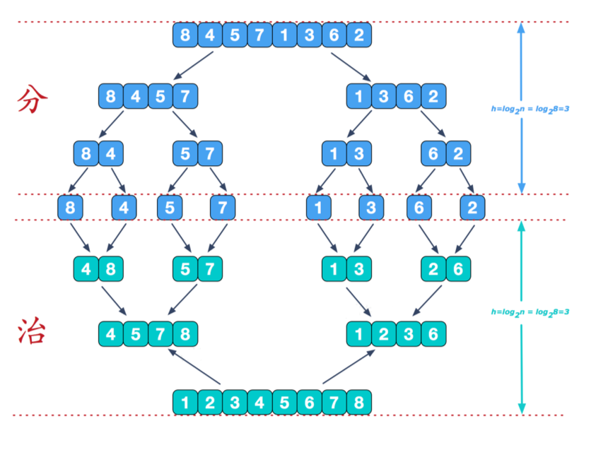

**说明:**

可以看到这种结构很像一棵完全二叉树，本文的归并排序我们采用递归去实现（也可采用迭代的方式去实现）。**分**阶段可以理解为就是递归拆分子序列的过程。


再来看看**治**阶段，我们需要将两个已经有序的子序列合并成一个有序序列，比如上图中的最后一次合并，要将[4,5,7,8]和[1,2,3,6]两个已经有序的子序列，合并为最终序列[1,2,3,4,5,6,7,8]，来看下实现步骤

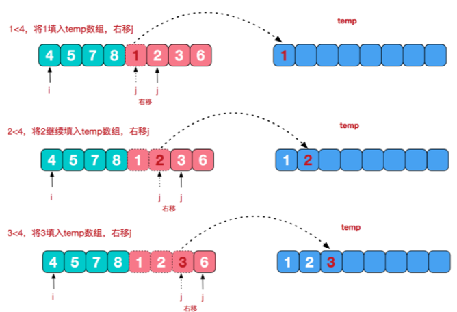


## 7.10.3 代码实现


```java
package com.atguigu.sort;

import java.text.SimpleDateFormat;
import java.util.Arrays;
import java.util.Date;

public class MergetSort {

	public static void main(String[] args) {
		int arr[] = { 8, 4, 5, 7, 1, 3, 6, 2 }; 
		int temp[] = new int[arr.length]; // 归并排序需要一个额外空间
		mergeSort(arr, 0, arr.length - 1, temp);
		System.out.println("归并排序后=" + Arrays.toString(arr));
	}

	// 分+合方法
	public static void mergeSort(int[] arr, int left, int right, int[] temp) {
		if (left < right) {
			int mid = (left + right) / 2; // 中间索引
			// 向左递归进行分解
			mergeSort(arr, left, mid, temp);
			// 向右递归进行分解
			mergeSort(arr, mid + 1, right, temp);
			// 合并
			merge(arr, left, mid, right, temp);
		}
	}

	// 合并的方法 先把此方法写好
	/**
	 * @param arr 排序的原始数组
	 * @param left 左边有序序列的初始索引
	 * @param mid 中间索引
	 * @param right 右边索引
	 * @param temp 做中转的数组
	 */
	public static void merge(int[] arr, int left, int mid, int right, int[] temp) {

		int i = left; // 初始化i, 左边有序序列的初始索引
		int j = mid + 1; // 初始化j, 右边有序序列的初始索引
		int t = 0; // 指向temp数组的当前索引

		// (一)
		// 先把左右两边(有序)的数据按照规则填充到temp数组
		// 直到左右两边的有序序列，有一边处理完毕为止
		while (i <= mid && j <= right) {// 继续
			// 如果左边的有序序列的当前元素，小于等于右边有序序列的当前元素
			// 即将左边的当前元素，填充到 temp数组
			// 然后 t++, i++
			if (arr[i] <= arr[j]) {
				temp[t] = arr[i];
				t += 1;
				i += 1;
			} else { // 反之,将右边有序序列的当前元素，填充到temp数组
				temp[t] = arr[j];
				t += 1;
				j += 1;
			}
		}

		// (二)
		// 把有剩余数据的一边的数据依次全部填充到temp
		while (i <= mid) { // 左边的有序序列还有剩余的元素，就全部填充到temp
			temp[t] = arr[i];
			t += 1;
			i += 1;
		}

		while (j <= right) { // 右边的有序序列还有剩余的元素，就全部填充到temp
			temp[t] = arr[j];
			t += 1;
			j += 1;
		}

		// (三)
		// 将temp数组的元素拷贝到arr
		// 注意，并不是每次都拷贝所有
		t = 0;
		int tempLeft = left; //
		// 第一次合并 tempLeft = 0 , right = 1 // tempLeft = 2 right = 3 // tL=0 ri=3
		// 最后一次 tempLeft = 0 right = 7
		while (tempLeft <= right) {
			arr[tempLeft] = temp[t];
			t += 1;
			tempLeft += 1;
		}
	}

}
```


# 7.11 基数排序

## 7.11.1 基本介绍


1. 基数排序（radix sort）属于"分配式排序"（distribution sort），又称"桶子法"（bucket sort）或bin sort，顾名思义，它是通过键值的各个位的值，将要排序的元素分配至某些"桶"中，达到排序的作用。
2. 基数排序法是属于稳定性的排序，基数排序法的是效率高的稳定性排序法。
3. 基数排序(Radix Sort)是桶排序的扩展。
4. 基数排序是1887年赫尔曼·何乐礼发明的。它是这样实现的：将整数按位数切割成不同的数字，然后按每个位数分别比较。


## 7.11.2 基本思想


将所有待比较数值统一为同样的数位长度，数位较短的数前面补零。然后，从最低位开始，依次进行一次排序。这样从最低位排序一直到最高位排序完成以后，数列就变成一个有序序列。


## 7.11.3 图文说明


将数组 {53, 3, 542, 748, 14, 214} 使用基数排序, 进行升序排序。

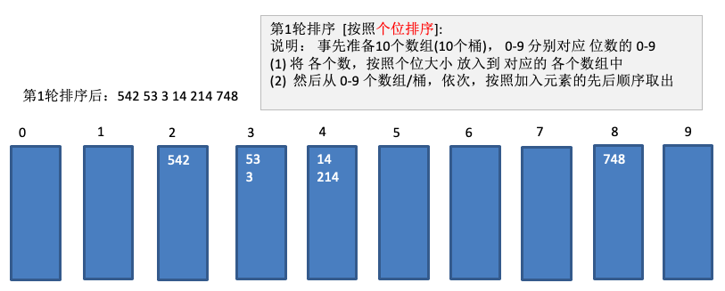


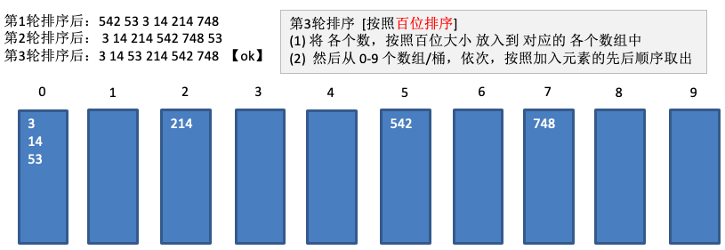


## 7.11.4 代码推导过程


```java
package com.atguigu.sort;
import java.util.Arrays;

public class RadixSort {

	public static void main(String[] args) {
		int arr[] = { 53, 3, 542, 748, 14, 214};
		System.out.println("排序前" + Arrays.toString(arr));
		radixSort1(arr);
		System.out.println("基数排序后 " + Arrays.toString(arr));
	}

	public static void radixSort1(int arr[]) {
		//定义一个二维数组，表示10个桶, 每个桶就是一个一维数组
		//说明
		//1. 二维数组包含10个一维数组
		//2. 为了防止在放入数的时候，数据溢出，则每个一维数组(桶)，大小定为arr.length
		//3. 明确，基数排序是使用空间换时间的经典算法
		int[][] bucket = new int[10][arr.length];
		
		//为了记录每个桶中，实际存放了多少个数据,我们定义一个一维数组来记录各个桶的每次放入的数据个数
		//可以这里理解
		//比如：bucketElementCounts[0] , 记录的就是  bucket[0] 桶的放入数据个数
		int[] bucketElementCounts = new int[10];
		
		//第1轮(针对每个元素的个位进行排序处理)
		for(int j = 0; j < arr.length; j++) {
			//取出每个元素的个位的值
			int digitOfElement = arr[j] / 1 % 10;
			//放入到对应的桶中
			bucket[digitOfElement][bucketElementCounts[digitOfElement]] = arr[j];
			bucketElementCounts[digitOfElement]++;
		}
		//按照这个桶的顺序(一维数组的下标依次取出数据，放入原来数组)
		int index = 0;
		//遍历每一桶，并将桶中是数据，放入到原数组
		for(int k = 0; k < bucketElementCounts.length; k++) {
			//如果桶中，有数据，我们才放入到原数组
			if(bucketElementCounts[k] != 0) {
				//循环该桶即第k个桶(即第k个一维数组), 放入
				for(int l = 0; l < bucketElementCounts[k]; l++) {
					//取出元素放入到arr
					arr[index++] = bucket[k][l];
				}
			}
			//第l轮处理后，需要将每个 bucketElementCounts[k] = 0 ！！！！
			bucketElementCounts[k] = 0;
			
		}
		System.out.println("第1轮，对个位的排序处理 arr =" + Arrays.toString(arr));
		
		//第2轮(针对每个元素的十位进行排序处理)
		for (int j = 0; j < arr.length; j++) {
			// 取出每个元素的十位的值
			int digitOfElement = arr[j] / 10  % 10; //748 / 10 => 74 % 10 => 4
			// 放入到对应的桶中
			bucket[digitOfElement][bucketElementCounts[digitOfElement]] = arr[j];
			bucketElementCounts[digitOfElement]++;
		}
		// 按照这个桶的顺序(一维数组的下标依次取出数据，放入原来数组)
		index = 0;
		// 遍历每一桶，并将桶中是数据，放入到原数组
		for (int k = 0; k < bucketElementCounts.length; k++) {
			// 如果桶中，有数据，我们才放入到原数组
			if (bucketElementCounts[k] != 0) {
				// 循环该桶即第k个桶(即第k个一维数组), 放入
				for (int l = 0; l < bucketElementCounts[k]; l++) {
					// 取出元素放入到arr
					arr[index++] = bucket[k][l];
				}
			}
			//第2轮处理后，需要将每个 bucketElementCounts[k] = 0 ！！！！
			bucketElementCounts[k] = 0;
		}
		System.out.println("第2轮，对个位的排序处理 arr =" + Arrays.toString(arr));
		
		
		//第3轮(针对每个元素的百位进行排序处理)
		for (int j = 0; j < arr.length; j++) {
			// 取出每个元素的百位的值
			int digitOfElement = arr[j] / 100 % 10; // 748 / 100 => 7 % 10 = 7
			// 放入到对应的桶中
			bucket[digitOfElement][bucketElementCounts[digitOfElement]] = arr[j];
			bucketElementCounts[digitOfElement]++;
		}
		// 按照这个桶的顺序(一维数组的下标依次取出数据，放入原来数组)
		index = 0;
		// 遍历每一桶，并将桶中是数据，放入到原数组
		for (int k = 0; k < bucketElementCounts.length; k++) {
			// 如果桶中，有数据，我们才放入到原数组
			if (bucketElementCounts[k] != 0) {
				// 循环该桶即第k个桶(即第k个一维数组), 放入
				for (int l = 0; l < bucketElementCounts[k]; l++) {
					// 取出元素放入到arr
					arr[index++] = bucket[k][l];
				}
			}
			//第3轮处理后，需要将每个 bucketElementCounts[k] = 0 ！！！！
			bucketElementCounts[k] = 0;
		}
		System.out.println("第3轮，对个位的排序处理 arr =" + Arrays.toString(arr)); 
	}
}

```


## 7.11.5 代码整理及优化


```java
package com.atguigu.sort;
import java.util.Arrays;

public class RadixSort {

	public static void main(String[] args) {
		int arr[] = { 53, 3, 542, 748, 14, 214};
		System.out.println("排序前" + Arrays.toString(arr));
//		radixSort1(arr);
		radixSort(arr);
		System.out.println("基数排序后 " + Arrays.toString(arr));
	}

	//基数排序方法
	public static void radixSort(int[] arr) {
		
		//根据前面的推导过程，我们可以得到最终的基数排序代码
		
		//1. 得到数组中最大的数的位数
		int max = arr[0]; //假设第一数就是最大数
		for(int i = 1; i < arr.length; i++) {
			if (arr[i] > max) {
				max = arr[i];
			}
		}
		//得到最大数是几位数
		int maxLength = (max + "").length();
		
		
		//定义一个二维数组，表示10个桶, 每个桶就是一个一维数组
		//说明
		//1. 二维数组包含10个一维数组
		//2. 为了防止在放入数的时候，数据溢出，则每个一维数组(桶)，大小定为arr.length
		//3. 名明确，基数排序是使用空间换时间的经典算法
		int[][] bucket = new int[10][arr.length];
		
		//为了记录每个桶中，实际存放了多少个数据,我们定义一个一维数组来记录各个桶的每次放入的数据个数
		//可以这里理解
		//比如：bucketElementCounts[0] , 记录的就是  bucket[0] 桶的放入数据个数
		int[] bucketElementCounts = new int[10];
		
		
		//这里我们使用循环将代码处理
		
		for(int i = 0 , n = 1; i < maxLength; i++, n *= 10) {
			//(针对每个元素的对应位进行排序处理)， 第一次是个位，第二次是十位，第三次是百位..
			for(int j = 0; j < arr.length; j++) {
				//取出每个元素的对应位的值
				int digitOfElement = arr[j] / n % 10;
				//放入到对应的桶中
				bucket[digitOfElement][bucketElementCounts[digitOfElement]] = arr[j];
				bucketElementCounts[digitOfElement]++;
			}
			//按照这个桶的顺序(一维数组的下标依次取出数据，放入原来数组)
			int index = 0;
			//遍历每一桶，并将桶中是数据，放入到原数组
			for(int k = 0; k < bucketElementCounts.length; k++) {
				//如果桶中，有数据，我们才放入到原数组
				if(bucketElementCounts[k] != 0) {
					//循环该桶即第k个桶(即第k个一维数组), 放入
					for(int l = 0; l < bucketElementCounts[k]; l++) {
						//取出元素放入到arr
						arr[index++] = bucket[k][l];
					}
				}
				//第i+1轮处理后，需要将每个 bucketElementCounts[k] = 0 ！！！！
				bucketElementCounts[k] = 0;
				
			}
			System.out.println("第"+(i+1)+"轮，对个位的排序处理 arr =" + Arrays.toString(arr));
		}
	}
}
```


## 7.11.6 基数排序的说明


1. 基数排序是对传统桶排序的扩展，速度很快。
2. 基数排序是经典的空间换时间的方式，占用内存很大，当对海量数据排序时，容易造成 OutOfMemoryError。
3. 基数排序时稳定的。（注:假定在待排序的记录序列中，存在多个具有相同的关键字的记录，若经过排序，这些记录的相对次序保持不变，即在原序列中，r[i]=r[j]，且 r[i]在 r[j]之前，而在排序后的序列中，r[i]仍在 r[j]之前，则称这种排序算法是稳定的；否则称为不稳定的）
4. 有负数的数组，我们不用基数排序来进行排序, 如果要支持负数，参考 https://code.i-harness.com/zh-CN/q/e98fa9


# 7.12 常用排序算法总结和对比


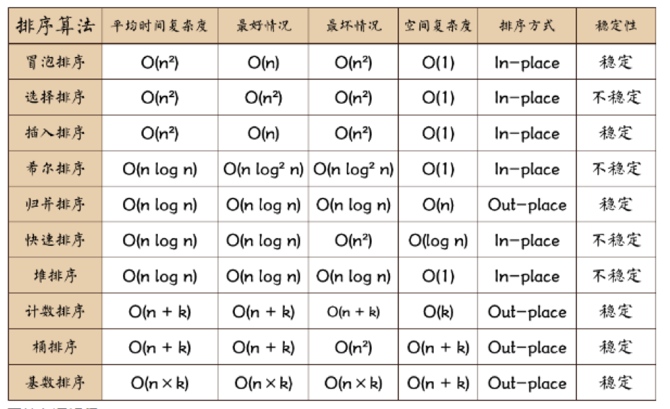

1. 稳定:如果a原本在b前面，而a=b，排序之后a仍然在b的前面；
2. 不稳定:如果a原本在b的前面，而a=b，排序之后a可能会出现在b的后面;
3. 内排序:所有排序操作都在内存中完成；
4. 外排序:由于数据太大，因此把数据放在磁盘中，而排序通过磁盘和内存的数据传输才能进行;
5. 时间复杂度:一个算法执行所耗费的时间。
6. 空间复杂度:运行完一个程序所需内存的大小。
7. n: 数据规模
8. k: "桶"的个数
9. In-place: 不占用额外内存
10. Out-place: 占用额外内存