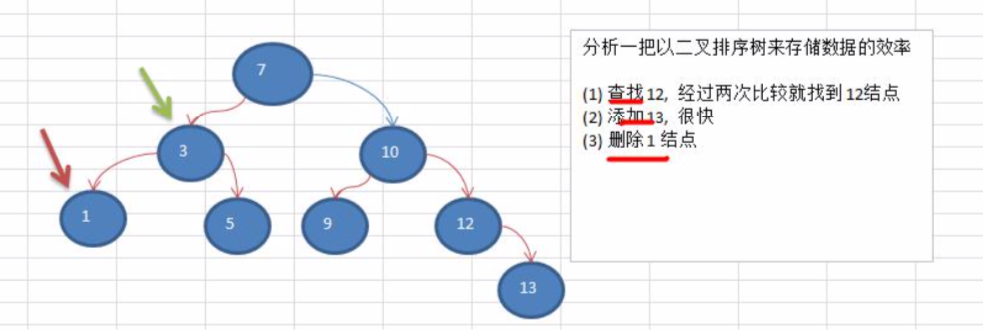
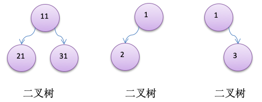
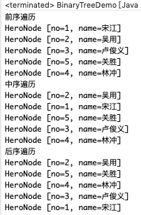
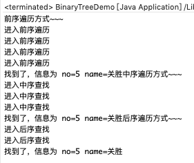
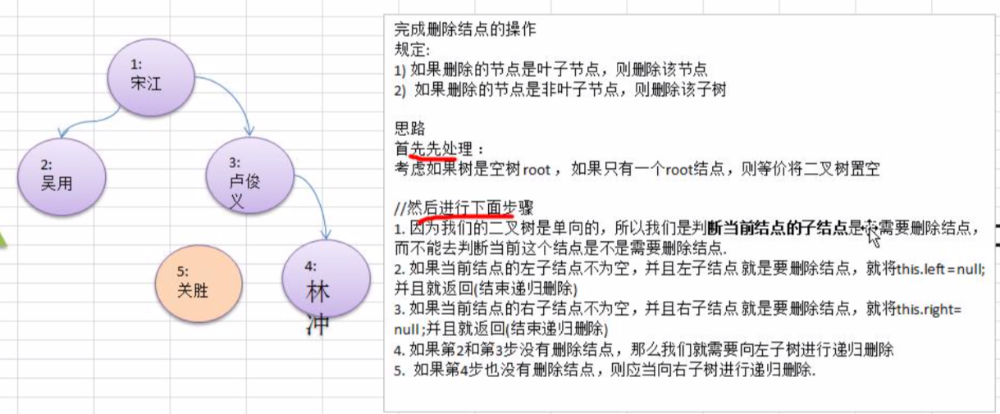
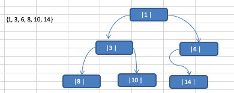
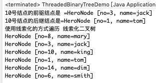

# 10.1 二叉树

## 10.1.1 为什么需要树这种数据结构

### 1、数组存储方式的分析


优点:通过==下标方式访问==元素，速度快。对于有序数组，还可使用==二分查找==提高检索速度。

缺点:如果要检索具体某个值，或者插入值(按一定顺序)==会整体移动==，效率较低。


### 2、链式存储方式的分析


优点：在一定程度上对数组存储方式有优化(比如：插入一个数值节点，只需要将插入节点，链接到链表中即可， 删除效率也很好)。

缺点：在进行检索时，效率仍然较低，比如(检索某个值，需要从头节点开始遍历) 。


### 3、**树**存储方式的分析


能提高数据**存储，读取**的效率, 比如利用 **二叉排序树**(Binary Sort Tree)，既可以保证数据的检索速度，同时也可以保证数据的插入，删除，修改的速度。

案例**:** [7, 3, 10, 1, 5, 9, 12]




## 10.1.2 树示意图


树的常用术语(结合示意图理解): 
1)节点
2) 根节点
3) 父节点
4) 子节点
5) 叶子节点 (没有子节点的节点)
6) 节点的权(节点值)
7) 路径(从root节点找到该节点的路线) 
8) 层
9) 子树
10) 树的高度(最大层数)
11) 森林 :多颗子树构成森林


## 10.1.3 二叉树的概念


1. 树有很多种，每个节点**最多只能有两个子节点**的一种形式称为二叉树。
2. 二叉树的子节点分为左节点和右节点。



3. 如果该二叉树的==所有叶子节点==都在最后一层，并且结点总数= ==2^n^ -1== , n 为层数，则我们称为==满二叉树==。
4. 如果该二叉树的所有==叶子节点==都在==最后一层==或者==倒数第二层==，而且最后一层的叶子节点在左边连续，倒数第二 层的叶子节点在右边连续，我们称为完全二叉树。


## 10.1.4 二叉树遍历 

### 1、三种遍历方式


使用前序，中序和后序对下面的二叉树进行遍历。

1. 前序遍历: **先输出父节点**，再遍历左子树和右子树。
2. 中序遍历: 先遍历左子树，**再输出父节点**，再遍历右子树。
3. 后序遍历: 先遍历左子树，再遍历右子树，**最后输出父**。

**小结**: 看输出父节点的顺序，就确定是前序，中序还是后序


### 2、思路分析图解


### 3、代码实现


```java
package com.atguigu.tree;
public class BinaryTreeDemo {

	public static void main(String[] args) {
		// 先需要创建一颗二叉树
		BinaryTree binaryTree = new BinaryTree();
		// 创建需要的结点
		HeroNode root = new HeroNode(1, "宋江");
		HeroNode node2 = new HeroNode(2, "吴用");
		HeroNode node3 = new HeroNode(3, "卢俊义");
		HeroNode node4 = new HeroNode(4, "林冲");
		HeroNode node5 = new HeroNode(5, "关胜");

		// 说明，我们先手动创建该二叉树，后面我们用递归的方式创建二叉树
		root.setLeft(node2);
		root.setRight(node3);
		node3.setRight(node4);
		node3.setLeft(node5);
		binaryTree.setRoot(root);

		// 测试
		 System.out.println("前序遍历"); // 1,2,3,5,4
		 binaryTree.preOrder();

		System.out.println("中序遍历");
		binaryTree.infixOrder(); // 2,1,5,3,4
	
		System.out.println("后序遍历");
		binaryTree.postOrder(); // 2,5,4,3,1
	}
}

// 定义BinaryTree 二叉树
class BinaryTree {
	private HeroNode root;
	public void setRoot(HeroNode root) {
		this.root = root;
	}

	// 前序遍历
	public void preOrder() {
		if (this.root != null) {
			this.root.preOrder();
		} else {
			System.out.println("二叉树为空，无法遍历");
		}
	}

	// 中序遍历
	public void infixOrder() {
		if (this.root != null) {
			this.root.infixOrder();
		} else {
			System.out.println("二叉树为空，无法遍历");
		}
	}

	// 后序遍历
	public void postOrder() {
		if (this.root != null) {
			this.root.postOrder();
		} else {
			System.out.println("二叉树为空，无法遍历");
		}
	}
}

// 先创建HeroNode 结点
class HeroNode {
	private int no;
	private String name;
	private HeroNode left; // 默认null
	private HeroNode right; // 默认null

	public HeroNode(int no, String name) {
		this.no = no;
		this.name = name;
	}

	//setter getter toString...

	// 编写前序遍历的方法
	public void preOrder() {
		System.out.println(this); // 先输出父结点
		// 递归向左子树前序遍历
		if (this.left != null) {
			this.left.preOrder();
		}
		// 递归向右子树前序遍历
		if (this.right != null) {
			this.right.preOrder();
		}
	}

	// 中序遍历
	public void infixOrder() {

		// 递归向左子树中序遍历
		if (this.left != null) {
			this.left.infixOrder();
		}
		// 输出父结点
		System.out.println(this);
		// 递归向右子树中序遍历
		if (this.right != null) {
			this.right.infixOrder();
		}
	}

	// 后序遍历
	public void postOrder() {
		if (this.left != null) {
			this.left.postOrder();
		}
		if (this.right != null) {
			this.right.postOrder();
		}
		System.out.println(this);
	}
}
```




## 10.1.5 二叉树-查找指定节点

### 1、查找要求


1.  请编写前序查找，中序查找和后序查找的方法。
2. 并分别使用三种查找方式，查找 heroNO = 5 的节点
3. 并分析各种查找方式，分别比较了多少次


### 2、思路分析图解


| ddddddddddddddddddddddddddddddddddddddddddddddddddddddddddddddddddddddddddddddddddddddddddddddddddddddddddddddddddd | d    |
| ------------------------------------------------------------ | ---- |
|  |      |


### 3、代码实现


```java
package com.atguigu.tree;

public class BinaryTreeDemo {

	public static void main(String[] args) {
		// 先需要创建一颗二叉树
		BinaryTree binaryTree = new BinaryTree();
		// 创建需要的结点
		HeroNode root = new HeroNode(1, "宋江");
		HeroNode node2 = new HeroNode(2, "吴用");
		HeroNode node3 = new HeroNode(3, "卢俊义");
		HeroNode node4 = new HeroNode(4, "林冲");
		HeroNode node5 = new HeroNode(5, "关胜");

		// 说明，我们先手动创建该二叉树，后面我们用递归的方式创建二叉树
		root.setLeft(node2);
		root.setRight(node3);
		node3.setRight(node4);
		node3.setLeft(node5);
		binaryTree.setRoot(root);

		// 前序遍历
		// 前序遍历的次数 ：4
		System.out.println("前序遍历方式~~~");
		HeroNode resNode1 = binaryTree.preOrderSearch(5);
		if (resNode1 != null) {
			System.out.printf("找到了，信息为 no=%d name=%s", resNode1.getNo(), resNode1.getName());
		} else {
			System.out.printf("没有找到 no = %d 的英雄", 5);
		}

		// 中序遍历查找
		// 中序遍历3次
		System.out.println("中序遍历方式~~~");
		HeroNode resNode2 = binaryTree.infixOrderSearch(5);
		if (resNode2 != null) {
			System.out.printf("找到了，信息为 no=%d name=%s", resNode2.getNo(), resNode2.getName());
		} else {
			System.out.printf("没有找到 no = %d 的英雄", 5);
		}

		// 后序遍历查找
		// 后序遍历查找的次数 2次
		System.out.println("后序遍历方式~~~");
		HeroNode resNode3 = binaryTree.postOrderSearch(5);
		if (resNode3 != null) {
			System.out.printf("找到了，信息为 no=%d name=%s", resNode3.getNo(), resNode3.getName());
		} else {
			System.out.printf("没有找到 no = %d 的英雄", 5);
		}
	}
}

// 定义BinaryTree 二叉树
class BinaryTree {
	private HeroNode root;
	public void setRoot(HeroNode root) {
		this.root = root;
	}

	// 前序遍历查找
	public HeroNode preOrderSearch(int no) {
		if (root != null) {
			return root.preOrderSearch(no);
		} else {
			return null;
		}
	}

	// 中序遍历查找
	public HeroNode infixOrderSearch(int no) {
		if (root != null) {
			return root.infixOrderSearch(no);
		} else {
			return null;
		}
	}

	// 后序遍历查找
	public HeroNode postOrderSearch(int no) {
		if (root != null) {
			return this.root.postOrderSearch(no);
		} else {
			return null;
		}
	}
}

// 先创建HeroNode 结点
class HeroNode {
	private int no;
	private String name;
	private HeroNode left; // 默认null
	private HeroNode right; // 默认null

	public HeroNode(int no, String name) {
		this.no = no;
		this.name = name;
	}

	// getter setter ...

	// 前序遍历查找
	/**
	 * @param no 查找no
	 * @return 如果找到就返回该Node ,如果没有找到返回 null
	 */
	public HeroNode preOrderSearch(int no) {
		System.out.println("进入前序遍历");
		// 比较当前结点是不是
		if (this.no == no) {
			return this;
		}
		// 1.则判断当前结点的左子节点是否为空，如果不为空，则递归前序查找
		// 2.如果左递归前序查找，找到结点，则返回
		HeroNode resNode = null;
		if (this.left != null) {
			resNode = this.left.preOrderSearch(no);
		}
		if (resNode != null) {// 说明我们左子树找到
			return resNode;
		}
		// 1.左递归前序查找，找到结点，则返回，否继续判断，
		// 2.当前的结点的右子节点是否为空，如果不空，则继续向右递归前序查找
		if (this.right != null) {
			resNode = this.right.preOrderSearch(no);
		}
		return resNode;
	}

	// 中序遍历查找
	public HeroNode infixOrderSearch(int no) {
		// 判断当前结点的左子节点是否为空，如果不为空，则递归中序查找
		HeroNode resNode = null;
		if (this.left != null) {
			resNode = this.left.infixOrderSearch(no);
		}
		if (resNode != null) {
			return resNode;
		}
		System.out.println("进入中序查找");
		// 如果找到，则返回，如果没有找到，就和当前结点比较，如果是则返回当前结点
		if (this.no == no) {
			return this;
		}
		// 否则继续进行右递归的中序查找
		if (this.right != null) {
			resNode = this.right.infixOrderSearch(no);
		}
		return resNode;

	}

	// 后序遍历查找
	public HeroNode postOrderSearch(int no) {
		// 判断当前结点的左子节点是否为空，如果不为空，则递归后序查找
		HeroNode resNode = null;
		if (this.left != null) {
			resNode = this.left.postOrderSearch(no);
		}
		if (resNode != null) {// 说明在左子树找到
			return resNode;
		}

		// 如果左子树没有找到，则向右子树递归进行后序遍历查找
		if (this.right != null) {
			resNode = this.right.postOrderSearch(no);
		}
		if (resNode != null) {
			return resNode;
		}
		System.out.println("进入后序查找");
		// 如果左右子树都没有找到，就比较当前结点是不是
		if (this.no == no) {
			return this;
		}
		return resNode;
	}

}
```




## 10.1.6 二叉树-删除节点

### 1、删除要求


1. 如果删除的节点是叶子节点，则删除该节点。
2. 如果删除的节点是非叶子节点，则删除该子树。
3. 测试，删除掉5号叶子节点和3号子树。


### 2、思路分析图解


| ddddddddddddddddddddddddddddddddddddddddddddddddddddddddddddddddddddddddddddddddddddddddddddddddddddddddddddddddddddddddd | d    |
| ------------------------------------------------------------ | ---- |
|  |      |


### 3、代码实现


```java
package com.atguigu.tree;

public class BinaryTreeDemo {

	public static void main(String[] args) {
		// 先需要创建一颗二叉树
		BinaryTree binaryTree = new BinaryTree();
		// 创建需要的结点
		HeroNode root = new HeroNode(1, "宋江");
		HeroNode node2 = new HeroNode(2, "吴用");
		HeroNode node3 = new HeroNode(3, "卢俊义");
		HeroNode node4 = new HeroNode(4, "林冲");
		HeroNode node5 = new HeroNode(5, "关胜");

		// 说明，我们先手动创建该二叉树，后面我们用递归的方式创建二叉树
		root.setLeft(node2);
		root.setRight(node3);
		node3.setRight(node4);
		node3.setLeft(node5);
		binaryTree.setRoot(root);

		// 测试一把删除结点
		System.out.println("删除前,前序遍历");
		binaryTree.preOrder(); // 1,2,3,5,4
		binaryTree.delNode(5);
		// binaryTree.delNode(3);
		System.out.println("删除后，前序遍历");
		binaryTree.preOrder(); // 1,2,3,4
	}
}

// 定义BinaryTree 二叉树
class BinaryTree {
	private HeroNode root;
	public void setRoot(HeroNode root) {
		this.root = root;
	}

	// 删除结点
	public void delNode(int no) {
		if (root != null) {
			// 如果只有一个root结点, 这里立即判断root是不是就是要删除结点
			if (root.getNo() == no) {
				root = null;
			} else {
				// 递归删除
				root.delNode(no);
			}
		} else {
			System.out.println("空树，不能删除~");
		}
	}
}

// 先创建HeroNode 结点
class HeroNode {
	private int no;
	private String name;
	private HeroNode left; // 默认null
	private HeroNode right; // 默认null

	public HeroNode(int no, String name) {
		this.no = no;
		this.name = name;
	}

	//getter setter ...

	// 递归删除结点
	// 1.如果删除的节点是叶子节点，则删除该节点
	// 2.如果删除的节点是非叶子节点，则删除该子树
	public void delNode(int no) {

		// 思路
		/*
		 * 1.因为我们的二叉树是单向的，所以我们是判断当前结点的子结点是否需要删除结点，而不能去判断当前这个结点是不是需要删除结点. 
		 * 2.如果当前结点的左子结点不为空，并且左子结点 就是要删除结点，就将this.left = null; 并且就返回(结束递归删除) 
		 * 3.如果当前结点的右子结点不为空，并且右子结点 就是要删除结点，就将this.right= null ;并且就返回(结束递归删除) 
		 * 4.如果第2和第3步没有删除结点，那么我们就需要向左子树进行递归删除 5. 如果第4步也没有删除结点，则应当向右子树进行递归删除.
		 * 
		 */
		// 2. 如果当前结点的左子结点不为空，并且左子结点 就是要删除结点，就将this.left = null; 并且就返回(结束递归删除)
		if (this.left != null && this.left.no == no) {
			this.left = null;
			return;
		}
		// 3.如果当前结点的右子结点不为空，并且右子结点 就是要删除结点，就将this.right= null ;并且就返回(结束递归删除)
		if (this.right != null && this.right.no == no) {
			this.right = null;
			return;
		}
		// 4.我们就需要向左子树进行递归删除
		if (this.left != null) {
			this.left.delNode(no);
		}
		// 5.则应当向右子树进行递归删除
		if (this.right != null) {
			this.right.delNode(no);
		}
	}

}
```


### 4、思考


如果要删除的节点是非叶子节点，现在我们不希望将该非叶子节点为根节点的子树删除，需要指定规则, 假如

规定如下:

1. 如果该非叶子节点A只有一个子节点B，则子节点B替代节点A
2. 如果该非叶子节点A有左子节点B和右子节点C，则让左子节点B替代节点A。
3. 后面的二叉排序树时，会有具体的删除方法。


# 10.2 顺序存储二叉树

## 10.2.1 基本概念

### 1、基本说明


从数据存储来看，数组存储方式和树的存储方式可以相互转换，即数组可以转换成树，树也可以转换成数组，看下面的示意图


1. 上图的二叉树的结点，要求以数组的方式来存放arr:[1,2,3,4,5,6,6]
2. 要求在遍历数组arr时，仍然可以以前序遍历，中序遍历和后序遍历的方式完成结点的遍历


### 2、 特点


1. 顺序二叉树通常只考虑完全二叉树。
2. 第n个元素的左子节点为 2 * n + 1 
3. 第n个元素的右子节点为 2 * n + 2
4. 第n个元素的父节点为 (n-1) / 2
5. n : 表示二叉树中的第几个元素(按0开始编号如图所示)


## 10.2.2 遍历


```java
package com.atguigu.tree;
public class ArrBinaryTreeDemo {

	public static void main(String[] args) {
		int[] arr = { 1, 2, 3, 4, 5, 6, 7 };
		//创建一个 ArrBinaryTree
		ArrBinaryTree arrBinaryTree = new ArrBinaryTree(arr);
		arrBinaryTree.preOrder(); // 1,2,4,5,3,6,7
	}

}

//编写一个ArrayBinaryTree, 实现顺序存储二叉树遍历
class ArrBinaryTree {
	private int[] arr;//存储数据结点的数组

	public ArrBinaryTree(int[] arr) {
		this.arr = arr;
	}
	
	//重载preOrder
	public void preOrder() {
		this.preOrder(0);
	}
	
	//编写一个方法，完成顺序存储二叉树的前序遍历
	/**
	 * @param index 数组的下标 
	 */
	public void preOrder(int index) {
		//如果数组为空，或者 arr.length = 0
		if(arr == null || arr.length == 0) {
			System.out.println("数组为空，不能按照二叉树的前序遍历");
		}
		//输出当前这个元素
		System.out.println(arr[index]); 
		//向左递归遍历
		if((index * 2 + 1) < arr.length) {
			preOrder(2 * index + 1 );
		}
		//向右递归遍历
		if((index * 2 + 2) < arr.length) {
			preOrder(2 * index + 2);
		}
	}
	
}
```


思考：顺序二叉树**中序**，**后序**遍历方式的代码。


## 10.2.3 应用实例


八大排序算法中的堆排序，就会使用到顺序存储二叉树， 关于堆排序，放在后面。


# 10.3 线索化二叉树

## 10.3.1 先看一个问题


将数列 {1, 3, 6, 8, 10, 14 } 构建成一颗二叉树. n+1=7



问题分析：

1.  当我们对上面的二叉树进行中序遍历时，数列为{8,3,10,1,14,6}
2.  但是6,8,10,14这几个节点的左右指针，并没有完全的利用上。
3.  如果我们希望充分的利用各个节点的左右指针，让各个节点可以指向自己的前后节点，怎么办?
4.  解决方案-==线索二叉树==


## 10.3.2 基本介绍


1. n个结点的二叉链表中含有n+1 【公式 2n-(n-1)=n+1】 个空指针域。利用二叉链表中的空指针域，存放指向该结点在某种遍历次序下的前驱和后继结点的指针(这种附加的指针称为"线索")。
2. 这种加上了线索的二叉链表称为==线索链表==，相应的二叉树称为==线索二叉树==(Threaded BinaryTree)。根据线索性质的不同，线索二叉树可分为==前序线索二叉树==、==中序线索二叉树==**和**==后序线索二叉树==三种。
3. 一个结点的前一个结点，称为==前驱==结点。
4. 一个结点的后一个结点，称为==后继==结点。


## 10.3.3 问题解决

### 1、思路分析


说明: 当线索化二叉树后，Node 节点的 属性 left 和 right ，有如下情况:

1. left 指向的是左子树，也可能是指向的前驱节点。比如 1 节点 left 指向的左子树, 而 10 节点的 left 指向的就是前驱节点。
2. right 指向的是右子树，也可能是指向后继节点，比如 1 节点right 指向的是右子树，而 10 节点的right 指向的是后继节点。


### 2、 代码实现


```java
package com.atguigu.tree.threadedbinarytree;

public class ThreadedBinaryTreeDemo {

	public static void main(String[] args) {
		// 测试一把中序线索二叉树的功能
		HeroNode root = new HeroNode(1, "tom");
		HeroNode node2 = new HeroNode(3, "jack");
		HeroNode node3 = new HeroNode(6, "smith");
		HeroNode node4 = new HeroNode(8, "mary");
		HeroNode node5 = new HeroNode(10, "king");
		HeroNode node6 = new HeroNode(14, "dim");

		// 二叉树，后面我们要递归创建, 现在简单处理使用手动创建
		root.setLeft(node2);
		root.setRight(node3);
		node2.setLeft(node4);
		node2.setRight(node5);
		node3.setLeft(node6);

		// 测试中序线索化
		ThreadedBinaryTree threadedBinaryTree = new ThreadedBinaryTree();
		threadedBinaryTree.setRoot(root);
		threadedBinaryTree.threadedNodes();

		// 测试: 以10号节点测试
		HeroNode leftNode = node5.getLeft();
		HeroNode rightNode = node5.getRight();
		System.out.println("10号结点的前驱结点是 =" + leftNode); // 3
		System.out.println("10号结点的后继结点是=" + rightNode); // 1

		// 当线索化二叉树后，不能在使用原来的遍历方法
		// threadedBinaryTree.infixOrder();
		System.out.println("使用线索化的方式遍历 线索化二叉树");
		threadedBinaryTree.threadedList(); // 8, 3, 10, 1, 14, 6
	}

}

// 定义ThreadedBinaryTree 实现了线索化功能的二叉树
class ThreadedBinaryTree {
	private HeroNode root;

	// 为了实现线索化，需要创建要给指向当前结点的前驱结点的指针
	// 在递归进行线索化时，pre 总是保留前一个结点
	private HeroNode pre = null;

	public void setRoot(HeroNode root) {
		this.root = root;
	}

	// 重载一把threadedNodes方法
	public void threadedNodes() {
		this.threadedNodes(root);
	}

	// 编写对二叉树进行中序线索化的方法
	/**
	 * @param node
	 *            就是当前需要线索化的结点
	 */
	public void threadedNodes(HeroNode node) {

		// 如果node==null, 不能线索化
		if (node == null) {
			return;
		}

		// (一)先线索化左子树
		threadedNodes(node.getLeft());
		// (二)线索化当前结点[有难度]

		// 处理当前结点的前驱结点
		// 以8结点来理解
		// 8结点的.left = null , 8结点的.leftType = 1
		if (node.getLeft() == null) {
			// 让当前结点的左指针指向前驱结点
			node.setLeft(pre);
			// 修改当前结点的左指针的类型,指向前驱结点
			node.setLeftType(1);
		}

		// 处理后继结点
		if (pre != null && pre.getRight() == null) {
			// 让前驱结点的右指针指向当前结点
			pre.setRight(node);
			// 修改前驱结点的右指针类型
			pre.setRightType(1);
		}
		// !!! 每处理一个结点后，让当前结点是下一个结点的前驱结点
		pre = node;

		// (三)再线索化右子树
		threadedNodes(node.getRight());
	}

	// 遍历线索化二叉树的方法
	public void threadedList() {
		// 定义一个变量，存储当前遍历的结点，从root开始
		HeroNode node = root;
		while (node != null) {
			// 循环的找到leftType == 1的结点，第一个找到就是8结点
			// 后面随着遍历而变化,因为当leftType==1时，说明该结点是按照线索化
			// 处理后的有效结点
			while (node.getLeftType() == 0) {
				node = node.getLeft();
			}

			// 打印当前这个结点
			System.out.println(node);
			// 如果当前结点的右指针指向的是后继结点,就一直输出
			while (node.getRightType() == 1) {
				// 获取到当前结点的后继结点
				node = node.getRight();
				System.out.println(node);
			}
			// 替换这个遍历的结点
			node = node.getRight();
		}
	}

}

// 先创建HeroNode 结点
class HeroNode {
	private int no;
	private String name;
	private HeroNode left; // 默认null
	private HeroNode right; // 默认null
	// 说明
	// 1. 如果leftType == 0 表示指向的是左子树, 如果 1 则表示指向前驱结点
	// 2. 如果rightType == 0 表示指向是右子树, 如果 1表示指向后继结点
	private int leftType;
	private int rightType;

	// setter getter...

	@Override
	public String toString() {
		return "HeroNode [no=" + no + ", name=" + name + "]";
	}

}

```




### 3、思考


这里实现了中序线索化二叉树，前序线索化二叉树和后序线索化二叉树的分析思路类似。


