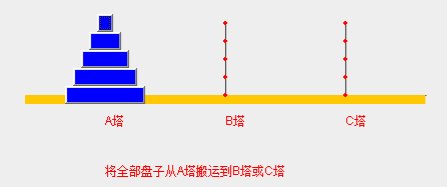

# 14.1 二分查找算法(非递归)

## 14.1.1二分查找算法(非递归)介绍


1. 前面介绍了二分查找算法，是使用递归的方式，下面使用二分查找算法的非递归方式。
2. 二分查找法只适用于从有序的数列中进行查找(比如数字和字母等)，将数列排序后再进行查找。
3. 二分查找法的运行时间为对数时间O(log~2~n)，即查找到需要的目标位置最多只需要log~2~n步，假设从[0,99]的队列(100 个数，即 n=100)中寻到目标数 30，则需要查找步数为log~2~100 , 即最多需要查找 7 次( 2^6^ < 100 < 2^7^)


## 14.1.2 二分查找算法(非递归)代码实现


数组 {1,3, 8, 10, 11, 67, 100}, 编程实现二分查找， 要求使用非递归的方式完成。

```java
package com.atguigu.binarysearchnorecursion;

public class BinarySearchNoRecur {

	public static void main(String[] args) {
		//测试
		int[] arr = {1,3, 8, 10, 11, 67, 100};
		int index = binarySearch(arr, 100);
		System.out.println("index=" + index);//
	}
	
	//二分查找的非递归实现
	/**
	 * @param arr 待查找的数组, arr是升序排序
	 * @param target 需要查找的数
	 * @return 返回对应下标，-1表示没有找到
	 */
	public static int binarySearch(int[] arr, int target) {
		
		int left = 0;
		int right = arr.length - 1;
		while(left <= right) { //说明继续查找
			int mid = (left + right) / 2;
			if(arr[mid] == target) {
				return mid;
			} else if ( arr[mid] > target) {
				right = mid - 1;//需要向左边查找
			} else {
				left = mid + 1; //需要向右边查找
			}
		}
		return -1;
	}

}
```


# 14.2 分治算法

## 14.2.1 分治算法介绍


1. 分治法是一种很重要的算法。字面上的解释是"分而治之"，就是把一个复杂的问题分成两个或更多的相同或相似的子问题，再把子问题分成更小的子问题......直到最后子问题可以简单的直接求解，原问题的解即子问题的解的合并。这个技巧是很多高效算法的基础，如排序算法(快速排序，归并排序)，傅立叶变换(快速傅立叶变 换)......

2. 分治算法可以求解的一些经典问题
   - 二分搜索
   - 大整数乘法
   - 棋盘覆盖
   - 合并排序
   - ==快速排序==
   - 线性时间选择
   - 最接近点对问题
   - 循环赛日程表
   - ==汉诺塔==


## 14.2.2 分治算法的基本步骤


分治法在每一层递归上都有三个步骤:

1. 分解:将原问题分解为若干个规模较小，相互独立，与原问题形式相同的子问题。
2. 解决:若子问题规模较小而容易被解决则直接解，否则递归地解各个子问题。
3. 合并:将各个子问题的解合并为原问题的解。


## 14.2.3 分治(Divide-and-Conquer(P))算法设计模式


```java
if |P|≤n0
   then return(ADHOC(P))
//将P分解为较小的子问题 P1 ,P2 ,…,Pk
for i←1 to k
do yi ← Divide-and-Conquer(Pi)   递归解决Pi
T ← MERGE(y1,y2,…,yk)   合并子问题
return(T)
```

其中|P|表示问题P的规模；n0为一阈值，表示当问题P的规模不超过n0时，问题已容易直接解出，不必再继续分解。ADHOC(P)是该分治法中的基本子算法，用于直接解小规模的问题P。因此，当P的规模不超过n0时直接用算法ADHOC(P)求解。算法MERGE(y1,y2,…,yk)是该分治法中的合并子算法，用于将P的子问题P1 ,P2 ,…,Pk的相应的解y1,y2,…,yk合并为P的解。


## 14.2.4 分治算法最佳实践-汉诺塔

### 1、汉诺塔介绍


汉诺塔(又称河内塔)问题是源于印度一个古老传说的益智玩具。大梵天创造世界的时候做了三根金刚石柱子，在一根柱子上从下往上按照大小顺序摞着 64 片黄金圆盘。大梵天命令婆罗门把圆盘从下面开始按大小顺序重新摆放在另一根柱子上。并且规定，在小圆盘上不能放大圆盘，在三根柱子之间一次只能移动一个圆盘。




### 2、 思路分析


1. 如果是有一个盘， A->C

   如果我们有 n >= 2 情况，我们总是可以看做是两个盘 1.最下边的盘 2. 上面的盘

2. 先把最上面的盘A->B

3. 把最下边的盘 A->C

4. 把B塔的所有盘从B->C


### 3、代码实现


```java
package com.atguigu.dac;

public class Hanoitower {

	public static void main(String[] args) {
		hanoiTower(3, 'A', 'B', 'C');
	}
	
	//汉诺塔的移动的方法
	//使用分治算法
	/**
	 * 
	 * @param num 总共多少个盘
	 * @param a 起始柱子
	 * @param b 借助的柱子
	 * @param c 目标柱子
	 */
	public static void hanoiTower(int num, char a, char b, char c) {
		//如果只有一个盘
		if(num == 1) {
			System.out.println("第1个盘从 " + a + "->" + c);
		} else {
			//如果我们有 n >= 2 情况，我们总是可以看做是两个盘 1.最下边的一个盘 2. 上面的所有盘
			//1. 先把 最上面的所有盘 A->B， 移动过程会使用到 c
			hanoiTower(num - 1, a, c, b);
			//2. 把最下边的盘 A->C
			System.out.println("第" + num + "个盘从 " + a + "->" + c);
			//3. 把B塔的所有盘 从 B->C , 移动过程使用到 a塔  
			hanoiTower(num - 1, b, a, c);
		}
	}

}
```


# 14.3 动态规划算法

