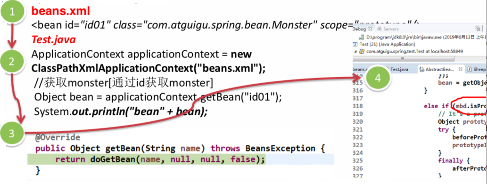

# 1.1 先看几个经典的面试题  

1) 有请使用UML类图画出原型模式核心角色

2) 原型设计模式的深拷贝和浅拷贝是什么，并写出深拷贝的两种方式的源码(重写 clone方法实现深拷贝、使用序列化来实现深拷贝)

3) 在Spring框架中哪里使用到原型模式，并对源码进行分析 

beans.xml
 \<bean id="id01" class="com.atguigu.spring.bean.Monster" scope="==prototype=="/> 

4)  Spring中原型bean的创建，就是原型模式的应用 

5) 代码分析+Debug源码 




# 1.2 设计模式的重要性 

1) 软件工程中，设计模式(design pattern)是对软件设计中普遍存在(反复出现) 的各种问题，所提出的解决方案。这个术语是由埃里希·伽玛(Erich Gamma)等人 在1990年代从建筑设计领域引入到计算机科学的 

2) 大厦VS简易房


3) 拿实际工作经历来说, 当一个项目开发完后，如果客户提出增新功能，怎么办?

4) 如果项目开发完后，原来程序员离职，你接手维护该项目怎么办? (维护性[可读性、 规范性])。

5) 目前程序员门槛越来越高，一线IT公司(大厂)，都会问你在实际项目中使用过什么设计模式，怎样使用的，解决了什么问题。

6) 设计模式在软件中哪里?面向对象(oo)=>功能模块[设计模式+算法(数据结构)]=>框架[使用到多种设计模式]=>架构 [服务器集群]。

7) 如果想成为合格软件工程师，那就花时间来研究下设计模式是非常必要的。


# 1.3  设计模式的目的

编写软件过程中，程序员面临着来自==耦合性，内聚性以及可维护性，可扩展性，重用性，灵活性==等多方面的挑战，设计模式是为了让程序(软件)，具有更好的

1) 代码重用性 (即:相同功能的代码，不用多次编写)

2) 可读性 (即:编程规范性,便于其他程序员的阅读和理解)

3) 可扩展性 (即:当需要增加新的功能时，非常的方便，称为可维护)

4) 可靠性 (即:当我们增加新的功能后，对原来的功能没有影响)

5) 使程序呈现高内聚，低耦合的特性


# 1.4 JDBC举例


```java
public void save(Student stu) {
    String sql = "INSERT INTO t_student(name,age) VALUES(?,?)";
    Connection conn = null;
    Statement st = null;
    try {
        // 1. 加载注册驱动
        Class.forName("com.mysql.jdbc.Driver");
        // 2. 获取数据库连接 
        conn=DriverManager.getConnection("jdbc:mysql:///jdbcdemo","root","root"); 
        // 3. 创建语句对象
        PreparedStatement ps = conn.prepareStatement(sql);
        ps.setObject(1, stu.getName());
        ps.setObject(2, stu.getAge());
        // 4. 执行 SQL 语句
        ps.executeUpdate();
        // 5. 释放资源
    } catch (Exception e) {
        e.printStackTrace();
    } finally {
        try {
            if (st != null)
                st.close();
        } catch (SQLException e) {
            e.printStackTrace();
        } finally {
            try {
                if (conn != null)
                    conn.close();
            } catch (SQLException e) {
                e.printStackTrace();
            }
        }
    }
}

// 删除学生信息
public void delete(Long id) {
    String sql = "DELETE FROM t_student WHERE id=?";
    Connection conn = null;
    Statement st = null;
    try {
        // 1. 加载注册驱动
        Class.forName("com.mysql.jdbc.Driver");
        // 2. 获取数据库连接
        conn = DriverManager.getConnection("jdbc:mysql:///jdbcdemo", "root", "root");
        // 3. 创建语句对象
        PreparedStatement ps = conn.prepareStatement(sql);
        ps.setObject(1, id);
        // 4. 执行 SQL 语句 
        ps.executeUpdate();
        // 5. 释放资源
    } catch (Exception e) {
        e.printStackTrace();
    } finally {
        try {
            if (st != null)
                st.close();
        } catch (SQLException e) {
            e.printStackTrace();
        } finally {
            try {
                if (conn != null)
                    conn.close();
            } catch (SQLException e) {
                e.printStackTrace();
            }
        }
    }
}

// 修改学生信息
public void update(Student stu) {
    String sql = "UPDATE t_student SET name=?,age=? WHERE id=?";
    Connection conn = null;
    Statement st = null;
    try {
        // 1. 加载注册驱动
        Class.forName("com.mysql.jdbc.Driver");
        // 2. 获取数据库连接 
        conn = DriverManager.getConnection("jdbc:mysql:///jdbcdemo", "root", "root");
        // 3. 创建语句对象
        PreparedStatement ps = conn.prepareStatement(sql);
        ps.setObject(1, stu.getName());
        ps.setObject(2, stu.getAge());
        ps.setObject(3, stu.getId());
        // 4. 执行 SQL 语句
        ps.executeUpdate();
        // 5. 释放资源
    } catch (Exception e) {
        e.printStackTrace();
    } finally {
        try {
            if (st != null)
                st.close();
        } catch (SQLException e) {
            e.printStackTrace();
        } finally {
            try {
                if (conn != null)
                    conn.close();
            } catch (SQLException e) {
                e.printStackTrace();
            }
        }
    }
}
```

上述代码中功能没问题，但是代码重复的太多，因此我们可以进行抽取，把重复的代码放 到一个工具类 JdbcUtil 里。

```JAVA
public class JdbcUtil {

    private JdbcUtil() {
    }

    static {
        // 1. 加载注册驱动 
        try {
            Class.forName("com.mysql.jdbc.Driver");
        } catch (Exception e) {
            e.printStackTrace();
        }
    }

    public static Connection getConnection() {
        try {
            // 2. 获取数据库连接
            return DriverManager.getConnection("jdbc:mysql:///jdbcdemo", "root", "root");
        } catch (Exception e) {
            e.printStackTrace();
        }
        return null;
    }

    //释放资源
    public static void close(ResultSet rs, Statement st, Connection conn) {
        try {
            if (rs != null)
                rs.close();
        } catch (SQLException e) {
            e.printStackTrace();
        } finally {
            try {
                if (st != null)
                    st.close();
            } catch (SQLException e) {
                e.printStackTrace();
            } finally {
                try {
                    if (conn != null)
                        conn.close();
                } catch (SQLException e) {
                    e.printStackTrace();
                }
            }
        }
    }
}
```

在实现类中直接调用工具类 JdbcUtil 中的方法即可

```JAVA
// 增加学生信息
public void save(Student stu) {
    String sql = "INSERT INTO t_student(name,age) VALUES(?,?)";
    Connection conn = null;
    PreparedStatement ps = null;
    try {
        conn = JDBCUtil.getConnection();
        // 3. 创建语句对象
        ps = conn.prepareStatement(sql);
        ps.setObject(1, stu.getName());
        ps.setObject(2, stu.getAge());
        // 4. 执行 SQL 语句 
        ps.executeUpdate();
        // 5. 释放资源
    } catch (Exception e) {
        e.printStackTrace();
    } finally {
        JDBCUtil.close(null, ps, conn);
    }
}

// 删除学生信息
public void delete(Long id) {
    String sql = "DELETE FROM t_student WHERE id=?";
    Connection conn = null;
    PreparedStatement ps = null;
    try {
        conn = JDBCUtil.getConnection();
        // 3. 创建语句对象
        ps = conn.prepareStatement(sql);
        ps.setObject(1, id);
        // 4. 执行 SQL 语句 
        ps.executeUpdate();
        // 5. 释放资源
    } catch (Exception e) {
        e.printStackTrace();
    } finally {
        JDBCUtil.close(null, ps, conn);
    }
}

// 修改学生信息
public void update(Student stu) {
    String sql = "UPDATE t_student SET name=?,age=? WHERE id=?";
    Connection conn = null;
    PreparedStatement ps = null;
    try {
        conn = JDBCUtil.getConnection();
        // 3. 创建语句对象
        ps = conn.prepareStatement(sql);
        ps.setObject(1, stu.getName());
        ps.setObject(2, stu.getAge());
        ps.setObject(3, stu.getId());
        // 4. 执行 SQL 语句 
        ps.executeUpdate();
        // 5. 释放资源
    } catch (Exception e) {
        e.printStackTrace();
    } finally {
        JDBCUtil.close(null, ps, conn);
    }
}

public Student get(Long id) {
    String sql = "SELECT * FROM t_student WHERE id=?";
    Connection conn = null;
    Statement st = null;
    ResultSet rs = null;
    PreparedStatement ps = null;
    try {
        conn = JDBCUtil.getConnection();
        // 3. 创建语句对象
        ps = conn.prepareStatement(sql);
        ps.setObject(1, id);
        // 4. 执行 SQL 语句
        rs = ps.executeQuery();
        if (rs.next()) {
            String name = rs.getString("name");
            int age = rs.getInt("age");
            Student stu = new Student(id, name, age);
            return stu;
        }
        // 5. 释放资源
    } catch (Exception e) {
        e.printStackTrace();
    } finally {
        JDBCUtil.close(rs, ps, conn);
    }
    return null;
}

public List<Student> list() {
    List<Student> list = new ArrayList<>();
    String sql = "SELECT * FROM t_student ";
    Connection conn = null;
    Statement st = null;
    ResultSet rs = null;
    PreparedStatement ps = null;
    try {
        conn = JDBCUtil.getConnection();
        // 3. 创建语句对象
        ps = conn.prepareStatement(sql);
        // 4. 执行 SQL 语句
        rs = ps.executeQuery();
        while (rs.next()) {
            long id = rs.getLong("id");
            String name = rs.getString("name");
            int age = rs.getInt("age");
            Student stu = new Student(id, name, age);
            list.add(stu);
        }
        // 5. 释放资源
    } catch (Exception e) {
        e.printStackTrace();
    } finally {
        JDBCUtil.close(rs, ps, conn);
    }
    return list;
}
```

虽然完成了重复代码的抽取，但数据库中的账号密码等直接显示在代码中，不利于后期账户密码改动的维护，我们可以建立个 db.propertise 文件用来存储这些信息

```properties
driverClassName =com.mysql.jdbc.Driver 
url =jdbc:mysql:///jdbcdemo
username =root
password =root
```

只需在工具类 JdbcUtil 中获取里面的信息即可

```java
static {
    // 1. 加载注册驱动 
    try {
        ClassLoader loader = Thread.currentThread().getContextClassLoader();
        InputStream inputStream = loader.getResourceAsStream("db.properties");
        p = new Properties();
        p.load(inputStream);
        Class.forName(p.getProperty("driverClassName"));
    } catch (
        Exception e) {
        e.printStackTrace();
    }

}

public static Connection getConnection() {
    try {
        // 2. 获取数据库连接
        return DriverManager.getConnection(p.getProperty("url"), p.getProperty("username"), p.getProperty("password"));
    } catch (Exception e) {
        e.printStackTrace();
    }
    return null;
}
```

抽取到这里貌似已经完成，但在实现类中，依然存在部分重复代码，在 DML 操作中，除 了 SQL 和设置值的不同，其他都相同，将相同的抽取出去，不同的部分通过参数传递进 来，无法直接放在工具类中，这时我们可以创建一个模板类 JdbcTemplate，创建一个 DML 和 DQL 的模板来进行对代码的重构。

```java
//查询统一模板
public static List<Student> query(String sql, Object... params) {
    List<Student> list = new ArrayList<>();
    Connection conn = null;
    PreparedStatement ps = null;
    ResultSet rs = null;
    try {
        conn = JDBCUtil.getConnection();
        ps = conn.prepareStatement(sql);
        //设置值
        for (int i = 0; i < params.length; i++) {
            ps.setObject(i + 1, params[i]);
        }
        rs = ps.executeQuery();
        while (rs.next()) {
            long id = rs.getLong("id");
            String name = rs.getString("name");
            int age = rs.getInt("age");
            Student stu = new Student(id, name, age);
            list.add(stu);
        }
        // 5. 释放资源
    } catch (Exception e) {
        e.printStackTrace();
    } finally {
        JDBCUtil.close(rs, ps, conn);
    }
    return list;
}
```

实现类直接调用方法即可。

```java
// 增加学生信息
public void save(Student stu) {
    String sql = "INSERT INTO t_student(name,age) VALUES(?,?)";
    Object[] params = new Object[]{stu.getName(), stu.getAge()};
    JdbcTemplate.update(sql, params);
}

// 删除学生信息
public void delete(Long id) {
    String sql = "DELETE FROM t_student WHERE id = ?";
    JdbcTemplate.update(sql, id);
}

// 修改学生信息
public void update(Student stu) {
    String sql = "UPDATE t_student SET name = ?,age = ? WHERE id = ?";
    Object[] params = new Object[]{stu.getName(), stu.getAge(), stu.getId()};
    JdbcTemplate.update(sql, params);
}

public Student get(Long id) {
    String sql = "SELECT * FROM t_student WHERE id=?";
    List<Student> list = JDBCTemplate.query(sql, id);
    return list.size() > 0 ? list.get(0) : null;
}

public List<Student> list() {
    String sql = "SELECT * FROM t_student ";
    return JDBCTemplate.query(sql);
}
```

这样重复的代码基本就解决了，但又个很严重的问题就是这个程序 DQL 操作中只能处理 Student 类和 t_student 表的相关数据，无法处理其他类如:Teacher 类和 t_teacher 表。 不同表(不同的对象),不同的表就应该有不同列，不同列处理结果集的代码就应该不一 样，处理结果集的操作只有 DAO 自己最清楚，也就是说，处理结果的方法压根就不应该 放在模板方中，应该由每个 DAO 自己来处理。因此我们可以创建一个 IRowMapper 接 口来处理结果集。

```java
public interface IRowMapper {
    //处理结果集
    List rowMapper(ResultSet rs) throws Exception;
}
```

DQL 模板类中调用 IRowMapper 接口中的 handle 方法，提醒实现类去自己去实现 mapping 方法

```java
public static List<Student> query(String sql, IRowMapper rsh, Object... params) {
    List<Student> list = new ArrayList<>();
    Connection conn = null;
    PreparedStatement ps = null;
    ResultSet rs = null;
    try {
        conn = JdbcUtil.getConnection();
        ps = conn.prepareStatement(sql);
        //设置值
        for (int i = 0; i < params.length; i++) {
            ps.setObject(i + 1, params[i]);
        }
        rs = ps.executeQuery();
        return rsh.mapping(rs); 
        // 5. 释放资源
    } catch (Exception e) {
        e.printStackTrace();
    } finally {
        JdbcUtil.close(rs, ps, conn);
    }
    return list;
}
```

实现类自己去实现 IRowMapper 接口的 mapping 方法，想要处理什么类型数据在里面定义即可

```java
public Student get(Long id) {
    String sql = "SELECT * FROM t_student WHERE id = ?";
    List<Student> list = JdbcTemplate.query(sql, new StudentRowMapper(), id);
    return list.size() > 0 ? list.get(0) : null;
}

public List<Student> list() {
    String sql = "SELECT * FROM t_student ";
    return JdbcTemplate.query(sql, new StudentRowMapper());
}

class StudentRowMapper implements IRowMapper {
    public List mapping(ResultSet rs) throws Exception {
        List<Student> list = new ArrayList<>();
        while (rs.next()) {
            long id = rs.getLong("id");
            String name = rs.getString("name");
            int age = rs.getInt("age");
            Student stu = new Student(id, name, age);
            list.add(stu);
        }
        return list;
    }
}
```

好了，基本已经大功告成了，但是 DQL 查询不单单只有查询学生信息(List 类型)，还 可以查询学生数量，这时就要通过泛型来完成

```java
public interface IRowMapper<T> { //处理结果集
    T mapping(ResultSet rs) throws Exception;
}
```


```java
public static <T> T query(String sql, IRowMapper<T> rsh, Object... params) {
    Connection conn = null;
    PreparedStatement ps = null;
    ResultSet rs = null;
    try {
        conn = JdbcUtil.getConnection();
        ps = conn.prepareStatement(sql);
        //设置值
        for (int i = 0; i < params.length; i++) {
            ps.setObject(i + 1, params[i]);
        }
        rs = ps.executeQuery();
        return rsh.mapping(rs); 
        // 5. 释放资源
    } catch (Exception e) {
        e.printStackTrace();
    } finally {
        JdbcUtil.close(rs, ps, conn);
    }
    return null;
}
```

这样不仅可以查询 List，还可以查询学生数量:

```java
    public Long getCount() {
        String sql = "SELECT COUNT(*) total FROM t_student";
        Long totalCount = (Long) JdbcTemplate.query(sql,
                new IRowMapper<Long>() {
                    public Long mapping(ResultSet rs) throws Exception {
                        Long totalCount = null;
                        if (rs.next()) {
                            totalCount = rs.getLong("total");
                        }
                        return totalCount;
                    }
                });
        return totalCount;
    }
```

好了，重构设计已经完成，好的代码能让我们以后维护更方便，因此学会对代码的重构是非常重要的


# 1.5 经典框架都在用设计模式解决问题

Spring 就是一个把设计模式用得淋漓尽致的经典框架，其实从类的命名就能看出来，来一一列举:

| 设计模式名称 | 举例                  |
| ------------ | --------------------- |
| 工厂模式     | BeanFactory           |
| 装饰者模式   | BeanWrapper           |
| 代理模式     | AopProxy              |
| 委派模式     | DispatcherServlet     |
| 策略模式     | HandlerMapping        |
| 适配器模式   | HandlerAdapter        |
| 模板模式     | JdbcTemplate          |
| 观察者模式   | ContextLoaderListener |

需要特别声明的是，设计模式从来都不是单个设计模式独立使用的。在实际应用中，通常是多个设计模式混合使用，你中有我，我中有你。后面我们会会围绕 Spring 的 IOC、 AOP、MVC、JDBC 这样的思路展开，根据其设计类型来设计讲解顺序。