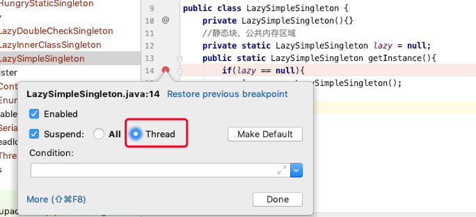
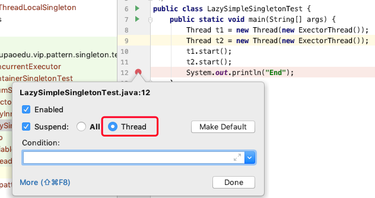
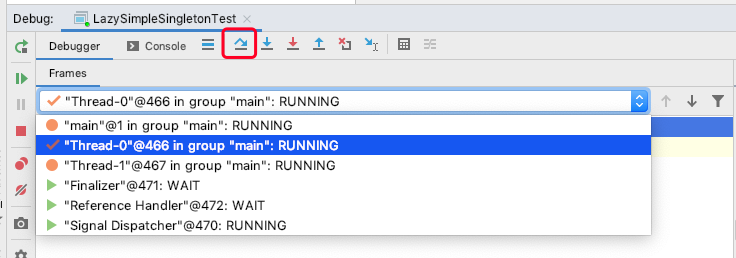
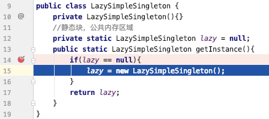

# 5.1 懒汉式(线程不安全)调试


懒汉式单例的简单 实现 LazySimpleSingleton:

```java
package com.gupaoedu.vip.pattern.singleton.lazy;
public class LazySimpleSingleton {
    private LazySimpleSingleton(){}
    //静态块，公共内存区域
    private static LazySimpleSingleton lazy = null;
    public synchronized static LazySimpleSingleton getInstance(){
        if(lazy == null){
            lazy = new LazySimpleSingleton();
        }
        return lazy;
    }
}
```

然后写一个线程类 ExectorThread 类:

```java
package com.gupaoedu.vip.pattern.singleton.test;
public class ExectorThread implements Runnable{
    @Override
    public void run() {
        LazySimpleSingleton singleton = LazySimpleSingleton.getInstance();
        System.out.println(Thread.currentThread().getName() + ":" + singleton);
    }
}
```

客户端测试代码:

```java
package com.gupaoedu.vip.pattern.singleton.test;
public class LazySimpleSingletonTest {
    public static void main(String[] args) {
        Thread t1 = new Thread(new ExectorThread());
        Thread t2 = new Thread(new ExectorThread());
        t1.start();
        t2.start();
        System.out.println("End");
    }
}
```

用线程模式调试，手动控制线程的 执行顺序来跟踪内存的变化状态。先给 ExectorThread 类打上断点，右键点击断点，切换为 Thread 模式，如下图:


然后，给 LazySimpleSingleton 类打上断点，同样标记为 Thread 模式:



切回到客户端测试代码，同样也打上断点，同时改为 Thread 模式，如下图:



开始 debug 之后，会看到 debug 控制台可以自由切换 Thread 的运行状态:

选中线程0，按F8，运行到检查为空




再选中线程1，按F8运行到同样位置




然后一直F8，直到线程1运行完毕。

然后再选择线程0，一直F8直到线程0运行完毕。

可以看到console输出了两个对象，地址不同：


给 `getInstance()` 加上 synchronized 关键字，是这个方法变成线程同步方法:

```java
public class LazySimpleSingleton {
    private LazySimpleSingleton(){}
    //静态块，公共内存区域
    private static LazySimpleSingleton lazy = null;
    public synchronized static LazySimpleSingleton getInstance(){
        if(lazy == null){
            lazy = new LazySimpleSingleton();
        }
        return lazy;
    }
}
```

这时候，我们再来调试。当我们将其中一个线程执行并调用 getInstance()方法时，另一个线程在调用 `getInstance()` 方法，线程的状态由 RUNNING 变成了 MONITOR，出现阻塞。直到第一个线程执行完这个方法，第二个线程才恢复 RUNNING 状态继续调用 `getInstance()` 方法。如下图所示:


# 5.2 反射破坏单例


大家有没有发现，上面介绍的单例模式的构造方法除了加上 private 以外，没有做任何处理。如果我们使用反射来调用其构造方法，然后，再调用 `getInstance()` 方法，应该就会两个不同的实例。现在来看一段测试代码，以 LazyInnerClassSingleton 为例:

```java
package com.gupaoedu.vip.pattern.singleton.lazy;
//懒汉式单例
public class LazyInnerClassSingleton {
    private LazyInnerClassSingleton(){}
    public static final LazyInnerClassSingleton getInstance(){
        return LazyHolder.LAZY;
    }
    //默认不加载
    private static class LazyHolder{
        private static final LazyInnerClassSingleton LAZY = new LazyInnerClassSingleton();
    }
}
```

```java
package com.gupaoedu.vip.pattern.singleton.test;
public class LazyInnerClassSingletonTest {

    public static void main(String[] args) {
        try{
            //很无聊的情况下，进行破坏
            Class<?> clazz = LazyInnerClassSingleton.class;

            //通过反射拿到私有的构造方法
            Constructor c = clazz.getDeclaredConstructor(null);
            //强制访问，强吻，不愿意也要吻
            c.setAccessible(true);

            //暴力初始化
            Object o1 = c.newInstance();

            //调用了两次构造方法，相当于new了两次
            //犯了原则性问题，
            Object o2 = c.newInstance();
            System.out.println(o1 == o2); //false

        }catch (Exception e){
            e.printStackTrace();
        }
    }
}
```

显然，是创建了两个不同的实例。现在，我们在其构造方法中做一些限制，一旦出现多次重复创建，则直接抛出异常。来看优化后的代码:

```java
//史上最牛 B 的单例模式的实现方式
public class LazyInnerClassSingleton {
    //默认使用LazyInnerClassGeneral的时候，会先初始化内部类
    //如果没使用的话，内部类是不加载的
    private LazyInnerClassSingleton(){
        if(LazyHolder.LAZY != null){
            throw new RuntimeException("不允许创建多个实例");
        }
    }

    //每一个关键字都不是多余的
    //static 是为了使单例的空间共享
    //保证这个方法不会被重写，重载
    public static final LazyInnerClassSingleton getInstance(){
        //在返回结果以前，一定会先加载内部类
        return LazyHolder.LAZY;
    }

    //默认不加载
    private static class LazyHolder{
        private static final LazyInnerClassSingleton LAZY = new LazyInnerClassSingleton();
    }
}
```

再运行测试代码，会得到以下结果:


至此，史上最牛 B 的单例写法便大功告成。


# 5.3 序列化破坏单例


当我们将一个单例对象创建好，有时候需要将对象序列化然后写入到磁盘，下次使用时再从磁盘中读取到对象，反序列化转化为内存对象。反序列化后的对象会重新分配内存， 即重新创建。那如果序列化的目标的对象为单例对象，就违背了单例模式的初衷，相当于破坏了单例，来看一段代码:

```java
package com.gupaoedu.vip.pattern.singleton.seriable;
//反序列化时导致单例破坏
public class SeriableSingleton implements Serializable {

    //序列化就是说把内存中的状态通过转换成字节码的形式
    //从而转换一个IO流，写入到其他地方(可以是磁盘、网络IO)
    //内存中状态给永久保存下来了

    //反序列化
    //讲已经持久化的字节码内容，转换为IO流
    //通过IO流的读取，进而将读取的内容转换为Java对象
    //在转换过程中会重新创建对象new

    public  final static SeriableSingleton INSTANCE = new SeriableSingleton();
    private SeriableSingleton(){}

    public static SeriableSingleton getInstance(){
        return INSTANCE;
    }
}
```

编写测试代码:

```java
package com.gupaoedu.vip.pattern.singleton.test;
public class SeriableSingletonTest {
    public static void main(String[] args) {

        SeriableSingleton s1 = null;
        SeriableSingleton s2 = SeriableSingleton.getInstance();

        FileOutputStream fos = null;
        try {
            fos = new FileOutputStream("SeriableSingleton.obj");
            ObjectOutputStream oos = new ObjectOutputStream(fos);
            oos.writeObject(s2);
            oos.flush();
            oos.close();


            FileInputStream fis = new FileInputStream("SeriableSingleton.obj");
            ObjectInputStream ois = new ObjectInputStream(fis);
            s1 = (SeriableSingleton)ois.readObject();
            ois.close();

            System.out.println(s1);
            System.out.println(s2);
            System.out.println(s1 == s2);

        } catch (Exception e) {
            e.printStackTrace();
        }
    }
}
```

运行结果:


运行结果中，可以看出，反序列化后的对象和手动创建的对象是不一致的，实例化了两 次，违背了单例的设计初衷。那么，我们如何保证序列化的情况下也能够实现单例？其实很简单，只需要增加 `readResolve()` 方法即可。来看优化代码:

```java
package com.gupaoedu.vip.pattern.singleton.seriable;
public class SeriableSingleton implements Serializable {
    public  final static SeriableSingleton INSTANCE = new SeriableSingleton();
    private SeriableSingleton(){}

    public static SeriableSingleton getInstance(){
        return INSTANCE;
    }

    private Object readResolve(){
        return  INSTANCE;
    }
}
```

再看运行结果:


大家一定会关心这是什么原因呢?为什么要这样写?看上去很神奇的样子，也让人有些费解。不如，我们一起来看看 JDK 的源码实现以一清二楚了。我们进入 ObjectInputStream 类的 `readObject()`方法，代码如下:

```java
public final Object readObject()
    throws IOException, ClassNotFoundException
{
    if (enableOverride) {
        return readObjectOverride();
    }

    // if nested read, passHandle contains handle of enclosing object
    int outerHandle = passHandle;
    try {
        Object obj = readObject0(false);
        handles.markDependency(outerHandle, passHandle);
        ClassNotFoundException ex = handles.lookupException(passHandle);
        if (ex != null) {
            throw ex;
        }
        if (depth == 0) {
            vlist.doCallbacks();
        }
        return obj;
    } finally {
        passHandle = outerHandle;
        if (closed && depth == 0) {
            clear();
        }
    }
}
```

我们发现在 `readObject` 中又调用了我们重写的 `readObject0()`方法。进入 `readObject0()` 方法，代码如下:

```java
private Object readObject0(boolean unshared) throws IOException { 
    //...
    case TC_OBJECT:
    return checkResolve(readOrdinaryObject(unshared));
    //...                                       
}
```

我们看到 TC_OBJECTD 中判断，调用了 ObjectInputStream 的 `readOrdinaryObject()` 方法，我们继续进入看源码:

```java
private Object readOrdinaryObject(boolean unshared)
    throws IOException
{
   //...
    Object obj;
    try {
        obj = desc.isInstantiable() ? desc.newInstance() : null;
    } catch (Exception ex) {
        throw (IOException) new InvalidClassException(
            desc.forClass().getName(),
            "unable to create instance").initCause(ex);
    }
  	//...
    return obj;
}
```

发现调用了 ObjectStreamClass 的 `isInstantiable()`方法，而 `isInstantiable()`里面的代码如下:

```java
boolean isInstantiable() {
    requireInitialized();
    return (cons != null);
}
```

代码非常简单，就是判断一下构造方法是否为空，构造方法不为空就返回 true。意味着，只要有无参构造方法就会实例化。

这时候，其实还没有找到为什么加上` readResolve()`方法就避免了单例被破坏的真正原因。我再回到 ObjectInputStream 的 `readOrdinaryObject()`方法继续往下看:

```java
private Object readOrdinaryObject(boolean unshared)
    throws IOException
{
   //...
    Object obj;
    try {
        obj = desc.isInstantiable() ? desc.newInstance() : null;
    } catch (Exception ex) {
        throw (IOException) new InvalidClassException(
            desc.forClass().getName(),
            "unable to create instance").initCause(ex);
    }

    //...
    if (obj != null &&
        handles.lookupException(passHandle) == null &&
        desc.hasReadResolveMethod())
    {
        Object rep = desc.invokeReadResolve(obj);
        if (unshared && rep.getClass().isArray()) {
            rep = cloneArray(rep);
        }
        if (rep != obj) {
            // Filter the replacement object
            if (rep != null) {
                if (rep.getClass().isArray()) {
                    filterCheck(rep.getClass(), Array.getLength(rep));
                } else {
                    filterCheck(rep.getClass(), -1);
                }
            }
            handles.setObject(passHandle, obj = rep);
        }
    }

    return obj;
}
```

判断无参构造方法是否存在之后，又调用了 `hasReadResolveMethod()`方法，来看代码:

```java
boolean hasReadResolveMethod() {
    requireInitialized();
    return (readResolveMethod != null);
}
```

逻辑非常简单，就是判断 readResolveMethod 是否为空，不为空就返回 true。那么 readResolveMethod 是在哪里赋值的呢？通过全局查找找到了赋值代码在私有方法 `ObjectStreamClass()`方法中给 readResolveMethod 进行赋值，来看代码:

```java
readResolveMethod = getInheritableMethod(cl, "readResolve", null, Object.class);
```

上面的逻辑其实就是通过反射找到一个无参的 `readResolve()`方法，并且保存下来。现在再回到 ObjectInputStream 的 `readOrdinaryObject()`方法继续往下看， 如果 `readResolve()`存在则调用 `invokeReadResolve()`方法，来看代码:

```java
Object invokeReadResolve(Object obj)
    throws IOException, UnsupportedOperationException
{
    requireInitialized();
    if (readResolveMethod != null) {
        try {
            return readResolveMethod.invoke(obj, (Object[]) null);
        } catch (InvocationTargetException ex) {
            Throwable th = ex.getTargetException();
            if (th instanceof ObjectStreamException) {
                throw (ObjectStreamException) th;
            } else {
                throwMiscException(th);
                throw new InternalError(th);  // never reached
            }
        } catch (IllegalAccessException ex) {
            // should not occur, as access checks have been suppressed
            throw new InternalError(ex);
        }
    } else {
        throw new UnsupportedOperationException();
    }
}
```

我们可以看到在 `invokeReadResolve()`方法中用反射调用了 `readResolveMethod` 方法。 通过 JDK 源码分析我们可以看出，虽然，增加 `readResolve()`方法返回实例，解决了单例被破坏的问题。但是，我们通过分析源码以及调试，我们可以看到实际上实例化了两 次，只不过新创建的对象没有被返回而已。那如果，创建对象的动作发生频率增大，就意味着内存分配开销也就随之增大，难道真的就没办法从根本上解决问题吗？下面我们来==注册式单例==也许能帮助到你。


# 5.4 注册式单例