# 6.1 引出问题 

## 6.1.1 看一个具体的需求 

看一个披萨的项目:要便于披萨种类的扩展，要便于维护 

1. 披萨的种类很多(比如 GreekPizz、CheesePizz 等)
2. 披萨的制作有 prepare,bake,cut,box
3. 完成披萨店订购功能。 

## 6.1.2 使用传统的方式来完成 

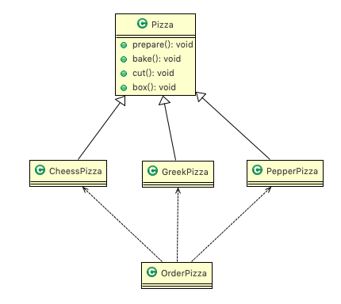

编写 OrderPizza.java 去订购需要的各种 Pizza 

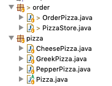

```java
package com.atguigu.factory.simplefactory.pizzastore.pizza;
//将Pizza 类做成抽象
public abstract class Pizza {
	protected String name; //名字

	//准备原材料, 不同的披萨不一样，因此，我们做成抽象方法
	public abstract void prepare();
	//烘烤
	public void bake() { System.out.println(name + " baking;"); }
	//切割
	public void cut() { System.out.println(name + " cutting;"); }
	//打包
	public void box() { System.out.println(name + " boxing;"); }

	public void setName(String name) { this.name = name; }
}
```

```java
package com.atguigu.factory.simplefactory.pizzastore.pizza;
public class CheesePizza extends Pizza {
	@Override
	public void prepare() { System.out.println(" 给制作奶酪披萨 准备原材料 "); }
}
```

```java
package com.atguigu.factory.simplefactory.pizzastore.pizza;
public class GreekPizza extends Pizza {
	@Override
	public void prepare() { System.out.println(" 给希腊披萨 准备原材料 "); }
}
```

```java
package com.atguigu.factory.simplefactory.pizzastore.pizza;
public class PepperPizza extends Pizza {
	@Override
	public void prepare() { System.out.println(" 给胡椒披萨准备原材料 "); }
}
```


```java
package com.atguigu.factory.simplefactory.pizzastore.order;

import java.io.BufferedReader;
import java.io.IOException;
import java.io.InputStreamReader;

import com.atguigu.factory.simplefactory.pizzastore.pizza.CheesePizza;
import com.atguigu.factory.simplefactory.pizzastore.pizza.GreekPizza;
import com.atguigu.factory.simplefactory.pizzastore.pizza.PepperPizza;
import com.atguigu.factory.simplefactory.pizzastore.pizza.Pizza;

public class OrderPizza {

	// 构造器
	public OrderPizza() {
		Pizza pizza = null;
		String orderType; // 订购披萨的类型
		do {
			orderType = getType();
			if (orderType.equals("cheese")) {
				pizza = new GreekPizza();
				pizza.setName(" 奶酪披萨 ");
			} else if (orderType.equals("greek")) {
				pizza = new CheesePizza();
				pizza.setName(" 希腊披萨 ");
			} else if (orderType.equals("pepper")) {
				pizza = new PepperPizza();
				pizza.setName(" 胡椒披萨 ");
			} else {
				break;
			}
			//输出pizza 制作过程
			pizza.prepare();
			pizza.bake();
			pizza.cut();
			pizza.box();
			
		} while (true);
	}
	
	// 写一个方法，可以获取客户希望订购的披萨种类
	private String getType() {
		try {
			BufferedReader strin = new BufferedReader(new InputStreamReader(System.in));
			System.out.println("input pizza 种类:");
			String str = strin.readLine();
			return str;
		} catch (IOException e) {
			e.printStackTrace();
			return "";
		}
	}
}
```

```java
package com.atguigu.factory.simplefactory.pizzastore.order;

//相当于一个客户端，发出订购
public class PizzaStore {
	public static void main(String[] args) {
		new OrderPizza();
	}
}
```

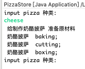

## 6.1.3 传统的方式的优缺点 

1. 优点是比较好理解，简单易操作。
2. 缺点是违反了设计模式的ocp原则，即==对扩展开放，对修改关闭==。即当我们给类增加新功能的时候，尽量不修改代码，或者尽可能少修改代码。
3. 比如我们这时要新增加一个Pizza的种类(Pepper披萨)，我们需要新增PepperPizza类和修改OrderPizza类(扩展开放满足，修改关闭不满足)。


4. 改进的思路分析：
   1. ==分析==: 修改代码可以接受，但是如果我们在其它的地方也有创建Pizza的代码，就意味着，也需要修改，而创建Pizza的代码，==往往有多处==。 
   2. ==思路==: 把创建Pizza对象封装到一个类中，这样我们有新的Pizza种类时，只需要修改该类就可，==其它有创建到Pizza对象的代码就不需要修改了==-> ==简单工厂模式== 


# 6.2 简单工厂模式 

## 6.2.1 基本介绍 

1. 简单工厂模式是属于创建型模式，是工厂模式的一种。==简单工厂模式是由一个工厂对象决定创建出哪一种产品类的实例==。简单工厂模式是工厂模式家族中最简单实用的模式 。
2. 简单工厂模式:定义了一个创建对象的类，由这个类来**封装实例化对象的行为**(代码)。 
3. 在软件开发中，当我们会用到大量的创建某种、某类或者某批对象时，就会使用到工厂模式。
4. 工厂类创建的对象比较少。
5. 客户端只需要传入工厂类的参数，对于如何创建对象的逻辑不需要关心。
6. 不属于23种设计模式中。


## 6.2.2 简单工厂

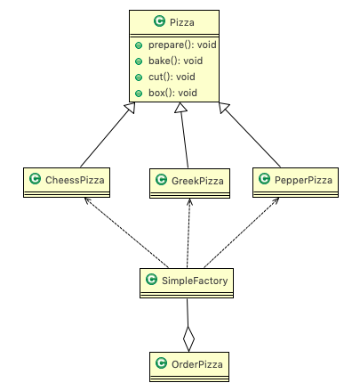

```java
package com.atguigu.factory.simplefactory.pizzastore.improve.order;

import com.atguigu.factory.simplefactory.pizzastore.pizza.CheesePizza;
import com.atguigu.factory.simplefactory.pizzastore.pizza.GreekPizza;
import com.atguigu.factory.simplefactory.pizzastore.pizza.PepperPizza;
import com.atguigu.factory.simplefactory.pizzastore.pizza.Pizza;

//简单工厂类
public class SimpleFactory {

	//更加orderType 返回对应的Pizza 对象
	public Pizza createPizza(String orderType) {
		Pizza pizza = null;

		System.out.println("使用简单工厂模式");
		if (orderType.equals("greek")) {
			pizza = new GreekPizza();
			pizza.setName(" 希腊披萨 ");
		} else if (orderType.equals("cheese")) {
			pizza = new CheesePizza();
			pizza.setName(" 奶酪披萨 ");
		} else if (orderType.equals("pepper")) {
			pizza = new PepperPizza();
			pizza.setName("胡椒披萨");
		}
		
		return pizza;
	}

}
```

```java
package com.atguigu.factory.simplefactory.pizzastore.improve.order;

import java.io.BufferedReader;
import java.io.IOException;
import java.io.InputStreamReader;
import com.atguigu.factory.simplefactory.pizzastore.pizza.Pizza;

public class OrderPizza {
	//定义一个简单工厂对象
	SimpleFactory simpleFactory;
	Pizza pizza = null;
	
	//构造器
	public OrderPizza(SimpleFactory simpleFactory) {
		setFactory(simpleFactory);
	}
	
	public void setFactory(SimpleFactory simpleFactory) {
		String orderType = ""; //用户输入的
		
		this.simpleFactory = simpleFactory; //设置简单工厂对象
		
		do {
			orderType = getType(); 
			pizza = this.simpleFactory.createPizza(orderType);
			
			//输出pizza
			if(pizza != null) { //订购成功
				pizza.prepare();
				pizza.bake();
				pizza.cut();
				pizza.box();
			} else {
				System.out.println(" 订购披萨失败 ");
				break;
			}
		}while(true);
	}

}
```

```java
package com.atguigu.factory.simplefactory.pizzastore.improve.order;

//相当于一个客户端，发出订购
public class PizzaStore {
	public static void main(String[] args) {
		//使用简单工厂模式
		new OrderPizza(new SimpleFactory());
	}
}
```


### 另外案例

有 Java 架构、大数据、人工 智能等课程，已经形成了一个生态。我们可以定义一个课程标准 ICourse 接口:

```java
package com.gupaoedu.vip.pattern.factory;
public interface ICourse {
     // 录制视频
    void record();
}

```

创建一个 Java 课程的实现 JavaCourse 类:

```java
public class JavaCourse implements ICourse {
    public void record() {
        System.out.println("录制Java课程");
    }
}
```

看客户端调用代码，我们会这样写:

```java
public class SimpleFactoryTest {
    public static void main(String[] args) {
        ICourse course = new JavaCourse();
        course.record();
    }
}
```

看上面的代码，父类 ICourse 指向子类 JavaCourse 的引用，应用层代码需要依赖 JavaCourse，如果业务扩展，我继续增加 PythonCourse 甚至更多，那么我们客户端的依赖会变得越来越臃肿。因此，我们要想办法把这种依赖减弱，把创建细节隐藏。虽然目前的代码中，我们创建对象的过程并不复杂，但从代码设计角度来讲不易于扩展。现在，我们用简单工厂模式对代码进行优化。先增加课程 PythonCourse 类:

```java
public class PythonCourse implements ICourse {
    public void record() {
        System.out.println("录制Python课程");
    }
}
```

创建 CourseFactory 工厂类:

```java
public class CourseFactory {
    public ICourse create(String name) {
        if ("java".equals(name)) {
            return new JavaCourse();
        } else if ("python".equals(name)) {
            return new PythonCourse();
        } else {
            return null;
        }
    }
}
```

修改客户端调用代码:

```java
public class SimpleFactoryTest {
    public static void main(String[] args) {
        CourseFactory factory = new CourseFactory();
        ICourse course = factory.create("java");
        course.record();
    }
}
```

先看一下类图:


当然，我们为了调用方便，可将 factory 的 create()改为静态方法。


客户端调用是简单了，但如果我们业务继续扩展，要增加前端课程，那么工厂中的 create() 就要根据产品链的丰富每次都要修改代码逻辑。不符合开闭原则。因此，我们对简单工 厂还可以继续优化，可以采用反射技术:

```java
public class CourseFactory {
    public ICourse create(String className) {
        try {
            if (!(null == className || "".equals(className))) {
                return (ICourse) Class.forName(className).newInstance();
            }

        } catch (Exception e) {
            e.printStackTrace();
        }
        return null;
    }
}
```

修改客户端调用代码:

```java
public class SimpleFactoryTest {
    public static void main(String[] args) {
        CourseFactory factory = new CourseFactory();
        ICourse course = factory.create("com.gupaoedu.vip.pattern.factory.JavaCourse");
        course.record();
    }
}
```

优化之后，产品不断丰富不需要修改 CourseFactory 中的代码。但是，有个问题是，方法参数是字符串，可控性有待提升，而且还需要强制转型。我们再修改一下代码:

```java
public class CourseFactory {
    public ICourse create(Class<? extends ICourse> clazz){
        try {
            if (null != clazz) {
                return clazz.newInstance();
            }
        }catch (Exception e){
            e.printStackTrace();
        }
        return null;
    }
}
```

优化客户端代码:

```java
public class SimpleFactoryTest {
    public static void main(String[] args) {
        CourseFactory factory = new CourseFactory();
        ICourse course = factory.create(JavaCourse.class);
        course.record();
    }
}
```

再看一下类图:


## 6.2.3 静态工厂

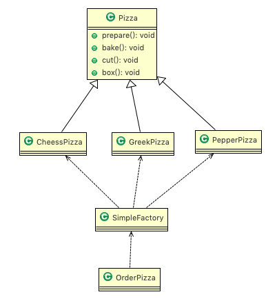

```java
package com.atguigu.factory.simplefactory.pizzastore.improve.order;

import com.atguigu.factory.simplefactory.pizzastore.pizza.CheesePizza;
import com.atguigu.factory.simplefactory.pizzastore.pizza.GreekPizza;
import com.atguigu.factory.simplefactory.pizzastore.pizza.PepperPizza;
import com.atguigu.factory.simplefactory.pizzastore.pizza.Pizza;

//简单工厂类
public class SimpleFactory {
	//简单工厂模式 也叫 静态工厂模式 
	public static Pizza createPizza2(String orderType) {
		Pizza pizza = null;

		System.out.println("使用简单工厂模式2");
		if (orderType.equals("greek")) {
			pizza = new GreekPizza();
			pizza.setName(" 希腊披萨 ");
		} else if (orderType.equals("cheese")) {
			pizza = new CheesePizza();
			pizza.setName(" 奶酪披萨 ");
		} else if (orderType.equals("pepper")) {
			pizza = new PepperPizza();
			pizza.setName("胡椒披萨");
		}
		return pizza;
	}

}
```

```java
package com.atguigu.factory.simplefactory.pizzastore.improve.order;

import java.io.BufferedReader;
import java.io.IOException;
import java.io.InputStreamReader;
import com.atguigu.factory.simplefactory.pizzastore.pizza.Pizza;

public class OrderPizza2 {

	Pizza pizza = null;
	String orderType = "";
	// 构造器
	public OrderPizza2() {
		do {
			orderType = getType();
			pizza = SimpleFactory.createPizza2(orderType);

			// 输出pizza
			if (pizza != null) { // 订购成功
				pizza.prepare();
				pizza.bake();
				pizza.cut();
				pizza.box();
			} else {
				System.out.println(" 订购披萨失败 ");
				break;
			}
		} while (true);
	}

	// 写一个方法，可以获取客户希望订购的披萨种类
	private String getType() {
		try {
			BufferedReader strin = new BufferedReader(new InputStreamReader(System.in));
			System.out.println("input pizza 种类:");
			String str = strin.readLine();
			return str;
		} catch (IOException e) {
			e.printStackTrace();
			return "";
		}
	}
}
```

```java
package com.atguigu.factory.simplefactory.pizzastore.improve.order;

//相当于一个客户端，发出订购
public class PizzaStore {
	public static void main(String[] args) {
		//使用静态工厂模式 
		new OrderPizza2();
	}
}
```

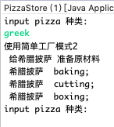


## 6.2.4 简单工厂源码-Calendar

简单工厂模式在 JDK 源码也是无处不在，现在我们来举个例子，例如 Calendar 类，看 `Calendar.getInstance()`方法，下面打开的是 Calendar 的具体创建类:

```java
private static Calendar createCalendar(TimeZone zone,
                                       Locale aLocale)
{
    CalendarProvider provider =
        LocaleProviderAdapter.getAdapter(CalendarProvider.class, aLocale)
        .getCalendarProvider();
    if (provider != null) {
        try {
            return provider.getInstance(zone, aLocale);
        } catch (IllegalArgumentException iae) {
            // fall back to the default instantiation
        }
    }

    Calendar cal = null;

    if (aLocale.hasExtensions()) {
        String caltype = aLocale.getUnicodeLocaleType("ca");
        if (caltype != null) {
            switch (caltype) {
                case "buddhist":
                    cal = new BuddhistCalendar(zone, aLocale);
                    break;
                case "japanese":
                    cal = new JapaneseImperialCalendar(zone, aLocale);
                    break;
                case "gregory":
                    cal = new GregorianCalendar(zone, aLocale);
                    break;
            }
        }
    }
    if (cal == null) {
        // If no known calendar type is explicitly specified,
        // perform the traditional way to create a Calendar:
        // create a BuddhistCalendar for th_TH locale,
        // a JapaneseImperialCalendar for ja_JP_JP locale, or
        // a GregorianCalendar for any other locales.
        // NOTE: The language, country and variant strings are interned.
        if (aLocale.getLanguage() == "th" && aLocale.getCountry() == "TH") {
            cal = new BuddhistCalendar(zone, aLocale);
        } else if (aLocale.getVariant() == "JP" && aLocale.getLanguage() == "ja"
                   && aLocale.getCountry() == "JP") {
            cal = new JapaneseImperialCalendar(zone, aLocale);
        } else {
            cal = new GregorianCalendar(zone, aLocale);
        }
    }
    return cal;
}
```


## 6.2.5 缺点


简单工厂也有它的缺点:工厂类的职责相对过重，不易于扩展过于复杂的产品结构。


# 6.3 看一个新的需求 

披萨项目新的需求:客户在点披萨时，可以点不同口味的披萨，比如 北京的奶酪pizza、 北京的胡椒pizza 或者是伦敦的奶酪pizza、伦敦的胡椒pizza。 

思路1

使用==简单工厂模式==，创建==不同的简单工厂类==，比如 BJPizzaSimpleFactory、LDPizzaSimpleFactory 等等.从当前这个案例来说，也是可以的，但是考虑到项目的规模，以及软件的可维护性、可扩展性并不是特别好

思路 2 

使用工厂方法模式 

# 6.4  工厂方法模式 

## 6.4.1 基本介绍

1. 工厂方法模式设计方案:将披萨项目的实例化功能抽象成抽象方法，在不同的口味点餐子类中具体实现。 
2. 工厂方法模式:定义了一个创建对象的抽象方法，由子类决定要实例化的类。工厂方法模式将对象的实例化推迟到子类。 
3. 在工厂方法模式中用户只需要关心所需产品对应的工厂，无须关心创建细节，而且加入新的产品符合开闭原则。
4. 

## 6.4.2 UML类图

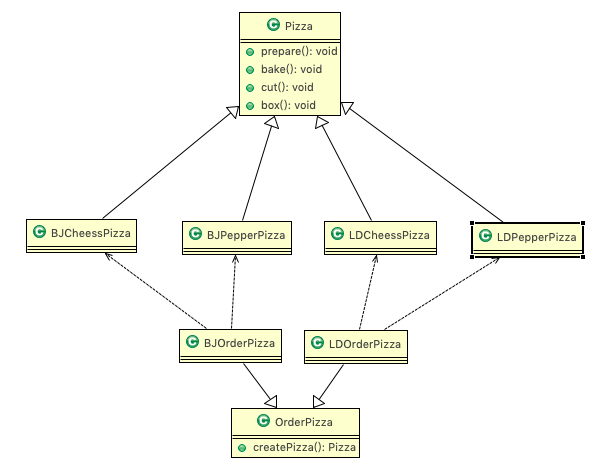

## 6.4.3 代码实现

```java
package com.atguigu.factory.factorymethod.pizzastore.order;

import java.io.BufferedReader;
import java.io.IOException;
import java.io.InputStreamReader;
import com.atguigu.factory.factorymethod.pizzastore.pizza.Pizza;

public abstract class OrderPizza {

	//定义一个抽象方法，createPizza , 让各个工厂子类自己实现
	abstract Pizza createPizza(String orderType);
	
	// 构造器
	public OrderPizza() {
		Pizza pizza = null;
		String orderType; // 订购披萨的类型
		do {
			orderType = getType();
			pizza = createPizza(orderType); //抽象方法，由工厂子类完成
			//输出pizza 制作过程
			pizza.prepare();
			pizza.bake();
			pizza.cut();
			pizza.box();
		} while (true);
	}

	// 写一个方法，可以获取客户希望订购的披萨种类
	private String getType() {
		try {
			BufferedReader strin = new BufferedReader(new InputStreamReader(System.in));
			System.out.println("input pizza 种类:");
			String str = strin.readLine();
			return str;
		} catch (IOException e) {
			e.printStackTrace();
			return "";
		}
	}

}
```

```java
package com.atguigu.factory.factorymethod.pizzastore.order;

import com.atguigu.factory.factorymethod.pizzastore.pizza.BJCheesePizza;
import com.atguigu.factory.factorymethod.pizzastore.pizza.BJPepperPizza;
import com.atguigu.factory.factorymethod.pizzastore.pizza.Pizza;

public class BJOrderPizza extends OrderPizza {

	@Override
	Pizza createPizza(String orderType) {
		Pizza pizza = null;
		if(orderType.equals("cheese")) {
			pizza = new BJCheesePizza();
		} else if (orderType.equals("pepper")) {
			pizza = new BJPepperPizza();
		}
		return pizza;
	}

}
```

```java
package com.atguigu.factory.factorymethod.pizzastore.order;

import com.atguigu.factory.factorymethod.pizzastore.pizza.LDCheesePizza;
import com.atguigu.factory.factorymethod.pizzastore.pizza.LDPepperPizza;
import com.atguigu.factory.factorymethod.pizzastore.pizza.Pizza;

public class LDOrderPizza extends OrderPizza {

	@Override
	Pizza createPizza(String orderType) {
		Pizza pizza = null;
		if(orderType.equals("cheese")) {
			pizza = new LDCheesePizza();
		} else if (orderType.equals("pepper")) {
			pizza = new LDPepperPizza();
		}
		return pizza;
	}

}
```

```java
package com.atguigu.factory.factorymethod.pizzastore.order;

public class PizzaStore {

	public static void main(String[] args) {
		String loc = "bj";
		if (loc.equals("bj")) {
			//创建北京口味的各种Pizza
			new BJOrderPizza();
		} else {
			//创建伦敦口味的各种Pizza
			new LDOrderPizza();
		}
	}

}
```

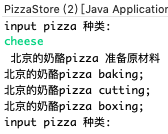


## 6.4.4 另外案例


工厂方法模式主要解决产品扩展的问题，在简单工厂中，随着产品链的丰富，如果每个 课程的创建逻辑有区别的话，工厂的职责会变得越来越多，有点像万能工厂，并不便于 维护。根据单一职责原则我们将职能继续拆分，专人干专事。Java 课程由 Java 工厂创建， Python 课程由 Python 工厂创建，对工厂本身也做一个抽象。来看代码，先创建 ICourseFactory 接口:

```java
package com.gupaoedu.vip.pattern.factory.factorymethod;
public interface ICourseFactory {
    ICourse create();
}
```

在分别创建子工厂，JavaCourseFactory 类:

```java
public class JavaCourseFactory implements ICourseFactory {
    public ICourse create() {
        return new JavaCourse();
    }
}
```

PythonCourseFactory 类:

```java
public class PythonCourseFactory implements ICourseFactory {
    public ICourse create() {
        return new PythonCourse();
    }
}
```

看测试代码:

```java
public class FactoryMethodTest {
    public static void main(String[] args) {
        ICourseFactory factory = new PythonCourseFactory();
        ICourse course = factory.create();
        course.record();

        factory = new JavaCourseFactory();
        course = factory.create();
        course.record();
    }
}
```

现在再来看一下类图:

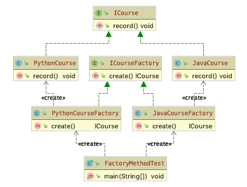


## 6.4.5 源码-log4j

再来看看 slfj 中工厂方法模式的应用，看看类图就 OK 了:

```java
public final class LoggerFactory {  
    public static Logger getLogger(String name) {
        ILoggerFactory iLoggerFactory = getILoggerFactory();
        return iLoggerFactory.getLogger(name);
    }

    public static Logger getLogger(Class clazz) {
        return getLogger(clazz.getName());
    }
}
```


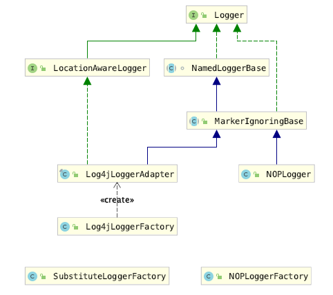


## 6.4.6 小结-工厂方法


工厂方法适用于以下场景:

1. 创建对象需要大量重复的代码。
2. 客户端(应用层)不依赖于产品类实例如何被创建、实现等细节。
3. 一个类通过其子类来指定创建哪个对象。

工厂方法也有缺点:

1. 类的个数容易过多，增加复杂度。
2. 增加了系统的抽象性和理解难度。


# 6.5 抽象工厂模式 

## 6.5.1 基本介绍 

1. 抽象工厂模式:定义了一个==interface 用于创建相关或有依赖关系的对象簇==，而无需指明具体的类。
2. 抽象工厂模式可以将简单工厂模式和工厂方法模式进行整合。 
3. 从设计层面看，抽象工厂模式就是对简单工厂模式的改进(或者称为进一步的抽象)。 
4. 将工厂抽象成==两层==，==AbsFactory(抽象工厂)== 和 ==具体实现的工厂子类==。程序员可以根据创建对象类型使用对应 的工厂子类。这样将单个的简单工厂类变成了工厂簇，更利于代码的维护和扩展。 

## 6.5.2 UML类图


## 6.5.3 代码实现

```java
package com.atguigu.factory.absfactory.pizzastore.order;

import com.atguigu.factory.absfactory.pizzastore.pizza.Pizza;

//一个抽象工厂模式的抽象层(接口)
public interface AbsFactory {
	//让下面的工厂子类来 具体实现
	public Pizza createPizza(String orderType);
}
```

```java
package com.atguigu.factory.absfactory.pizzastore.order;

import com.atguigu.factory.absfactory.pizzastore.pizza.BJCheesePizza;
import com.atguigu.factory.absfactory.pizzastore.pizza.BJPepperPizza;
import com.atguigu.factory.absfactory.pizzastore.pizza.Pizza;

//这是工厂子类
public class BJFactory implements AbsFactory {

	@Override
	public Pizza createPizza(String orderType) {
		System.out.println("~使用的是抽象工厂模式~");
		Pizza pizza = null;
		if(orderType.equals("cheese")) {
			pizza = new BJCheesePizza();
		} else if (orderType.equals("pepper")){
			pizza = new BJPepperPizza();
		}
		return pizza;
	}

}
```

```java
package com.atguigu.factory.absfactory.pizzastore.order;

import com.atguigu.factory.absfactory.pizzastore.pizza.LDCheesePizza;
import com.atguigu.factory.absfactory.pizzastore.pizza.LDPepperPizza;
import com.atguigu.factory.absfactory.pizzastore.pizza.Pizza;

public class LDFactory implements AbsFactory {

	@Override
	public Pizza createPizza(String orderType) {
		System.out.println("~使用的是抽象工厂模式~");
		Pizza pizza = null;
		if (orderType.equals("cheese")) {
			pizza = new LDCheesePizza();
		} else if (orderType.equals("pepper")) {
			pizza = new LDPepperPizza();
		}
		return pizza;
	}

}
```

```java
package com.atguigu.factory.absfactory.pizzastore.order;

import java.io.BufferedReader;
import java.io.IOException;
import java.io.InputStreamReader;
import com.atguigu.factory.absfactory.pizzastore.pizza.Pizza;

public class OrderPizza {

	AbsFactory factory;

	// 构造器
	public OrderPizza(AbsFactory factory) {
		setFactory(factory);
	}

	private void setFactory(AbsFactory factory) {
		Pizza pizza = null;
		String orderType = ""; // 用户输入
		this.factory = factory;
		do {
			orderType = getType();
			// factory 可能是北京的工厂子类，也可能是伦敦的工厂子类
			pizza = factory.createPizza(orderType);
			if (pizza != null) { // 订购ok
				pizza.prepare();
				pizza.bake();
				pizza.cut();
				pizza.box();
			} else {
				System.out.println("订购失败");
				break;
			}
		} while (true);
	}

	// 写一个方法，可以获取客户希望订购的披萨种类
	private String getType() {
		try {
			BufferedReader strin = new BufferedReader(new InputStreamReader(System.in));
			System.out.println("input pizza 种类:");
			String str = strin.readLine();
			return str;
		} catch (IOException e) {
			e.printStackTrace();
			return "";
		}
	}
}
```

```java
package com.atguigu.factory.absfactory.pizzastore.order;
public class PizzaStore {
	public static void main(String[] args) {
		new OrderPizza(new LDFactory());
	}
}
```

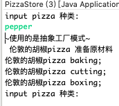


abstractBeanFactory


# 6.7 工厂模式小结 

1. 工厂模式的意义

   将实例化对象的代码提取出来，放到一个类中统一管理和维护，达到和主项目的依赖关系的解耦。从而提高项目的扩展和维护性。

2. 三种工厂模式 (简单工厂模式、工厂方法模式、抽象工厂模式) 

3. 设计模式的==依赖抽象==原则 

4. 创建对象实例时，不要直接 new 类, 而是把这个new 类的动作放在一个工厂的方法中，并返回。有的书上说，变量不要直接持有具体类的引用。 

5. 不要让类继承具体类，而是继承抽象类或者是实现interface(接口) 

6. 不要覆盖基类中已经实现的方法。 