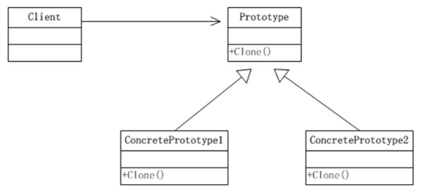

# 7.1 克隆羊问题 

现在有一只羊tom，姓名为: tom, 年龄为:1，颜色为:白色，请编写程序创建和tom 羊属性完全相同的10只羊。 

# 7.2 传统方式解决克隆羊问题 

## 7.2.1 代码实现


```java
package com.atguigu.prototype;

public class Sheep {
	private String name;
	private int age;
	private String color;
	public Sheep(String name, int age, String color) {
		super();
		this.name = name;
		this.age = age;
		this.color = color;
	}
	// getter setter toString...
}
```

```java
package com.atguigu.prototype;

public class Client {

	public static void main(String[] args) {
		//传统的方法
		Sheep sheep = new Sheep("tom", 1, "白色");
		
		Sheep sheep2 = new Sheep(sheep.getName(), sheep.getAge(), sheep.getColor());
		Sheep sheep3 = new Sheep(sheep.getName(), sheep.getAge(), sheep.getColor());
		Sheep sheep4 = new Sheep(sheep.getName(), sheep.getAge(), sheep.getColor());
		Sheep sheep5 = new Sheep(sheep.getName(), sheep.getAge(), sheep.getColor());
		//....
		
		System.out.println(sheep);
		System.out.println(sheep2);
		System.out.println(sheep3);
		System.out.println(sheep4);
		System.out.println(sheep5);
		//...
	}

}
```

## 7.2.2 传统的方式的优缺点 

1. 优点是比较好理解，简单易操作。

2. 在创建新的对象时，总是需要重新获取原始对象的属性，如果创建的对象比较复杂时，效率较低。

3. 总是需要重新初始化对象，而不是动态地获得对象运行时的状态, 不够灵活。

4. 改进的思路分析

   Java 中 Object 类是所有类的根类，Object 类提供了一个 clone()方法，该方法可以将一个 Java 对象复制一份，但是需要实现clone的Java类必须要实现一个接口Cloneable，该接口表示该类能够复制且具有==复制的能力== => ==原型模式== 


# 7.3 原型模式

## 7.3.1 基本介绍


1. 原型模式(Prototype模式)是指:用==原型实例指定创建对象的种类，并且通过拷贝这些原型，创建新的对象==。

2. 原型模式是一种创建型设计模式，允许一个对象再创建另外一个可定制的对象，无需知道如何创建的细节，不调用构造函数。

3. 工作原理是:通过将一个原型对象传给那个要发动创建的对象，这个要发动创建的对象通过请求原型对象拷贝它们自己来实施创建，即 `对象.clone()`。

4. 形象的理解:孙大圣拔出猴毛，变出其它孙大圣。

   

## 7.3.2 原理结构图-uml 类图 



1. Prototype : 原型类，声明一个克隆自己的接口 
2. ConcretePrototype: 具体的原型类, 实现一个克隆自己的操作 
3. Client: 让一个原型对象克隆自己，从而创建一个新的对象(属性一样) 

## 7.3.3 代码实现

```java
package com.atguigu.prototype.improve;

public class Sheep implements Cloneable {
	private String name;
	private int age;
	private String color;
    private String address = "蒙古羊";
    public Sheep friend; //是对象, 克隆是会如何处理
	public Sheep(String name, int age, String color) {
		super();
		this.name = name;
		this.age = age;
		this.color = color;
	}
	//getter setter toString ...
    
	//克隆该实例，使用默认的clone方法来完成
	@Override
	protected Object clone()  {
		Sheep sheep = null;
		try {
			sheep = (Sheep)super.clone();
		} catch (Exception e) {
			System.out.println(e.getMessage());
		}
		return sheep;
	}
	
}
```

```java
package com.atguigu.prototype.improve;

public class Client {

	public static void main(String[] args) {
		System.out.println("原型模式完成对象的创建");
		Sheep sheep = new Sheep("tom", 1, "白色");
		sheep.friend = new Sheep("jack", 2, "黑色");
	
		Sheep sheep2 = (Sheep)sheep.clone(); //克隆
		Sheep sheep3 = (Sheep)sheep.clone(); //克隆
		Sheep sheep4 = (Sheep)sheep.clone(); //克隆
		Sheep sheep5 = (Sheep)sheep.clone(); //克隆
		
		System.out.println("sheep2 =" + sheep2 + "sheep2.friend=" + sheep2.friend.hashCode());
		System.out.println("sheep3 =" + sheep3 + "sheep3.friend=" + sheep3.friend.hashCode());
		System.out.println("sheep4 =" + sheep4 + "sheep4.friend=" + sheep4.friend.hashCode());
		System.out.println("sheep5 =" + sheep5 + "sheep5.friend=" + sheep5.friend.hashCode());
	}

}
```


# 7.4 原型模式在Spring框架中源码分析 


​	...


# 7.5 深入讨论-浅拷贝和深拷贝

## 7.5.1 浅拷贝的介绍 

1. 对于数据类型是基本数据类型的成员变量，浅拷贝会直接进行值传递，也就是将该属性值复制一份给新的对象。 

2. 对于数据类型是引用数据类型的成员变量，比如说成员变量是某个数组、某个类的对象等，那么浅拷贝会进行 引用传递，也就是只是将该成员变量的引用值(内存地址)复制一份给新的对象。因为实际上两个对象的该成员变量都指向同一个实例。在这种情况下，在一个对象中修改该成员变量会影响到另一个对象的该成员变量值 

3. 前面我们克隆羊就是浅拷贝 

4. 浅拷贝是使用默认的 clone()方法来实现 

   `sheep = (Sheep) super.clone(); `

## 7.5.2 深拷贝基本介绍

1. 复制对象的所有基本数据类型的成员变量值 
2. 为所有引用数据类型的成员变量申请存储空间，并复制每个引用数据类型成员变量所引用的对象，直到该对象 可达的所有对象。也就是说，==对象进行深拷贝要对整个对象(包括对象的引用类型)进行拷贝== 。
3. ==深拷贝实现方式1:重写clone方法来实现深拷贝== 
4. ==深拷贝实现方式2:通过对象序列化实现深拷贝(推荐)== 

## 7.5.3 重写clone方法实现深拷贝

## 7.5.4 使用序列化来实现深拷贝

```java
package com.atguigu.prototype.deepclone;

import java.io.Serializable;

public class DeepCloneableTarget implements Serializable, Cloneable {
	private static final long serialVersionUID = 1L;
	private String cloneName;
	private String cloneClass;

	//构造器
	public DeepCloneableTarget(String cloneName, String cloneClass) {
		this.cloneName = cloneName;
		this.cloneClass = cloneClass;
	}

	//因为该类的属性，都是String , 因此我们这里使用默认的clone完成即可
	@Override
	protected Object clone() throws CloneNotSupportedException {
		return super.clone();
	}
}
```

```java
package com.atguigu.prototype.deepclone;

import java.io.ByteArrayInputStream;
import java.io.ByteArrayOutputStream;
import java.io.ObjectInputStream;
import java.io.ObjectOutputStream;
import java.io.Serializable;

public class DeepProtoType implements Serializable, Cloneable{
	
	public String name; //String 属性
	public DeepCloneableTarget deepCloneableTarget;// 引用类型
	public DeepProtoType() {
		super();
	}
	
	//深拷贝 - 方式 1 使用clone 方法
	@Override
	protected Object clone() throws CloneNotSupportedException {
		
		Object deep = null;
		//这里完成对基本数据类型(属性)和String的克隆
		deep = super.clone(); 
		//对引用类型的属性，进行单独处理
		DeepProtoType deepProtoType = (DeepProtoType)deep;
		deepProtoType.deepCloneableTarget  = (DeepCloneableTarget)deepCloneableTarget.clone();
		return deepProtoType;
	}
	
	//深拷贝 - 方式2 通过对象的序列化实现 (推荐)
	public Object deepClone() {
		
		//创建流对象
		ByteArrayOutputStream bos = null;
		ObjectOutputStream oos = null;
		ByteArrayInputStream bis = null;
		ObjectInputStream ois = null;
		
		try {
			//序列化
			bos = new ByteArrayOutputStream();
			oos = new ObjectOutputStream(bos);
			oos.writeObject(this); //当前这个对象以对象流的方式输出
			
			//反序列化
			bis = new ByteArrayInputStream(bos.toByteArray());
			ois = new ObjectInputStream(bis);
			DeepProtoType copyObj = (DeepProtoType)ois.readObject();
			
			return copyObj;
		} catch (Exception e) {
			e.printStackTrace();
			return null;
		} finally {
			//关闭流
			try {
				bos.close();
				oos.close();
				bis.close();
				ois.close();
			} catch (Exception e2) {
				System.out.println(e2.getMessage());
			}
		}
	}
	
}
```

```java
package com.atguigu.prototype.deepclone;

public class Client {

	public static void main(String[] args) throws Exception {
		DeepProtoType p = new DeepProtoType();
		p.name = "宋江";
		p.deepCloneableTarget = new DeepCloneableTarget("大牛", "小牛");
		
		//方式1 完成深拷贝
//		DeepProtoType p2 = (DeepProtoType) p.clone();
	
		//方式2 完成深拷贝
		DeepProtoType p2 = (DeepProtoType) p.deepClone();
		
		System.out.println("p.name=" + p.name + "p.deepCloneableTarget=" + p.deepCloneableTarget.hashCode());
		System.out.println("p2.name=" + p.name + "p2.deepCloneableTarget=" + p2.deepCloneableTarget.hashCode());
	}

}
```


# 7.6 原型模式的注意事项和细节

1. 创建新的对象比较复杂时，可以利用原型模式简化==对象的创建过程，同时也能够提高效率== 。
2. 不用重新初始化对象，而是动态地获得对象运行时的状态 。
3. 如果原始对象发生变化(增加或者减少属性)，其它克隆对象的也会发生相应的变化，无需修改代码 
4. 在实现深克隆的时候可能需要比较复杂的代码 。
5. ==缺点==:需要为每一个类配备一个克隆方法，这对全新的类来说不是很难，但对==已有的类进行改造==时，需要修改 其源代码，==违背了 ocp 原则==，这点请注意。 

