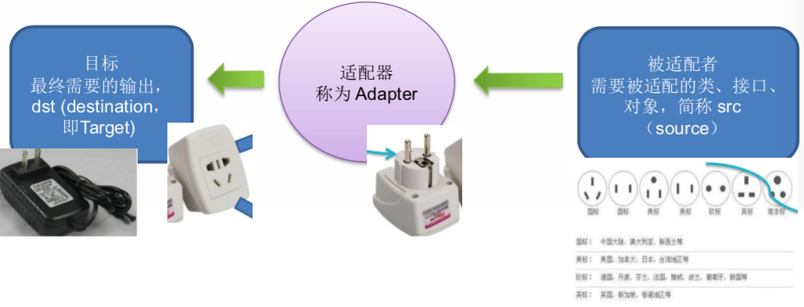
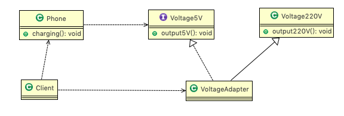
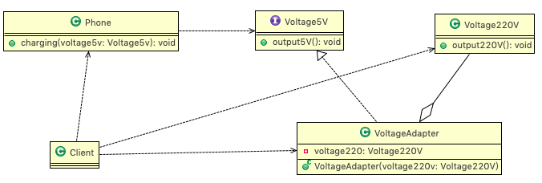
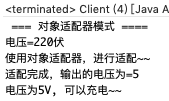
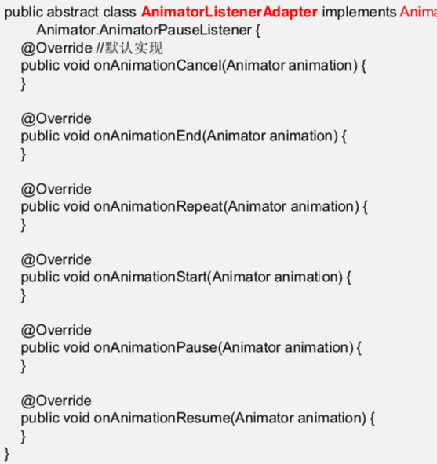
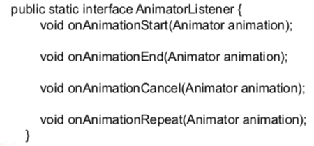

# 9.1 现实生活中的适配器例子 

泰国插座用的是两孔的(欧标)，可以买个多功能转换插头 (适配器) ，这样就可以使用了。 


# 9.2 适配器模式基本介绍 

1. 适配器模式(Adapter Pattern)将某个类的接口转换成客户端期望的另一个接口表 示，主的==目的是兼容性==，让原本因接口不匹配不能一起工作的两个类可以协同 工作。其别名为包装器(Wrapper)。
2. 适配器模式属于结构型模式 
3. 主要分为三类:==类适配器模式、对象适配器模式、接口适配器模式==。 

# 9.3 工作原理 

1. 适配器模式:将一个类的接口转换成另一种接口，让原本接口不兼容的类可以兼容。
2. 从用户的角度看不到被适配者，是解耦的 
3. 用户调用适配器转化出来的目标接口方法，适配器再调用被适配者的相关接口方法 
4. 用户收到反馈结果，感觉只是和目标接口交互，如图 



# 9.4 类适配器模式 

## 9.4.1 基本介绍

基本介绍:Adapter 类，通过继承 src 类，实现 dst 类接口，完成 src->dst 的适配。 

## 9.4.2 应用实例 

以生活中充电器的例子来讲解适配器，充电器本身相当于 Adapter，220V 交流电相当于 src (即被适配者)，我们 的目 dst(即 目标)是 5V 直流电 


## 9.4.2 思路分析(类图) 



## 9.4.3 代码实现

```java
package com.atguigu.adapter.classadapter;

//被适配的类
public class Voltage220V {
	//输出220V的电压
	public int output220V() {
		int src = 220;
		System.out.println("电压=" + src + "伏");
		return src;
	}
}
```

```java
package com.atguigu.adapter.classadapter;

//适配接口
public interface IVoltage5V {
	public int output5V();
}
```

```java
package com.atguigu.adapter.classadapter;

//适配器类
public class VoltageAdapter extends Voltage220V implements IVoltage5V {

	@Override
	public int output5V() {
		//获取到220V电压
		int srcV = output220V();
		int dstV = srcV / 44 ; //转成 5v
		return dstV;
	}

}
```

```java
package com.atguigu.adapter.classadapter;

public class Phone {
	//充电
	public void charging(IVoltage5V iVoltage5V) {
		if(iVoltage5V.output5V() == 5) {
			System.out.println("电压为5V, 可以充电~~");
		} else if (iVoltage5V.output5V() > 5) {
			System.out.println("电压大于5V, 不能充电~~");
		}
	}
}
```

```java
package com.atguigu.adapter.classadapter;

public class Client {
	public static void main(String[] args) {
		System.out.println(" === 类适配器模式 ====");
		Phone phone = new Phone();
		phone.charging(new VoltageAdapter());
	}
}
```


## 9.4.4 类适配器模式注意事项和细节 

1. Java 是单继承机制，所以类适配器需要继承 src 类这一点算是一个缺点, 因为这要求 dst 必须是接口，有一定局限性。
2. src 类的方法在 Adapter 中都会暴露出来，也增加了使用的成本。
3. 由于其继承了src类，所以它可以根据需求重写src类的方法，使得Adapter的灵活性增强了。 

# 9.5 对象适配器模式 

## 9.5.1 基本介绍

1. 基本思路和类的适配器模式相同，只是将Adapter类作修改，不是继承src类，而是持有src类的实例，以解决兼容性的问题。 即:持有 src类，实现 dst 类接口， 完成src->dst的适配。
2. 根据"合成复用原则"，在系统中尽量使用关联关系来替代继承关系。 
3. ==对象适配器模式是适配器模式常用的一种== 

## 9.5.2 应用实例 

以生活中充电器的例子来讲解适配器，充电器本身相当于Adapter，220V交流电相当于src (即被适配者)，我们的目dst(即目标)是5V直流电，==使用对象适配器模式完成==。 

## 9.5.3 思路分析(类图):只需修改适配器即可

```java
public class VoltageAdapter2 implements Voltage5 {
	private Voltage220 voltage220; //持有Voltage220对象,不是继承了 
}
```



## 9.5.4 代码实现

```java
package com.atguigu.adapter.objectadapter;

//被适配的类
public class Voltage220V {
	//输出220V的电压，不变
	public int output220V() {
		int src = 220;
		System.out.println("电压=" + src + "伏");
		return src;
	}
}
```

```java
package com.atguigu.adapter.objectadapter;

//适配接口
public interface IVoltage5V {
	public int output5V();
}
```

```java
package com.atguigu.adapter.objectadapter;

//适配器类
public class VoltageAdapter  implements IVoltage5V {

	private Voltage220V voltage220V; // 关联关系-聚合
	
	//通过构造器，传入一个 Voltage220V 实例
	public VoltageAdapter(Voltage220V voltage220v) {
		this.voltage220V = voltage220v;
	}

	@Override
	public int output5V() {
		int dst = 0;
		if(null != voltage220V) {
			int src = voltage220V.output220V();//获取220V 电压
			System.out.println("使用对象适配器，进行适配~~");
			dst = src / 44;
			System.out.println("适配完成，输出的电压为=" + dst);
		}
		return dst;
	}
}
```

```java
package com.atguigu.adapter.objectadapter;

public class Phone {
	//充电
	public void charging(IVoltage5V iVoltage5V) {
		if(iVoltage5V.output5V() == 5) {
			System.out.println("电压为5V, 可以充电~~");
		} else if (iVoltage5V.output5V() > 5) {
			System.out.println("电压大于5V, 不能充电~~");
		}
	}
}
```

```java
package com.atguigu.adapter.objectadapter;

public class Client {
	public static void main(String[] args) {
		System.out.println(" === 对象适配器模式 ====");
		Phone phone = new Phone();
		phone.charging(new VoltageAdapter(new Voltage220V()));
	}
}
```



## 9.5.5 对象适配器模式注意事项和细节 

1. 对象适配器和类适配器其实算是同一种思想，只不过实现方式不同。 根据合成复用原则，使用组合替代继承， 所以它解决了类适配器必须继承 src 的局限性问题，也不再要求 dst 必须是接口。 
2. 使用成本更低，更灵活。 


# 9.6 接口适配器模式 

## 9.6.1 基本介绍

1. 一些书籍称为:适配器模式(DefaultAdapterPattern)或==缺省适配器模式==。
2. 核心思路:当==不需要全部实现接口提供的方法==时，可先==设计一个抽象类实现接口==，并为该接口中每个方法提供  一个==默认实现(空方法)==，那么==该抽象类的子类可有选择地覆盖父类的某些方法==来实现需求。 
3.  适用于一个接口不想使用其所有的方法的情况。

## 9.6.2 应用实例

1. Android 中的属性动画 ValueAnimator 类可以通过 addListener(AnimatorListener listener)方法添加监听器， 那么常规写法如下: 


2. 有时候我们不想实现 Animator.AnimatorListener接口的全部方法， 我们只想监听onAnimationStart，我们会如下写：


3. AnimatorListenerAdapter 类，就是一个接口适配器，代码如下图:它空实现了 Animator.AnimatorListener 类(src)的所有方法。



4. AnimatorListener是一个接口 



## 9.6.3 思路分析(类图)


## 9.6.4 代码实现

```java
package com.atguigu.adapter.interfaceadapter;

public interface Interface4 {
	public void m1();
	public void m2();
	public void m3();
	public void m4();
}
```

```java
package com.atguigu.adapter.interfaceadapter;

//在AbsAdapter 我们将 Interface4 的方法进行默认实现
public abstract class AbsAdapter implements Interface4 {
	//默认实现
	public void m1() {}
	public void m2() {}
	public void m3() {}
	public void m4() {}
}
```

```java
package com.atguigu.adapter.interfaceadapter;

public class Client {
	public static void main(String[] args) {
		
		AbsAdapter absAdapter = new AbsAdapter() {
			//只需要去覆盖我们 需要使用 接口方法
			@Override
			public void m1() {
				System.out.println("使用了m1的方法");
			}
		};
		
		absAdapter.m1();
	}
}
```


# 9.7 在 SpringMVC 框架应用的源码剖析 

## 9.7.1 源码分析

1. SpringMvc中的HandlerAdapter,就使用了适配器模式 

2. SpringMVC处理请求的流程回顾 

3. 使用HandlerAdapter 的原因分析 

   可以看到处理器的类型不同，有多重实现方式，那么调用方式就不是确定的，如果需要直接调用 Controller方法，需要调用的时候就得不断是使用if else来进行判断是哪一种子类然后执行。那么如果后面要扩展Controller，就得修改原来的代码，这样违背了OCP原则。 

4. 代码分析+Debug源码 

| ddddddddddddddddddddddddddddddddddddddddddddddddddddddddddddddddddddddddddddddddddddddddddddddddddddd | d    |
| ------------------------------------------------------------ | ---- |
|  |      |

## 9.7.2 手写

 动手写SpringMVC通过适配器设计模式获取到对应的Controller的源码 

1. Spring定义了一个适配接口，使得每一种Controller有一种对应的适配器实现类 
2. 适配器代替controller执行相应的方法
3. 扩展Controller 时，只需要增加一个适配器类就完成了SpringMVC的扩展了
4. ==这就是设计模式的力量== 


```java
package com.atguigu.spring.springmvc;

///定义一个Adapter接口 
public interface HandlerAdapter {
	public boolean supports(Object handler);
	public void handle(Object handler);
}

// 多种适配器类
class SimpleHandlerAdapter implements HandlerAdapter {
	public void handle(Object handler) { 
		((SimpleController) handler).doSimplerHandler(); 
	}

	public boolean supports(Object handler) {
		return (handler instanceof SimpleController);
	}
}

class HttpHandlerAdapter implements HandlerAdapter {
	public void handle(Object handler) {
		((HttpController) handler).doHttpHandler();
	}

	public boolean supports(Object handler) {
		return (handler instanceof HttpController);
	}
}

class AnnotationHandlerAdapter implements HandlerAdapter {
	public void handle(Object handler) {
		((AnnotationController) handler).doAnnotationHandler();
	}

	public boolean supports(Object handler) {
		return (handler instanceof AnnotationController);
	}
}
```

```java
package com.atguigu.spring.springmvc;

//多种Controller实现  
public interface Controller {
}

class HttpController implements Controller {
	public void doHttpHandler() {
		System.out.println("http...");
	}
}

class SimpleController implements Controller {
	public void doSimplerHandler() {
		System.out.println("simple...");
	}
}

class AnnotationController implements Controller {
	public void doAnnotationHandler() {
		System.out.println("annotation...");
	}
}
```

```java
package com.atguigu.spring.springmvc;

import java.util.ArrayList;
import java.util.List;

public class DispatchServlet {

	public static List<HandlerAdapter> handlerAdapters = new ArrayList<HandlerAdapter>();

	public DispatchServlet() {
		handlerAdapters.add(new AnnotationHandlerAdapter());
		handlerAdapters.add(new HttpHandlerAdapter());
		handlerAdapters.add(new SimpleHandlerAdapter());
	}

	public void doDispatch() {
		// 此处模拟SpringMVC从request取handler的对象，
		// 适配器可以获取到希望的Controller
		 HttpController controller = new HttpController();
		// AnnotationController controller = new AnnotationController();
		//SimpleController controller = new SimpleController();
		// 得到对应适配器
		HandlerAdapter adapter = getHandler(controller);
		// 通过适配器执行对应的controller对应方法
		adapter.handle(controller);
	}

	public HandlerAdapter getHandler(Controller controller) {
		//遍历：根据得到的controller(handler), 返回对应适配器
		for (HandlerAdapter adapter : this.handlerAdapters) {
			if (adapter.supports(controller)) {
				return adapter;
			}
		}
		return null;
	}

	public static void main(String[] args) {
		new DispatchServlet().doDispatch(); // http...
	}
}
```

# 9.8 适配器模式的注意事项和细节 

1. 三种命名方式，是根据src是以怎样的形式给到Adapter(在Adapter里的形式)来命名的。

   类适配器:以类给到，在Adapter里，就是将src当做类，继承 

   对象适配器:以对象给到，在 Adapter 里，将 src 作为一个对象，持有 

   接口适配器:以接口给到，在 Adapter 里，将 src 作为一个接口，实现 

2. Adapter 模式最大的作用还是将原本不兼容的接口融合在一起工作。 

3. 实际开发中，实现起来不拘泥于我们讲解的三种经典形式 