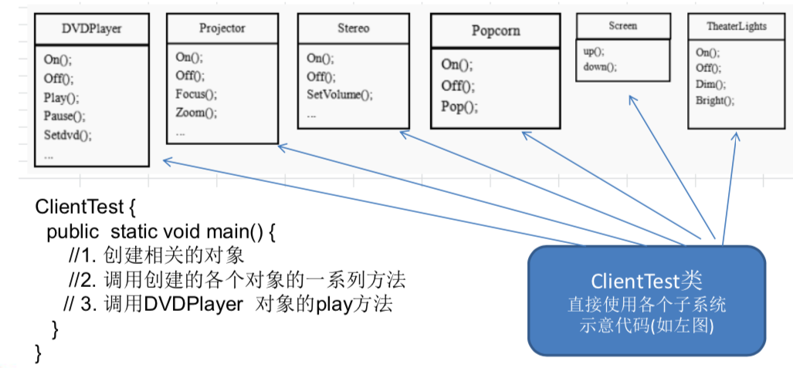
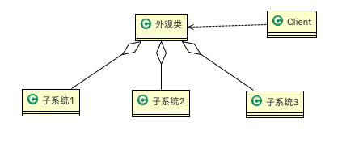
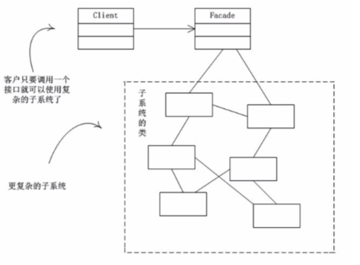
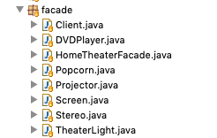

# 13.1 影院管理项目 


组建一个家庭影院: 

DVD播放器、投影仪、自动屏幕、环绕立体声、爆米花机,要求完成使用家庭影院的功能，其过程为: 

直接用遥控器:统筹各设备开关 

开爆米花机

放下屏幕

开投影仪 

开音响

开DVD，选dvd

去拿爆米花

调暗灯光

播放

观影结束后，关闭各种设备 


## 13.2 传统方式解决影院管理 

## 13.2.1 类图





## 13.2.2 问题分析 


1. 在ClientTest 的main方法中，创建各个子系统的对象，并直接去调用子系统(对象) 相关方法，会造成调用过程混乱，没有清晰的过程。
2. 不利于在ClientTest 中，去维护对子系统的操作。
3. 解决思路:定义一个高层接口，给子系统中的一组接口提供一个==一致的界面(比如在高层接口提供四个方法 ready, play, pause, end )==，用来访问子系统中的一群接口。
4. 也就是说就是通过==定义一个一致的接口(界面类)==，用以屏蔽内部子系统的细节，使得调用端只需跟这个接口发生调用，而无需关心这个子系统的内部细节 => ==外观模式==  


# 13.3 外观模式 

## 13.3.1 基本介绍


1. 外观模式(Facade)，也叫"过程模式":外观模式为子系统中的一组接口提供一个一致的界面，此模式定义了一个高层接口，这个接口使得这一子系统更加容易使用。
2. 外观模式通过定义一个一致的接口，用以屏蔽内部子系统的细节，使得调用端只需跟这个接口发生调用，而无需关心这个子系统的内部细节。


## 13.3.2 原理类图 




1. 外观类(Facade): 为调用端提供统一的调用接口, 外观类知道哪些子系统负责处理请求,从而将调用端的请求代 理给适当子系统对象。
2. 调用者(Client): 外观接口的调用者。
3. 子系统的集合:指模块或者子系统，处理Facade对象指派的任务，他是功能的实际提供者。


## 13.3.3 外观模式解决影院管理说明


1. 外观模式可以理解为转换一群接口，客户只 要调用一个接口，而不用调用多个接口才能 达到目的。比如:在pc上安装软件的时候经常有一键安装选项(省去选择安装目录、安 装的组件等等)，还有就是手机的重启功能 (把关机和启动合为一个操作) 
2. 外观模式就是解决多个复杂接口带来的使用困难，起到简化用户操作的作用 
3. 示意图说明 




## 13.3.4 思路分析和图解(类图) 


## 13.3.5 代码实现




```java
package com.atguigu.facade;

public class HomeTheaterFacade {
	
	//定义各个子系统对象
	private TheaterLight theaterLight;
	private Popcorn popcorn;
	private Stereo stereo;
	private Projector projector;
	private Screen screen;
	private DVDPlayer dVDPlayer;
	
	
	//构造器
	public HomeTheaterFacade() {
		super();
		this.theaterLight = TheaterLight.getInstance();
		this.popcorn = Popcorn.getInstance();
		this.stereo = Stereo.getInstance();
		this.projector = Projector.getInstance();
		this.screen = Screen.getInstance();
		this.dVDPlayer = DVDPlayer.getInstanc();
	}

	//操作分成 4 步
	public void ready() {
		popcorn.on();
		popcorn.pop();
		screen.down();
		projector.on();
		stereo.on();
		dVDPlayer.on();
		theaterLight.dim();
	}
	
	public void play() {
		dVDPlayer.play();
	}
	
	public void pause() {
		dVDPlayer.pause();
	}
	
	public void end() {
		popcorn.off();
		theaterLight.bright();
		screen.up();
		projector.off();
		stereo.off();
		dVDPlayer.off();
	}
}
```


```java
package com.atguigu.facade;

public class TheaterLight {
	private static TheaterLight instance = new TheaterLight();
	public static TheaterLight getInstance() {
		return instance;
	}
    
	public void on() { System.out.println(" TheaterLight on "); }
	public void off() { System.out.println(" TheaterLight off "); }
	public void dim() { System.out.println(" TheaterLight dim.. "); }
	public void bright() { System.out.println(" TheaterLight bright.. "); }
}
```

```java
package com.atguigu.facade;

public class Popcorn {
	private static Popcorn instance = new Popcorn();
	public static Popcorn getInstance() {
		return instance;
	}
	
	public void on() { System.out.println(" popcorn on "); }
	public void off() { System.out.println(" popcorn ff "); }
	public void pop() { System.out.println(" popcorn is poping "); }
}
```

```java
package com.atguigu.facade;

public class Stereo {
	private static Stereo instance = new Stereo();
	public static Stereo getInstance() {
		return instance;
	}
	
	public void on() { System.out.println(" Stereo on "); }
	public void off() { System.out.println(" Screen off "); }
	public void up() { System.out.println(" Screen up.. "); }
}
```

```java
package com.atguigu.facade;

public class Projector {
	private static Projector instance = new Projector();
	public static Projector getInstance() {
		return instance;
	}
	
	public void on() { System.out.println(" Projector on "); }
	public void off() { System.out.println(" Projector ff "); }
	public void focus() { System.out.println(" Projector is Projector  "); }
	//...
}
```

```java
package com.atguigu.facade;

public class Screen {
	private static Screen instance = new Screen();
	public static Screen getInstance() {
		return instance;
	}
	
	public void up() { System.out.println(" Screen up "); }
	public void down() { System.out.println(" Screen down "); }
}
```

```java
package com.atguigu.facade;

public class DVDPlayer {
	
	//使用单例模式, 使用饿汉式
	private static DVDPlayer instance = new DVDPlayer();
	public static DVDPlayer getInstanc() {
		return instance;
	}
	
	public void on() { System.out.println(" dvd on "); }
	public void off() { System.out.println(" dvd off "); }
	public void play() { System.out.println(" dvd is playing "); }
	//....
	public void pause() { System.out.println(" dvd pause .."); }
}
```


```java
package com.atguigu.facade;

public class Client {

	public static void main(String[] args) {
		//这里直接调用。。 很麻烦, 所以用外观模式调用
		HomeTheaterFacade homeTheaterFacade = new HomeTheaterFacade();
		homeTheaterFacade.ready();
		System.out.println("-----------");
		homeTheaterFacade.play();
		System.out.println("-----------");
		homeTheaterFacade.end();
	}
}
```


# 13.4 在MyBatis框架应用的源码分析 