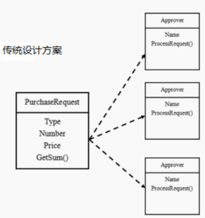
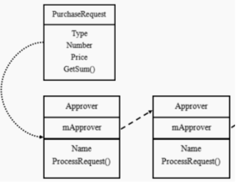
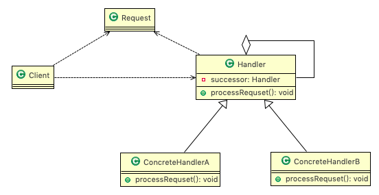

# 26.1 学校 OA 系统的采购审批项目


采购员采购教学器材

1. 如果金额小于等于5000,由教学主任审批(0<=x<=5000)
2. 如果金额小于等于10000,由院长审批(5000<x<=10000)
3. 如果金额小于等于30000,由副校长审批(10000<x<=30000)
4. 如果金额超过30000以上，有校长审批(30000<x)

请设计程序完成采购审批项目


# 26.2 传统方案解决

## 26.2.1 传统的设计方案(类图)





## 26.2.2 问题分析


1. 传统方式是:接收到一个采购请求后，根据采购金额来调用对应的Approver (审批人)完成审批。

2. 传统方式的问题分析 : 

   客户端这里会使用到分支判断(比如 switch) 来对不同的采购请求处理， 这样就存在如下问题：

   * 如果各个级别的人员审批金额发生变化，在客户端的也需要变化 
   * 客户端必须明确的知道有多少个审批级别和访问

3. 这样对一个采购请求进行处理和Approver(审批人)就存在强耦合关系，不利于代码的扩展和维护。

4. 解决方案=》==职责链模式==


# 26.3 职责链模式

## 26.3.1 基本介绍


1. 职责链模式(Chain of Responsibility Pattern), 又叫 责任链模式，为请求创建了一个==接收者对象的链==(简单示意图)。这种模式对请求的发送者和接收者进行解耦。



1. 职责链模式通常每个接收者都包含对另一个接收者的引用。如果一个对象不能处理该请求， 那么它会把相同的请求传给下一个接收者，依此类推。
2. 这种类型的设计模式属于行为型模式。


## 26.3.2 原理类图




1. Handler : 抽象的处理者, 定义了一个处理请求的接口, 同时含义另外Handler。
2. ConcreteHandlerA , B 是具体的处理者，处理它自己负责的请求，可以访问它的后继者(即下一个处理者),，如果可以处理当前请求，则处理，否则就将该请求交给后继者去处理，从而形成一个职责链。
3. Request：含义很多属性，表示一个请求。


# 26.4 职责链模式解决 OA 系统采购审批

## 26.4.1 思路分析和图解(类图)


## 26.4.2 代码实现


```java
package com.atguigu.responsibilitychain;

public abstract class Approver {

	Approver approver;  //下一个处理者
	String name; // 名字
	
	public Approver(String name) {
		this.name = name;
	}

	//下一个处理者
	public void setApprover(Approver approver) {
		this.approver = approver;
	}
	
	//处理审批请求的方法，得到一个请求, 处理是子类完成，因此该方法做成抽象
	public abstract void processRequest(PurchaseRequest purchaseRequest);
	
}
```


```java
package com.atguigu.responsibilitychain;
public class DepartmentApprover extends Approver {
	public DepartmentApprover(String name) {
		super(name);
	}
	
	@Override
	public void processRequest(PurchaseRequest purchaseRequest) {
		if(purchaseRequest.getPrice() <= 5000) {
			System.out.println(" 请求编号 id= " + purchaseRequest.getId() + " 被 " + this.name + " 处理");
		}else {
			approver.processRequest(purchaseRequest);
		}
	}
}
```

```java
package com.atguigu.responsibilitychain;
public class CollegeApprover extends Approver {
	public CollegeApprover(String name) {
		super(name);
	}
	
	@Override
	public void processRequest(PurchaseRequest purchaseRequest) {
		if(purchaseRequest.getPrice() < 5000 && purchaseRequest.getPrice() <= 10000) {
			System.out.println(" 请求编号 id= " + purchaseRequest.getId() + " 被 " + this.name + " 处理");
		}else {
			approver.processRequest(purchaseRequest);
		}
	}
}
```

```java
package com.atguigu.responsibilitychain;
public class ViceSchoolMasterApprover extends Approver {
	public ViceSchoolMasterApprover(String name) {
		super(name);
	}
	
	@Override
	public void processRequest(PurchaseRequest purchaseRequest) {
		if(purchaseRequest.getPrice() < 10000 && purchaseRequest.getPrice() <= 30000) {
			System.out.println(" 请求编号 id= " + purchaseRequest.getId() + " 被 " + this.name + " 处理");
		}else {
			approver.processRequest(purchaseRequest);
		}
	}
}
```

```java
package com.atguigu.responsibilitychain;
public class SchoolMasterApprover extends Approver {
	public SchoolMasterApprover(String name) {
		super(name);
	}
	
	@Override
	public void processRequest(PurchaseRequest purchaseRequest) {
		if(purchaseRequest.getPrice() > 30000) {
			System.out.println(" 请求编号 id= " + purchaseRequest.getId() + " 被 " + this.name + " 处理");
		}else {
			approver.processRequest(purchaseRequest);
		}
	}
}
```


```java
package com.atguigu.responsibilitychain;

//请求类
public class PurchaseRequest {

	private int type = 0; //请求类型
	private float price = 0.0f; //请求金额
	private int id = 0;
	//构造器
	public PurchaseRequest(int type, float price, int id) {
		this.type = type;
		this.price = price;
		this.id = id;
	}

    //setter getter...
}
```


```java
package com.atguigu.responsibilitychain;

public class Client {

	public static void main(String[] args) {
		//创建一个请求
		PurchaseRequest purchaseRequest = new PurchaseRequest(1, 31000, 1);
		
		//创建相关的审批人
		DepartmentApprover departmentApprover = new DepartmentApprover("张主任");
		CollegeApprover collegeApprover = new CollegeApprover("李院长");
		ViceSchoolMasterApprover viceSchoolMasterApprover = new ViceSchoolMasterApprover("王副校");
		SchoolMasterApprover schoolMasterApprover = new SchoolMasterApprover("佟校长");
	
		//需要将各个审批级别的下一个设置好 (处理人构成环形: )
		departmentApprover.setApprover(collegeApprover);
		collegeApprover.setApprover(viceSchoolMasterApprover);
		viceSchoolMasterApprover.setApprover(schoolMasterApprover);
		schoolMasterApprover.setApprover(departmentApprover);
		
		departmentApprover.processRequest(purchaseRequest);
		viceSchoolMasterApprover.processRequest(purchaseRequest);
	}

}
```


# 26.5 在SpringMVC框架应用的源码分析


SpringMVC-HandlerExecutionChain 类就使用到职责链模式

| dddddddddddddddddddddddddddddddddddddddddddddddddddddddddddddddddddddddddddddddddddddddddddddddddddddddddddd | d    |
| ------------------------------------------------------------ | ---- |
|  |      |


```java
package com.atguigu.spring.test;

import org.springframework.web.servlet.HandlerExecutionChain;
import org.springframework.web.servlet.HandlerInterceptor;

public class ResponsibilityChain {

	public static void main(String[] args) {
		
		// DispatcherServlet 
		
		//说明
		/*
		 * 
		 *  protected void doDispatch(HttpServletRequest request, HttpServletResponse response) throws Exception {
		 *   HandlerExecutionChain mappedHandler = null; 
		 *   mappedHandler = getHandler(processedRequest);//获取到HandlerExecutionChain对象
		 *   
		 *    //在 mappedHandler.applyPreHandle 内部 得到了 HandlerInterceptor interceptor
		 *    //调用了拦截器的  interceptor.preHandle
		 *   if (!mappedHandler.applyPreHandle(processedRequest, response)) {
					return;
				}
				
			  //说明：在 mappedHandler.applyPostHandle 方法内部获取到拦截器，并调用 
			  //拦截器的  interceptor.postHandle(request, response, this.handler, mv);
			 mappedHandler.applyPostHandle(processedRequest, response, mv);
		 *  }
		 *  
		 *  //说明：在 mappedHandler.applyPreHandle内部中，
		 *  还调用了  triggerAfterCompletion 方法，该方法中调用了  
		 *  HandlerInterceptor interceptor = getInterceptors()[i];
			try {
				interceptor.afterCompletion(request, response, this.handler, ex);
			}
			catch (Throwable ex2) {
				logger.error("HandlerInterceptor.afterCompletion threw exception", ex2);
			}
		 */
	
	}

}
```

1. springmvc 请求的流程图中，执行了 拦截器相关方法 interceptor.preHandler 等等。
2. 在处理 SpringMvc 请求时，使用到职责链模式还使用到适配器模式。
3. HandlerExecutionChain 主要负责的是请求拦截器的执行和请求处理，但是他本身不处理请求，只是将请求分配给链上注册处理器执行，这是职责链实现方式,减少职责链本身与处理逻辑之间的耦合，规范了处理流程。
4. HandlerExecutionChain 维护了 HandlerInterceptor 的集合， 可以向其中注册相应的拦截器。


# 26.6 职责链模式的注意事项和细节


1. 将请求和处理分开，实现解耦，提高系统的灵活性。
2. 简化了对象，使对象不需要知道链的结构。
3. 性能会受到影响，特别是在==链比较长的时候==，因此需控制链中最大节点数量，一般通过在Handler中设置一个最大节点数量，在 setNext()方法中判断是否已经超过阀值，超过则不允许该链建立，避免出现超长链无意识地 破坏系统性能。
4. 调试不方便。采用了类似递归的方式，调试时逻辑可能比较复杂。
5. 最佳应用场景:有多个对象可以处理同一个请求时，比如:多级请求、请假/加薪等审批流程、Java Web中Tomcat对Encoding的处理、拦截器。